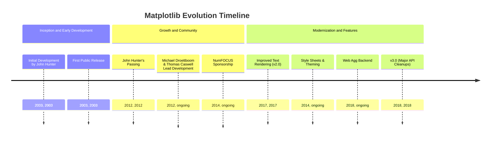
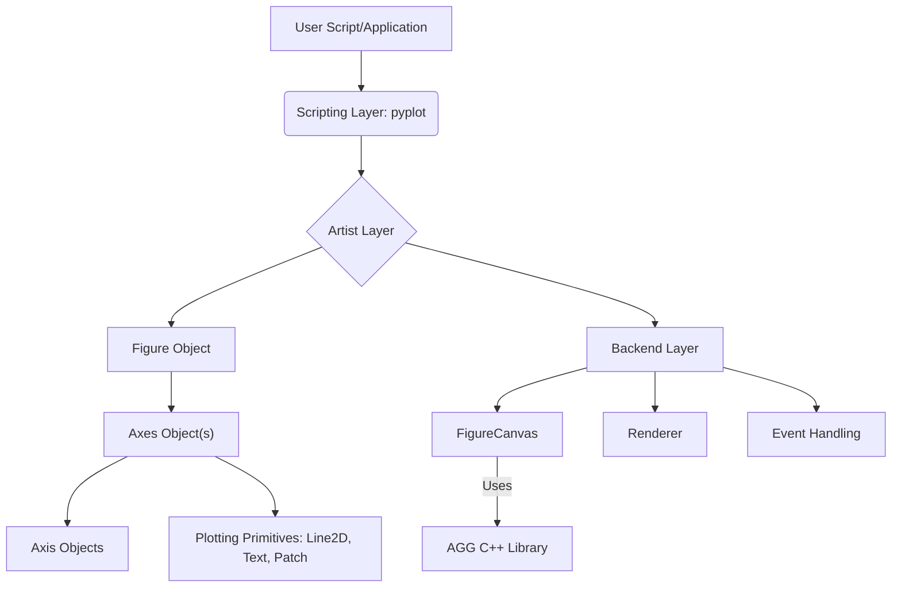
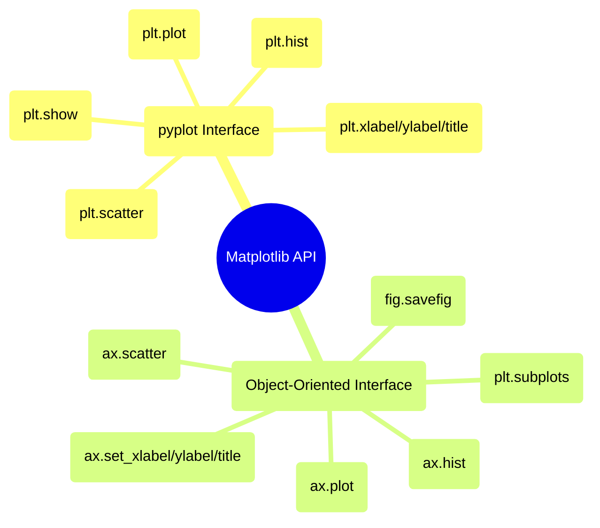

## Matplotlib Evolution Document

### 1. Introduction and Historical Context

Matplotlib is a comprehensive library for creating static, animated, and interactive visualizations in Python. It is a cornerstone of the scientific Python ecosystem, providing a flexible and powerful tool for generating high-quality plots, charts, and figures across various domains, including data science, engineering, and research.

Matplotlib was initially conceived and developed by John Hunter in 2003. As a neurobiologist, Hunter sought to replace proprietary MATLAB-based tools for analyzing electrocorticography (ECOG) signals with an open-source, Python-based alternative. His goal was to create a plotting library that offered a similar interface and capabilities to MATLAB's plotting functions, but within the Python environment, allowing for greater extensibility and collaboration among researchers.

Since its inception, Matplotlib has evolved from a MATLAB-like scripting interface to a robust, object-oriented plotting library. It leverages NumPy extensively for numerical operations and has fostered a vibrant open-source community that continues to drive its development and maintenance.

### 1.1. Matplotlib Evolution Timeline



### 2. Core Architecture

Matplotlib's architecture is structured in a layered hierarchy, providing different levels of control and abstraction. This design allows users to create simple plots quickly using a high-level interface or to exert fine-grained control over every element of a figure using a more object-oriented approach.

#### 2.1. The Backend Layer

This is the lowest layer, responsible for handling the actual drawing and interacting with the operating system's graphics toolkit. It consists of three abstract interface classes:

*   **`FigureCanvas`**: The area where the plot is drawn and displayed. It handles rendering to various output formats (e.g., screen, PNG, PDF).
*   **`Renderer`**: Responsible for translating abstract drawing commands into specific drawing operations on the `FigureCanvas`. Matplotlib often uses the Anti-Grain Geometry (AGG) C++ library for high-performance 2D rendering.
*   **`Event`**: Handles user interactions such as keyboard presses and mouse clicks, enabling interactive features in plots.

#### 2.2. The Artist Layer

This is the intermediate layer, where most of the plotting logic resides. Everything visible on a Matplotlib figure is an `Artist` object. Artists can be primitive (e.g., `Line2D`, `Rectangle`, `Text`) or composite (collections of other artists).

*   **`Figure`**: The top-level container for all plot elements. It can contain multiple `Axes` objects, titles, legends, and other artists.
*   **`Axes`**: The most important `Artist` object, representing a single plot area. Most plotting methods (e.g., `plot()`, `scatter()`, `hist()`) are defined as methods of the `Axes` object. An `Axes` object contains two (or three in 3D) `Axis` objects, which handle ticks, tick labels, and axis labels.

#### 2.3. The Scripting Layer (`pyplot`)

This is the highest-level interface, designed for quick and easy plot generation, mimicking MATLAB's procedural plotting style. The `matplotlib.pyplot` module provides a collection of functions that implicitly create and manage figures and axes, making it convenient for interactive plotting and simple scripts.

**Mermaid Diagram: Matplotlib Core Architecture**



### 3. Detailed API Overview

Matplotlib offers two main approaches to plotting: the convenient `pyplot` interface for quick plots and the more powerful object-oriented (OO) interface for fine-grained control. While `pyplot` is often used for initial exploration, the OO API is recommended for complex visualizations and programmatic control.

#### 3.1. `matplotlib.pyplot` Interface

This procedural interface provides a state-machine environment, where functions implicitly operate on the "current" figure and axes. It's ideal for interactive sessions and simple plots.

*   **`plt.plot(x, y, ...)`**
    *   **Context:** Plots lines and/or markers to the current `Axes`.
    *   **Parameters:**
        *   `x`, `y`: The horizontal and vertical coordinates of the data points.
        *   `fmt`: (Optional) A format string, e.g., `'ro-'` for red circles with a solid line.
    *   **Returns:** A list of `Line2D` objects.

*   **`plt.scatter(x, y, ...)`**
    *   **Context:** Creates a scatter plot of `x` vs. `y`.
    *   **Parameters:**
        *   `x`, `y`: The data positions.
        *   `s`: (Optional) The marker size in points^2.
        *   `c`: (Optional) The marker color.
    *   **Returns:** A `PathCollection` object.

*   **`plt.hist(x, bins=10, ...)`**
    *   **Context:** Plots a histogram.
    *   **Parameters:**
        *   `x`: The input data that is binned.
        *   `bins`: (Optional) The number of histogram bins.
    *   **Returns:** A tuple of `(n, bins, patches)`.

*   **`plt.xlabel(label)`, `plt.ylabel(label)`, `plt.title(title)`**
    *   **Context:** Sets the label for the x-axis, y-axis, and the title of the current `Axes`, respectively.

*   **`plt.show()`**
    *   **Context:** Displays all open figures. This function blocks execution until all figures are closed.

#### 3.2. Object-Oriented (OO) Interface

This approach provides explicit control over figures and axes objects, making it suitable for complex plots, embedding in GUI applications, and creating reusable plotting functions.

*   **`fig, ax = plt.subplots(nrows=1, ncols=1, ...)`**
    *   **Context:** Creates a figure and a set of subplots. This is the most common way to start with the OO interface.
    *   **Parameters:**
        *   `nrows`, `ncols`: The number of rows and columns of the subplot grid.
    *   **Returns:** A tuple `(Figure, Axes)` or `(Figure, ndarray of Axes)`.

*   **`ax.plot(x, y, ...)`**, **`ax.scatter(x, y, ...)`**, **`ax.hist(x, bins=10, ...)`**
    *   **Context:** These are the OO equivalents of the `pyplot` functions, called directly on an `Axes` object.

*   **`ax.set_xlabel(label)`, `ax.set_ylabel(label)`, `ax.set_title(title)`**
    *   **Context:** Sets the labels and title for a specific `Axes` object.

*   **`fig.savefig(fname, ...)`**
    *   **Context:** Saves the current figure to a file.
    *   **Parameters:**
        *   `fname`: The filename or file-like object.
        *   `dpi`: (Optional) The resolution in dots per inch.

### 3.3. API Mindmap



### 3.3. API Mindmap


### 4. Evolution and Impact

*   **Versatility and Customization:** Matplotlib's strength lies in its unparalleled versatility and customization options. It allows users to create almost any type of static, animated, or interactive visualization imaginable, with fine-grained control over every aesthetic detail.
*   **Foundation for Other Libraries:** Matplotlib serves as the underlying plotting engine for many other Python visualization libraries, such as Seaborn (for statistical graphics) and Pandas (for DataFrame plotting methods). This makes it a fundamental skill for anyone doing data visualization in Python.
*   **Continuous Development:** Despite its maturity, Matplotlib continues to evolve. Recent developments include improved text rendering, new style sheets, better web backends, and ongoing API cleanups (e.g., in v3.0) to enhance consistency and usability.
*   **Community and Documentation:** A strong open-source community contributes to its development, provides extensive documentation, and offers support, ensuring its continued relevance and robustness.

### 5. Conclusion

Matplotlib has cemented its position as the indispensable plotting library for Python. Born out of a need for open-source scientific visualization, it has grown into a powerful, flexible, and highly customizable tool. Its layered architecture, dual API interfaces, and continuous evolution ensure that it remains at the forefront of data visualization, empowering researchers and developers to effectively communicate insights through compelling graphics.

### 6. Typical use cases

- Quick plotting with pyplot

```python
import matplotlib.pyplot as plt
import numpy as np

x = np.linspace(0, 2*np.pi, 200)
y = np.sin(x)

plt.plot(x, y, label="sin(x)")
plt.xlabel("x")
plt.ylabel("y")
plt.title("Quick sine wave")
plt.legend()
plt.show()
```

- Object-oriented subplots and customization

```python
import matplotlib.pyplot as plt
import numpy as np

x = np.linspace(0, 2*np.pi, 200)
fig, axes = plt.subplots(1, 2, figsize=(8, 3))
axes[0].plot(x, np.sin(x), color="tab:blue")
axes[0].set_title("sin(x)")
axes[1].plot(x, np.cos(x), color="tab:orange", linestyle="--")
axes[1].set_title("cos(x)")
fig.suptitle("Trigonometric functions")
fig.tight_layout()
plt.show()
```

- Styling with style sheets

```python
import matplotlib.pyplot as plt
import numpy as np

plt.style.use("seaborn-v0_8-darkgrid")
x = np.linspace(0, 10, 100)
plt.scatter(x, np.sqrt(x), s=30, c=x, cmap="viridis")
plt.colorbar(label="x")
plt.title("Styled scatter with color mapping")
plt.show()
```

- Saving figures with DPI

```python
import matplotlib.pyplot as plt

fig, ax = plt.subplots()
ax.bar(["A", "B", "C"], [3, 5, 2])
fig.savefig("bar_high_res.png", dpi=300, bbox_inches="tight")
```