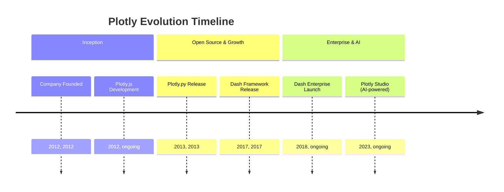
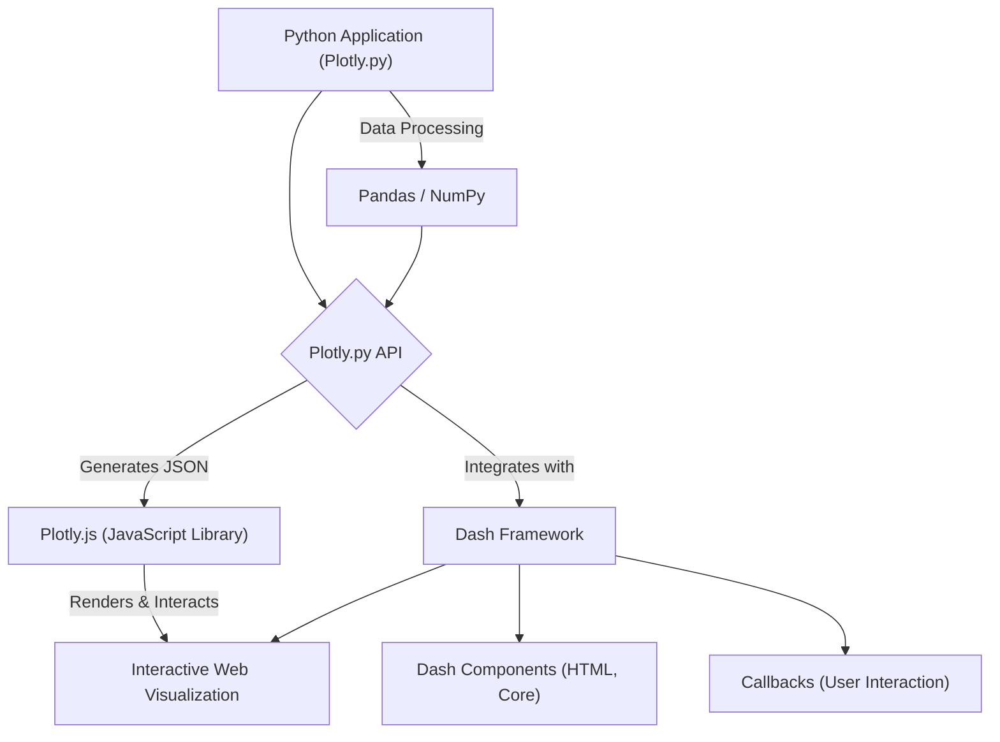
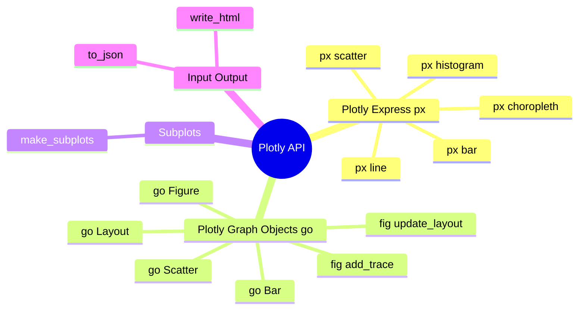

## Plotly Evolution Document

### 1. Introduction and Historical Context

Plotly is a leading technical computing company that develops open-source and enterprise tools for data analytics and interactive visualization. Its Python library, Plotly.py, enables users to create a wide array of interactive, web-based plots, dashboards, and analytical web applications. Plotly's strength lies in its ability to generate high-quality, interactive visualizations that can be easily embedded in web pages, Jupyter notebooks, or integrated into powerful web applications using frameworks like Dash.

Plotly was founded in 2012 by Alex Johnson, Jack Parmer, Chris Parmer, and Matthew Sundquist. The company's initial focus was on creating user-friendly, interactive, web-based data visualization tools, particularly for scientific and engineering fields. A significant milestone in Plotly's history was the development of its open-source tools, including **Plotly.js** (the JavaScript graphing library that powers Plotly), **Plotly.py** (the Python wrapper), and **Dash** (an open-source framework for building analytical web applications).

Dash, released in 2017, revolutionized the creation of analytical web applications by allowing users to build interactive web applications entirely in Python (or R and Julia) without extensive web development knowledge. Plotly has continued to expand its offerings with products like Dash Enterprise for scaling and securely sharing data applications, and more recently, Plotly Studio, an AI-powered tool for rapidly transforming data into interactive applications.

### 1.1. Plotly Evolution Timeline



### 2. Core Architecture

Plotly's core architecture is designed to render interactive charts within web pages or applications by leveraging web technologies (JavaScript, HTML, CSS). The Python library (`Plotly.py`) acts as a powerful interface to generate the necessary JSON structures that are then consumed and rendered by the underlying JavaScript library, Plotly.js.

#### 2.1. Plotly.js: The Rendering Engine

At the heart of Plotly's visualization capabilities is **Plotly.js**, a robust open-source JavaScript graphing library. When you create a plot using Plotly.py, the Python code generates a JSON representation of the figure. This JSON is then passed to Plotly.js, which handles the client-side rendering, interactivity (zooming, panning, hovering), and responsiveness of the visualizations. This separation of concerns allows for rich, interactive graphics that can be easily embedded in web environments.

#### 2.2. Python API (Plotly.py)

Plotly.py provides a comprehensive Python interface to Plotly.js. It allows users to define figures, traces (data series), layouts, and other plot attributes using Python objects. These Python objects are then serialized into JSON, which Plotly.js understands. This abstraction allows Python users to create complex interactive visualizations without writing any JavaScript.

#### 2.3. Dash Framework Integration

**Dash** is a key component of the Plotly ecosystem, enabling the creation of interactive analytical web applications. Dash applications are built by composing a layout of components (HTML, Core Components, custom components) and defining callbacks that update the application's output based on user interactions. Plotly figures are seamlessly integrated into Dash applications, allowing for dynamic and interactive dashboards.

**Mermaid Diagram: Plotly Core Architecture**



### 3. Detailed API Overview

Plotly's Python API is primarily structured around two distinct interfaces: Plotly Express for high-level, quick plots, and Plotly Graph Objects for fine-grained control.

#### 3.1. Plotly Express (`plotly.express`)

Plotly Express (`px`) is a high-level API designed for quickly generating a variety of common chart types with minimal code. It is ideal for rapid data exploration and visualization.

*   **`px.scatter(data_frame, x, y, ...)`**: Creates a scatter plot.
*   **`px.line(data_frame, x, y, ...)`**: Creates a line plot.
*   **`px.bar(data_frame, x, y, ...)`**: Creates a bar chart.
*   **`px.histogram(data_frame, x, ...)`**: Creates a histogram.
*   **`px.choropleth(data_frame, locations, color, ...)`**: Creates a choropleth map.

#### 3.2. Plotly Graph Objects (`plotly.graph_objects`)

Plotly Graph Objects (`go`) is a low-level API that provides extensive control and customization over every aspect of a plot. It operates with fundamental objects such as `Figure`, `layout`, and `data`.

*   **`go.Figure(data=None, layout=None)`**: The main class for creating and manipulating figures.
*   **`go.Scatter(x, y, mode, ...)`**: Represents a scatter plot trace.
*   **`go.Bar(x, y, ...)`**: Represents a bar chart trace.
*   **`go.Layout(title, xaxis, yaxis, ...)`**: Defines the layout of the figure (titles, axes, annotations).
*   **`fig.add_trace(trace)`**: Adds a trace to the figure.
*   **`fig.update_layout(title_text, ...)`**: Updates layout attributes.

#### 3.3. Subplots (`plotly.subplots`)

*   **`plotly.subplots.make_subplots(rows, cols, ...)`**: Creates a figure with a grid of subplots.

#### 3.4. Input/Output (`plotly.io`)

*   **`plotly.io.write_html(fig, file, ...)`**: Writes a figure to an HTML file.
*   **`plotly.io.to_json(fig)`**: Converts a figure to its JSON representation.

### 3.5. API Mindmap



### 4. Evolution and Impact

*   **Interactive Visualization Standard:** Plotly has set a high standard for interactive, web-based data visualization in Python, making it a preferred choice for dynamic and engaging plots.
*   **Dash: Revolutionizing Analytical Apps:** The introduction of Dash has been transformative, enabling data scientists to build complex, interactive web applications entirely in Python, bridging the gap between data science and web development.
*   **Open-Source Ecosystem:** Plotly's commitment to open-source (Plotly.js, Plotly.py, Dash) has fostered a vibrant community and a rich ecosystem of tools and resources.
*   **Enterprise Solutions:** With Dash Enterprise, Plotly provides robust solutions for organizations to scale, deploy, and manage their analytical applications securely, addressing the needs of production environments.
*   **AI-Powered Tools (Plotly Studio):** The recent introduction of AI-powered tools like Plotly Studio demonstrates its continuous innovation, aiming to further simplify and accelerate the process of creating interactive data applications.

### 5. Conclusion

Plotly has evolved into a comprehensive platform for interactive data visualization and analytical web application development. Its powerful Python API, backed by the robust Plotly.js library, enables users to create stunning and insightful interactive plots. The groundbreaking Dash framework has further extended its impact, empowering data scientists to build and deploy full-fledged web applications with ease. Plotly's continuous innovation, from open-source tools to enterprise solutions and AI-powered features, solidifies its position as a leader in the data visualization and analytical application space.

### 6. Typical use cases

- Quick interactive plot with Plotly Express

```python
import plotly.express as px
import pandas as pd

 df = pd.DataFrame({"x": range(10), "y": [v*v for v in range(10)]})
fig = px.scatter(df, x="x", y="y", color="y", title="Interactive scatter")
fig.show()
```

- Fine-grained control with Graph Objects

```python
import plotly.graph_objects as go

fig = go.Figure()
fig.add_trace(go.Scatter(x=[1, 2, 3], y=[2, 1, 3], mode="lines+markers", name="series"))
fig.update_layout(title_text="Custom layout", xaxis_title="x", yaxis_title="y")
fig.show()
```

- Subplots

```python
from plotly.subplots import make_subplots
import plotly.graph_objects as go

fig = make_subplots(rows=1, cols=2, subplot_titles=("A", "B"))
fig.add_trace(go.Bar(x=["a", "b"], y=[3, 5]), row=1, col=1)
fig.add_trace(go.Scatter(x=[1, 2, 3], y=[1, 4, 9], mode="markers"), row=1, col=2)
fig.update_layout(title_text="Subplots example")
fig.show()
```

- Export to standalone HTML

```python
import plotly.express as px
import plotly.io as pio

df = px.data.gapminder().query("year == 2007")
fig = px.scatter(df, x="gdpPercap", y="lifeExp", color="continent")
pio.write_html(fig, "gapminder_2007.html", auto_open=False, include_plotlyjs="cdn")
```