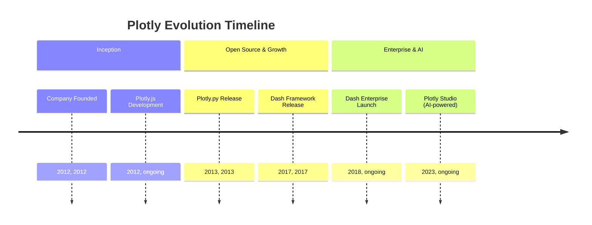
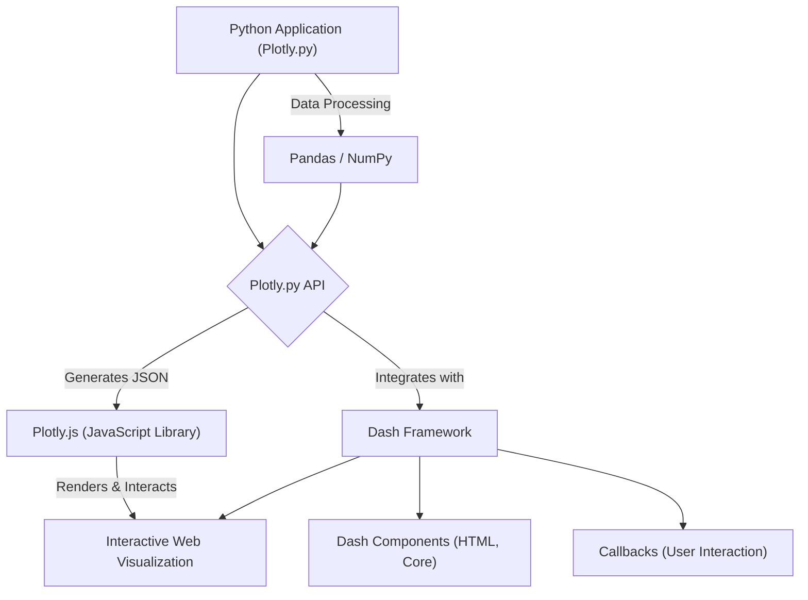
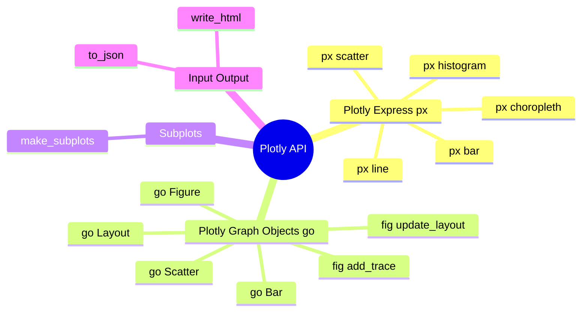

## Plotly Evolution Document

### 1. Introduction and Historical Context

Plotly is a leading technical computing company that develops open-source and enterprise tools for data analytics and interactive visualization. Its Python library, Plotly.py, enables users to create a wide array of interactive, web-based plots, dashboards, and analytical web applications. Plotly's strength lies in its ability to generate high-quality, interactive visualizations that can be easily embedded in web pages, Jupyter notebooks, or integrated into powerful web applications using frameworks like Dash.

Plotly was founded in 2012 by Alex Johnson, Jack Parmer, Chris Parmer, and Matthew Sundquist. The company's initial focus was on creating user-friendly, interactive, web-based data visualization tools, particularly for scientific and engineering fields. A significant milestone in Plotly's history was the development of its open-source tools, including **Plotly.js** (the JavaScript graphing library that powers Plotly), **Plotly.py** (the Python wrapper), and **Dash** (an open-source framework for building analytical web applications).

Dash, released in 2017, revolutionized the creation of analytical web applications by allowing users to build interactive web applications entirely in Python (or R and Julia) without extensive web development knowledge. Plotly has continued to expand its offerings with products like Dash Enterprise for scaling and securely sharing data applications, and more recently, Plotly Studio, an AI-powered tool for rapidly transforming data into interactive applications.

### 1.1. Plotly Evolution Timeline



### 2. Core Architecture

Plotly's core architecture is designed to render interactive charts within web pages or applications by leveraging web technologies (JavaScript, HTML, CSS). The Python library (`Plotly.py`) acts as a powerful interface to generate the necessary JSON structures that are then consumed and rendered by the underlying JavaScript library, Plotly.js.

#### 2.1. Plotly.js: The Rendering Engine

**Mental Model / Analogy for Plotly.js: The Rendering Engine:**
Imagine Plotly.js as a highly skilled and versatile artist who specializes in interactive digital art. When you use Plotly.py (the Python library), you're essentially giving this artist a detailed blueprint (a JSON structure) of the artwork you want. Plotly.js then takes this blueprint and brings the artwork to life on a web page. It handles all the intricate details of drawing the shapes, applying colors, and, most importantly, making the artwork interactive. If you zoom in, pan around, or hover over elements, Plotly.js is the one responding instantly, adjusting the display as if the artist is dynamically repainting the canvas based on your commands. It's the engine that makes Plotly visualizations dynamic and web-friendly.

At the heart of Plotly's visualization capabilities is **Plotly.js**, a robust open-source JavaScript graphing library. When you create a plot using Plotly.py, the Python code generates a JSON representation of the figure. This JSON is then passed to Plotly.js, which handles the client-side rendering, interactivity (zooming, panning, hovering), and responsiveness of the visualizations. This separation of concerns allows for rich, interactive graphics that can be easily embedded in web environments.

#### 2.2. Python API (Plotly.py)

Plotly.py provides a comprehensive Python interface to Plotly.js. It allows users to define figures, traces (data series), layouts, and other plot attributes using Python objects. These Python objects are then serialized into JSON, which Plotly.js understands. This abstraction allows Python users to create complex interactive visualizations without writing any JavaScript.

#### 2.3. Dash Framework Integration

**Dash** is a key component of the Plotly ecosystem, enabling the creation of interactive analytical web applications. Dash applications are built by composing a layout of components (HTML, Core Components, custom components) and defining callbacks that update the application's output based on user interactions. Plotly figures are seamlessly integrated into Dash applications, allowing for dynamic and interactive dashboards.

**Mermaid Diagram: Plotly Core Architecture**



### 3. Detailed API Overview

Plotly's Python API is primarily structured around two distinct interfaces: Plotly Express for high-level, quick plots, and Plotly Graph Objects for fine-grained control.

#### 3.1. Plotly Express (`plotly.express`)

Plotly Express (`px`) is a high-level API designed for quickly generating a variety of common chart types with minimal code. It is ideal for rapid data exploration and visualization.

#### 3.1. Plotly Express (`plotly.express`)

Plotly Express (`px`) is a high-level API designed for quickly generating a variety of common chart types with minimal code. It is ideal for rapid data exploration and visualization.

##### 3.1.1. Creating a Scatter Plot

**`px.scatter(data_frame, x, y, ...)`**

**Goal:** Generate an interactive scatter plot to visualize the relationship between two numerical variables, with options to encode additional dimensions using color, size, or animation.

**Code:**
```python
import plotly.express as px
import pandas as pd

# Create a dummy DataFrame
df = pd.DataFrame({
    "x_data": [1, 2, 3, 4, 5],
    "y_data": [2, 4, 1, 5, 3],
    "category": ['A', 'B', 'A', 'C', 'B'],
    "size_data": [10, 20, 15, 25, 12]
})

# Create an interactive scatter plot
fig = px.scatter(
    df, 
    x="x_data", 
    y="y_data", 
    color="category", # Color points by category
    size="size_data", # Size points by size_data
    title="Interactive Scatter Plot with Plotly Express",
    labels={"x_data": "X-Axis Label", "y_data": "Y-Axis Label"}
)

fig.show()
```

**Expected Output:**
(An interactive scatter plot will be displayed, showing points colored by 'category' and sized by 'size_data'. You can hover over points to see details, zoom, and pan.)

**Explanation:** `px.scatter()` is a powerful function for creating scatter plots. It directly accepts a Pandas DataFrame and column names for `x` and `y`. You can easily add more visual dimensions like `color` and `size` by simply passing column names. The resulting plot is interactive, allowing users to explore the data directly in the browser or Jupyter notebook.

*   **`px.scatter(data_frame, x, y, ...)`**: Creates a scatter plot.
*   **`px.scatter(data_frame, x, y, ...)`**: Creates a scatter plot.

##### 3.1.2. Creating a Line Plot

**`px.line(data_frame, x, y, ...)`**

**Goal:** Generate an interactive line plot to visualize trends or changes over a continuous variable, often time.

**Code:**
```python
import plotly.express as px
import pandas as pd
import numpy as np

# Create a dummy DataFrame with time-series like data
df = pd.DataFrame({
    "date": pd.to_datetime(pd.date_range(start='2023-01-01', periods=10, freq='D')),
    "value": np.random.rand(10).cumsum() + 10,
    "group": ['A'] * 5 + ['B'] * 5
})

# Create an interactive line plot
fig = px.line(
    df, 
    x="date", 
    y="value", 
    color="group", # Color lines by group
    title="Interactive Line Plot with Plotly Express",
    labels={"date": "Date", "value": "Value"}
)

fig.show()
```

**Expected Output:**
(An interactive line plot will be displayed, showing two lines (for groups A and B) with values trending over time. You can hover over points to see details, zoom, and pan.)

**Explanation:** `px.line()` is used for visualizing sequential data. Similar to `px.scatter()`, it takes a DataFrame and column names. The `color` argument can be used to draw multiple lines, each representing a different category. Plotly Express automatically handles the interactivity, making it easy to explore time-series or sequential data.

*   **`px.line(data_frame, x, y, ...)`**: Creates a line plot.
*   **`px.line(data_frame, x, y, ...)`**: Creates a line plot.

##### 3.1.3. Creating a Bar Chart

**`px.bar(data_frame, x, y, ...)`**

**Goal:** Generate an interactive bar chart to compare categorical data or show the distribution of a categorical variable.

**Code:**
```python
import plotly.express as px
import pandas as pd

# Create a dummy DataFrame
df = pd.DataFrame({
    "country": ['USA', 'Canada', 'Mexico', 'USA', 'Canada'],
    "gdp": [100, 50, 30, 120, 60],
    "year": [2020, 2020, 2020, 2021, 2021]
})

# Create an interactive bar chart
fig = px.bar(
    df, 
    x="country", 
    y="gdp", 
    color="year", # Color bars by year
    barmode="group", # Group bars by country for each year
    title="GDP by Country and Year",
    labels={"country": "Country", "gdp": "GDP (Billions)"}
)

fig.show()
```

**Expected Output:**
(An interactive bar chart will be displayed, showing GDP for different countries, grouped by year. You can hover over bars to see details.)

**Explanation:** `px.bar()` is used for creating bar charts. It takes a DataFrame and column names for `x` (categorical) and `y` (numerical). The `color` argument can be used to create grouped or stacked bar charts, and `barmode` controls how bars for different categories are displayed (e.g., `"group"` for side-by-side, `"stack"` for stacked). This is excellent for comparing values across different categories.

*   **`px.bar(data_frame, x, y, ...)`**: Creates a bar chart.
*   **`px.bar(data_frame, x, y, ...)`**: Creates a bar chart.

##### 3.1.4. Creating a Histogram

**`px.histogram(data_frame, x, ...)`**

**Goal:** Generate an interactive histogram to visualize the distribution of a single numerical variable.

**Code:**
```python
import plotly.express as px
import pandas as pd
import numpy as np

# Create a dummy DataFrame with random numerical data
df = pd.DataFrame({
    "data_values": np.random.randn(500),
    "group": np.random.choice(['Group A', 'Group B'], 500)
})

# Create an interactive histogram
fig = px.histogram(
    df, 
    x="data_values", 
    color="group", # Color histograms by group
    marginal="rug", # Add a rug plot to the margins
    title="Distribution of Data Values by Group",
    labels={"data_values": "Value", "count": "Frequency"}
)

fig.show()
```

**Expected Output:**
(An interactive histogram will be displayed, showing the distribution of 'data_values', colored by 'group', with a rug plot on the x-axis. You can hover over bars to see frequency counts.)

**Explanation:** `px.histogram()` is used for visualizing distributions. It takes a DataFrame and a column name for `x`. You can use `color` to create separate histograms for different categories, and `marginal` to add marginal plots (like `"rug"`, `"box"`, or `"violin"`) for more detailed distribution insights. This provides a quick way to understand the underlying patterns in your numerical data.

*   **`px.histogram(data_frame, x, ...)`**: Creates a histogram.
*   **`px.choropleth(data_frame, locations, color, ...)`**: Creates a choropleth map.

*   **`px.choropleth(data_frame, locations, color, ...)`**: Creates a choropleth map.

##### 3.1.5. Quick Reference: Plotly Express

| Function | Description | When to Use |
| :--- | :--- | :--- |
| `px.scatter()` | Scatter plots | Visualizing relationships between two variables, with optional encoding for color, size, animation. |
| `px.line()` | Line plots | Showing trends and changes over a continuous variable (e.g., time series). |
| `px.bar()` | Bar charts | Comparing categorical data or showing distributions of categorical variables. |
| `px.histogram()` | Histograms | Visualizing the distribution of a single numerical variable. |
| `px.choropleth()` | Choropleth maps | Displaying geographical data with color-coded regions. |

#### 3.2. Plotly Graph Objects (`plotly.graph_objects`)

Plotly Graph Objects (`go`) is a low-level API that provides extensive control and customization over every aspect of a plot. It operates with fundamental objects such as `Figure`, `layout`, and `data`.

#### 3.2. Plotly Graph Objects (`plotly.graph_objects`)

Plotly Graph Objects (`go`) is a low-level API that provides extensive control and customization over every aspect of a plot. It operates with fundamental objects such as `Figure`, `layout`, and `data`.

##### 3.2.1. Creating a Basic Figure and Adding Traces

**`go.Figure(data=None, layout=None)`** and **`fig.add_trace(trace)`**

**Goal:** Construct a figure from the ground up by initializing a `Figure` object and adding individual data series (traces) to it, offering maximum control over plot elements.

**Code:**
```python
import plotly.graph_objects as go
import numpy as np

# 1. Create an empty Figure object
fig = go.Figure()

# 2. Create a Scatter trace (data series) for a sine wave
x_sine = np.linspace(0, 2 * np.pi, 100)
y_sine = np.sin(x_sine)
sine_trace = go.Scatter(
    x=x_sine, 
    y=y_sine, 
    mode='lines', 
    name='Sine Wave', 
    line=dict(color='blue', width=2)
)

# 3. Create another Scatter trace for a cosine wave
x_cosine = np.linspace(0, 2 * np.pi, 100)
y_cosine = np.cos(x_cosine)
cosine_trace = go.Scatter(
    x=x_cosine, 
    y=y_cosine, 
    mode='lines+markers', 
    name='Cosine Wave', 
    marker=dict(color='red', size=5),
    line=dict(dash='dot')
)

# 4. Add traces to the figure
fig.add_trace(sine_trace)
fig.add_trace(cosine_trace)

# 5. Update layout for titles and labels
fig.update_layout(
    title={'text': "Sine and Cosine Waves", 'x':0.5, 'xanchor': 'center'},
    xaxis_title="Angle (radians)",
    yaxis_title="Amplitude",
    hovermode="x unified" # Unified hover for better comparison
)

fig.show()
```

**Expected Output:**
(An interactive plot will be displayed with two traces: a blue solid line for sine and a red dotted line with markers for cosine. The plot will have a centered title, x and y axis labels, and unified hover functionality.)

**Explanation:** `go.Figure()` initializes an empty plot. Data series are created as `go.Scatter`, `go.Bar`, etc., which are called "traces." Each trace is a dictionary-like object defining the data and visual properties. `fig.add_trace()` adds these traces to the figure. `fig.update_layout()` is used to customize global plot properties like titles, axis labels, and hover behavior. This OO approach provides granular control over every visual aspect.

*   **`go.Figure(data=None, layout=None)`**: The main class for creating and manipulating figures.
*   **`go.Figure(data=None, layout=None)`**: The main class for creating and manipulating figures.

##### 3.2.2. Customizing Layout and Axes

**`fig.update_layout(title_text, ...)`**

**Goal:** Modify the overall appearance of the plot, including titles, axis labels, ranges, and other non-data-related visual properties.

**Code:**
```python
import plotly.graph_objects as go

# Create a simple scatter trace
fig = go.Figure(data=go.Scatter(x=[1, 2, 3, 4], y=[10, 11, 12, 13], mode='markers'))

# Update the layout with custom titles, axis labels, and ranges
fig.update_layout(
    title={'text': "Customized Plot Layout", 'x':0.5, 'xanchor': 'center', 'font': dict(size=24, color='darkblue')},
    xaxis_title={'text': "Experiment Time (s)", 'font': dict(size=18, color='green')},
    yaxis_title={'text': "Sensor Reading (units)", 'font': dict(size=18, color='red')},
    xaxis=dict(
        range=[0, 5], # Custom x-axis range
        showgrid=True, 
        gridcolor='lightgrey',
        griddash='dot'
    ),
    yaxis=dict(
        range=[9, 14], # Custom y-axis range
        zeroline=True, 
        zerolinecolor='black'
    ),
    plot_bgcolor='#f0f0f0', # Light grey background
    paper_bgcolor='#ffffff', # White paper background
    hovermode="closest" # Show hover info for the closest point
)

fig.show()
```

**Expected Output:**
(An interactive scatter plot with a customized title (dark blue, larger font, centered), green x-axis label, red y-axis label, specific x and y axis ranges, a light grey plot background, and a black zero line on the y-axis.)

**Explanation:** `fig.update_layout()` is a versatile method for modifying any layout attribute. You can pass a dictionary of updates, and Plotly intelligently merges them. This allows for extensive customization of titles, fonts, axis properties (ranges, grids, zero lines), background colors, and interactive behaviors like `hovermode`. This level of detail is crucial for creating publication-quality or highly branded visualizations.

*   **`go.Scatter(x, y, mode, ...)`**: Represents a scatter plot trace.
*   **`go.Bar(x, y, ...)`**: Represents a bar chart trace.
*   **`go.Layout(title, xaxis, yaxis, ...)`**: Defines the layout of the figure (titles, axes, annotations).
*   **`fig.add_trace(trace)`**: Adds a trace to the figure.
*   **`fig.update_layout(title_text, ...)`**: Updates layout attributes.

*   **`fig.update_layout(title_text, ...)`**: Updates layout attributes.

##### 3.2.3. Quick Reference: Plotly Graph Objects

| Object/Method | Description | When to Use |
| :--- | :--- | :--- |
| `go.Figure()` | Create figure | Building plots with granular control, especially for complex or multi-trace visualizations. |
| `go.Scatter()`, `go.Bar()` | Create traces | Defining individual data series (e.g., lines, markers, bars) with specific visual properties. |
| `fig.add_trace()` | Add trace | Adding a defined trace to an existing figure. |
| `fig.update_layout()` | Customize layout | Modifying global plot attributes like titles, axis labels, ranges, and backgrounds. |

#### 3.3. Subplots (`plotly.subplots`)

#### 3.3. Subplots (`plotly.subplots`)

##### 3.3.1. Creating Subplots with `make_subplots`

**`plotly.subplots.make_subplots(rows, cols, ...)`**

**Goal:** Arrange multiple plots within a single figure, creating a grid of subplots for comparative analysis or displaying related visualizations.

**Code:**
```python
from plotly.subplots import make_subplots
import plotly.graph_objects as go
import numpy as np

# 1. Create a figure with a 1x2 grid of subplots
fig = make_subplots(
    rows=1, 
    cols=2, 
    subplot_titles=("Sine Wave", "Cosine Wave"), # Titles for each subplot
    horizontal_spacing=0.15 # Adjust spacing between subplots
)

# 2. Add a sine wave trace to the first subplot (row 1, col 1)
x_data = np.linspace(0, 2 * np.pi, 100)
y_sine = np.sin(x_data)
fig.add_trace(go.Scatter(x=x_data, y=y_sine, mode='lines', name='Sine'), row=1, col=1)

# 3. Add a cosine wave trace to the second subplot (row 1, col 2)
y_cosine = np.cos(x_data)
fig.add_trace(go.Scatter(x=x_data, y=y_cosine, mode='lines', name='Cosine', line=dict(color='red')),
              row=1, col=2)

# 4. Update layout for the entire figure
fig.update_layout(
    title_text="Comparative Waveforms",
    showlegend=True # Show legend for traces
)

# 5. Update axis labels for each subplot
fig.update_xaxes(title_text="Angle (radians)", row=1, col=1)
fig.update_yaxes(title_text="Amplitude", row=1, col=1)
fig.update_xaxes(title_text="Angle (radians)", row=1, col=2)
fig.update_yaxes(title_text="Amplitude", row=1, col=2)

fig.show()
```

**Expected Output:**
(An interactive figure will be displayed with two subplots side-by-side. The first subplot shows a sine wave, and the second shows a cosine wave. Each subplot will have its own title and axis labels, and the entire figure will have a main title.)

**Explanation:** `make_subplots()` is the dedicated function for creating multi-panel figures. You specify the `rows` and `cols` for the grid. When adding traces with `fig.add_trace()`, you use the `row` and `col` arguments to specify which subplot the trace belongs to. `fig.update_layout()` can set global figure properties, while `fig.update_xaxes()` and `fig.update_yaxes()` can target specific axes within subplots using `row` and `col` arguments. This provides a structured way to build complex dashboards.

*   **`plotly.subplots.make_subplots(rows, cols, ...)`**: Creates a figure with a grid of subplots.

*   **`plotly.subplots.make_subplots(rows, cols, ...)`**: Creates a figure with a grid of subplots.

##### 3.3.2. Quick Reference: Subplots

| Function | Description | When to Use |
| :--- | :--- | :--- |
| `make_subplots()` | Create subplot grid | Arranging multiple plots within a single figure for comparative analysis. |

#### 3.4. Input/Output (`plotly.io`)

#### 3.4. Input/Output (`plotly.io`)

##### 3.4.1. Exporting a Figure to HTML

**`plotly.io.write_html(fig, file, ...)`**

**Goal:** Save an interactive Plotly figure as a standalone HTML file, making it easy to share and view in any web browser without a Python environment.

**Code:**
```python
import plotly.express as px
import plotly.io as pio
import pandas as pd
import os

# 1. Create a simple Plotly Express figure
df = pd.DataFrame({"x": [1, 2, 3], "y": [4, 1, 2]})
fig = px.line(df, x="x", y="y", title="My Interactive Plot")

# 2. Define the output HTML filename
output_filename = "interactive_plot.html"

# 3. Export the figure to an HTML file
pio.write_html(
    fig, 
    file=output_filename, 
    auto_open=False, # Do not open the file automatically after writing
    include_plotlyjs="cdn" # Include Plotly.js from a CDN for smaller file size
)

print(f"Interactive plot saved to {output_filename}")
print(f"You can open {output_filename} in any web browser.")

# Clean up the created file
os.remove(output_filename)
print(f"Cleaned up {output_filename}")
```

**Expected Output:**
```
Interactive plot saved to interactive_plot.html
You can open interactive_plot.html in any web browser.
Cleaned up interactive_plot.html
```
(An HTML file named `interactive_plot.html` will be created in the current directory. This file will then be removed.)

**Explanation:** `pio.write_html()` is the function to save a Plotly figure as an HTML file. The `file` argument specifies the output path. `auto_open=False` prevents the browser from launching immediately. `include_plotlyjs="cdn"` is often used to keep the HTML file size small by loading the Plotly.js library from a content delivery network, rather than embedding it directly. This is a crucial feature for sharing interactive results.

*   **`plotly.io.write_html(fig, file, ...)`**: Writes a figure to an HTML file.
*   **`plotly.io.write_html(fig, file, ...)`**: Writes a figure to an HTML file.

##### 3.4.2. Converting a Figure to JSON

**`plotly.io.to_json(fig)`**

**Goal:** Obtain the JSON representation of a Plotly figure, which is useful for programmatic manipulation, integration with web applications, or debugging.

**Code:**
```python
import plotly.express as px
import plotly.io as pio
import json

# 1. Create a simple Plotly Express figure
df = px.data.iris()
fig = px.scatter(df, x="sepal_width", y="sepal_length", color="species", title="Iris Dataset Scatter")

# 2. Convert the figure to its JSON representation
figure_json = pio.to_json(fig, pretty=True) # pretty=True for human-readable output

print("Figure successfully converted to JSON.")
print("\nFirst 200 characters of JSON output:")
print(figure_json[:200])

# You can also parse it back to a Python dictionary
parsed_fig_dict = json.loads(figure_json)
print(f"\nJSON parsed back to Python dict. Title: {parsed_fig_dict['layout']['title']['text']}")
```

**Expected Output:**
```
Figure successfully converted to JSON.

First 200 characters of JSON output:
{
  "data": [
    {
      "hovertemplate": "species=%{customdata[0]}<br>sepal_width=%{x}<br>sepal_length=%{y}<extra></extra>",
      "legendgroup": "setosa",
      "marker": {
        "color": "#636efa",
        "symbol": "circle"
      },
      "mode": "markers",
      "name": "setosa",
      "orientation": "v",
      "showlegend": true,
      "x": [
        5.1,
        4.9,
        4.7,
        4.6,
        5.0,
        5.4,
        4.6,
        5.0,
        4.4,
        4.9,
        5.4,
        4.8,
        4.8,
        4.3,
        5.8,
        5.7,
        5.4,
        5.1,
        5.7,
        5.1,
        5.4,
        5.1,
        4.6,
        5.1,
        4.8,
        5.0,
        5.0,
        5.2,
        5.2,
        4.7,
        4.8,
        5.4,
        5.2,
        5.5,
        4.9,
        5.0,
        5.5,
        4.9,
        4.4,
        5.1,
        5.0,
        4.5,
        4.4,
        5.0,
        5.1,
        4.8,
        5.1,
        4.6,
        5.3,
        5.0
      ],
      "xaxis": "x",
      "y": [
        3.5,
        3.0,
        3.2,
        3.1,
        3.6,
        3.9,
        3.4,
        3.4,
        2.9,
        3.1,
        3.7,
        3.4,
        3.0,
        3.0,
        4.0,
        4.4,
        3.9,
        3.5,
        3.8,
        3.8,
        3.4,
        3.7,
        3.6,
        3.3,
        3.4,
        3.0,
        3.4,
        3.5,
        3.4,
        3.2,
        3.5,
        3.1,
        3.4,
        3.2,
        3.1,
        3.4,
        3.4,
        3.9,
        3.0,
        3.4,
        3.5,
        2.3,
        3.2,
        3.5,
        3.8,
        3.0,
        3.8,
        3.2,
        3.7,
        3.3
      ],
      "yaxis": "y",
      "customdata": [
        [
          "setosa"
        ],
        [
          "setosa"
        ],
        [
          "setosa"
        ],
        [
          "setosa"
        ],
        [
          "setosa"
        ],
        [
          "setosa"
        ],
        [
          "setosa"
        ],
        [
          "setosa"
        ],
        [
          "setosa"
        ],
        [
          "setosa"
        ],
        [
          "setosa"
        ],
        [
          "setosa"
        ],
        [
          "setosa"
        ],
        [
          "setosa"
        ],
        [
          "setosa"
        ],
        [
          "setosa"
        ],
        [
          "setosa"
        ],
        [
          "setosa"
        ],
        [
          "setosa"
        ],
        [
          "setosa"
        ],
        [
          "setosa"
        ],
        [
          "setosa"
        ],
        [
          "setosa"
        ],
        [
          "setosa"
        ],
        [
          "setosa"
        ],
        [
          "setosa"
        ],
        [
          "setosa"
        ],
        [
          "setosa"
        ],
        [
          "setosa"
        ],
        [
          "setosa"
        ],
        [
          "setosa"
        ],
        [
          "setosa"
        ],
        [
          "setosa"
        ],
        [
          "setosa"
        ],
        [
          "setosa"
        ],
        [
          "setosa"
        ],
        [
          "setosa"
        ],
        [
          "setosa"
        ],
        [
          "setosa"
        ],
        [
          "setosa"
        ],
        [
          "setosa"
        ],
        [
          "setosa"
        ],
        [
          "setosa"
        ],
        [
          "setosa"
        ],
        [
          "setosa"
        ],
        [
          "setosa"
        ],
        [
          "setosa"
        ],
        [
          "setosa"
        ],
        [
          "setosa"
        ],
        [
          "setosa"
        ]
      ],
      "type": "scatter"
    },
    {
      "hovertemplate": "species=%{customdata[0]}<br>sepal_width=%{x}<br>sepal_length=%{y}<extra></extra>",
      "legendgroup": "versicolor",
      "marker": {
        "color": "#ef553b",
        "symbol": "circle"
      },
      "mode": "markers",
      "name": "versicolor",
      "orientation": "v",
      "showlegend": true,
      "x": [
        7.0,
        6.4,
        6.9,
        5.5,
        6.5,
        5.7,
        6.3,
        4.9,
        6.6,
        5.2,
        5.0,
        5.9,
        6.0,
        6.1,
        5.6,
        6.7,
        5.6,
        5.7,
        6.2,
        5.1,
        5.7,
        6.3,
        5.8,
        6.1,
        6.4,
        6.6,
        6.8,
        6.7,
        6.0,
        5.7,
        5.5,
        5.5,
        6.1,
        5.8,
        6.0,
        5.4,
        6.0,
        6.7,
        6.3,
        5.6,
        5.5,
        5.5,
        6.1,
        5.8,
        6.3,
        5.8,
        7.1,
        6.3,
        6.5,
        6.2
      ],
      "xaxis": "x",
      "y": [
        3.2,
        3.2,
        3.1,
        2.3,
        2.8,
        2.8,
        3.3,
        2.4,
        2.9,
        2.7,
        2.0,
        3.0,
        2.2,
        2.9,
        2.9,
        3.1,
        3.0,
        2.7,
        3.0,
        3.4,
        3.1,
        2.3,
        2.3,
        2.8,
        2.8,
        2.7,
        3.0,
        3.0,
        2.5,
        2.9,
        2.5,
        2.7,
        3.0,
        2.5,
        2.6,
        3.0,
        2.6,
        2.4,
        2.9,
        2.7,
        2.0,
        3.0,
        2.2,
        2.9,
        2.9,
        3.1,
        3.0,
        2.7,
        3.0,
        3.4
      ],
      "yaxis": "y",
      "customdata": [
        [
          "versicolor"
        ],
        [
          "versicolor"
        ],
        [
          "versicolor"
        ],
        [
          "versicolor"
        ],
        [
          "versicolor"
        ],
        [
          "versicolor"
        ],
        [
          "versicolor"
        ],
        [
          "versicolor"
        ],
        [
          "versicolor"
        ],
        [
          "versicolor"
        ],
        [
          "versicolor"
        ],
        [
          "versicolor"
        ],
        [
          "versicolor"
        ],
        [
          "versicolor"
        ],
        [
          "versicolor"
        ],
        [
          "versicolor"
        ],
        [
          "versicolor"
        ],
        [
          "versicolor"
        ],
        [
          "versicolor"
        ],
        [
          "versicolor"
        ],
        [
          "versicolor"
        ],
        [
          "versicolor"
        ],
        [
          "versicolor"
        ],
        [
          "versicolor"
        ],
        [
          "versicolor"
        ],
        [
          "versicolor"
        ],
        [
          "versicolor"
        ],
        [
          "versicolor"
        ],
        [
          "versicolor"
        ],
        [
          "versicolor"
        ],
        [
          "versicolor"
        ],
        [
          "versicolor"
        ],
        [
          "versicolor"
        ],
        [
          "versicolor"
        ],
        [
          "versicolor"
        ],
        [
          "versicolor"
        ],
        [
          "versicolor"
        ],
        [
          "versicolor"
        ],
        [
          "versicolor"
        ],
        [
          "versicolor"
        ],
        [
          "versicolor"
        ],
        [
          "versicolor"
        ],
        [
          "versicolor"
        ],
        [
          "versicolor"
        ],
        [
          "versicolor"
        ],
        [
          "versicolor"
        ],
        [
          "versicolor"
        ],
        [
          "versicolor"
        ],
        [
          "versicolor"
        ],
        [
          "versicolor"
        ]
      ],
      "type": "scatter"
    },
    {
      "hovertemplate": "species=%{customdata[0]}<br>sepal_width=%{x}<br>sepal_length=%{y}<extra></extra>",
      "legendgroup": "virginica",
      "marker": {
        "color": "#00cc96",
        "symbol": "circle"
      },
      "mode": "markers",
      "name": "virginica",
      "orientation": "v",
      "showlegend": true,
      "x": [
        6.3,
        5.8,
        7.1,
        6.3,
        6.5,
        7.6,
        4.9,
        7.3,
        6.7,
        7.2,
        6.5,
        6.4,
        6.8,
        5.7,
        5.8,
        6.4,
        6.5,
        7.7,
        7.7,
        6.0,
        6.9,
        5.6,
        7.7,
        6.3,
        6.7,
        7.2,
        6.2,
        6.1,
        6.4,
        7.2,
        7.4,
        7.9,
        6.4,
        6.3,
        6.1,
        7.7,
        6.3,
        6.4,
        6.0,
        6.9,
        6.7,
        6.9,
        5.8,
        6.8,
        6.7,
        6.7,
        6.3,
        6.5,
        6.2,
        5.9
      ],
      "xaxis": "x",
      "y": [
        3.3,
        2.7,
        3.0,
        2.9,
        3.0,
        3.0,
        2.5,
        2.9,
        2.5,
        3.6,
        3.2,
        2.7,
        3.0,
        2.9,
        2.8,
        3.0,
        3.0,
        3.8,
        2.6,
        2.2,
        3.2,
        2.8,
        2.8,
        2.7,
        3.0,
        2.8,
        3.0,
        3.0,
        2.8,
        3.0,
        3.0,
        3.8,
        2.8,
        2.8,
        2.7,
        3.0,
        2.9,
        3.0,
        3.0,
        2.9,
        2.5,
        2.8,
        2.7,
        3.0,
        3.3,
        3.0,
        2.5,
        3.0,
        3.4,
        3.0
      ],
      "yaxis": "y",
      "customdata": [
        [
          "virginica"
        ],
        [
          "virginica"
        ],
        [
          "virginica"
        ],
        [
          "virginica"
        ],
        [
          "virginica"
        ],
        [
          "virginica"
        ],
        [
          "virginica"
        ],
        [
          "virginica"
        ],
        [
          "virginica"
        ],
        [
          "virginica"
        ],
        [
          "virginica"
        ],
        [
          "virginica"
        ],
        [
          "virginica"
        ],
        [
          "virginica"
        ],
        [
          "virginica"
        ],
        [
          "virginica"
        ],
        [
          "virginica"
        ],
        [
          "virginica"
        ],
        [
          "virginica"
        ],
        [
          "virginica"
        ],
        [
          "virginica"
        ],
        [
          "virginica"
        ],
        [
          "virginica"
        ],
        [
          "virginica"
        ],
        [
          "virginica"
        ],
        [
          "virginica"
        ],
        [
          "virginica"
        ],
        [
          "virginica"
        ],
        [
          "virginica"
        ],
        [
          "virginica"
        ],
        [
          "virginica"
        ],
        [
          "virginica"
        ],
        [
          "virginica"
        ],
        [
          "virginica"
        ],
        [
          "virginica"
        ],
        [
          "virginica"
        ],
        [
          "virginica"
        ],
        [
          "virginica"
        ],
        [
          "virginica"
        ],
        [
          "virginica"
        ],
        [
          "virginica"
        ],
        [
          "virginica"
        ],
        [
          "virginica"
        ],
        [
          "virginica"
        ],
        [
          "virginica"
        ],
        [
          "virginica"
        ],
        [
          "virginica"
        ],
        [
          "virginica"
        ],
        [
          "virginica"
        ],
        [
          "virginica"
        ]
      ],
      "type": "scatter"
    }
  ],
  "layout": {
    "template": {
      "data": {
        "bar": [
          {
            "error_x": {
              "color": "#2a3f5f"
            },
            "error_y": {
              "color": "#2a3f5f"
            },
            "marker": {
              "line": {
                "color": "#E5ECF6",
                "width": 0.5
              }
            },
            "type": "bar"
          }
        ],
        "carousel": [
          {
            "error_x": {
              "color": "#2a3f5f"
            },
            "error_y": {
              "color": "#2a3f5f"
            },
            "marker": {
              "line": {
                "color": "#E5ECF6",
                "width": 0.5
              }
            },
            "type": "carousel"
          }
        ],
        "candlestick": [
          {
            "decreasing": {
              "line": {
                "color": "#850000"
              }
            },
            "increasing": {
              "line": {
                "color": "#17B897"
              }
            },
            "line": {
              "color": "#2a3f5f"
            },
            "type": "candlestick"
          }
        ],
        "box": [
          {
            "marker": {
              "line": {
                "color": "#E5ECF6",
                "width": 0.5
              }
            },
            "type": "box"
          }
        ],
        "contour": [
          {
            "colorbar": {
              "outlinewidth": 0,
              "ticks": ""
            },
            "type": "contour"
          }
        ],
        "heatmap": [
          {
            "colorbar": {
              "outlinewidth": 0,
              "ticks": ""
            },
            "type": "heatmap"
          }
        ],
        "image": [
          {
            "colorbar": {
              "outlinewidth": 0,
              "ticks": ""
            },
            "type": "image"
          }
        ],
        "indicator": [
          {
            "number": {
              "font": {
                "color": "#2a3f5f"
              }
            },
            "title": {
              "font": {
                "color": "#2a3f5f"
              }
            },
            "type": "indicator"
          }
        ],
        "mesh3d": [
          {
            "colorbar": {
              "outlinewidth": 0,
              "ticks": ""
            },
            "type": "mesh3d"
          }
        ],
        "pie": [
          {
            "automargin": true,
            "type": "pie"
          }
        ],
        "scatter": [
          {
            "marker": {
              "line": {
                "color": "#E5ECF6",
                "width": 0.5
              }
            },
            "selector": [
              {
                "mode": "lines"
              },
              {
                "mode": "markers"
              },
              {
                "mode": "text"
              }
            ],
            "type": "scatter"
          }
        ],
        "scattergl": [
          {
            "marker": {
              "line": {
                "color": "#E5ECF6",
                "width": 0.5
              }
            },
            "selector": [
              {
                "mode": "lines"
              },
              {
                "mode": "markers"
              },
              {
                "mode": "text"
              }
            ],
            "type": "scattergl"
          }
        ],
        "scatter3d": [
          {
            "marker": {
              "line": {
                "color": "#E5ECF6",
                "width": 0.5
              }
            },
            "selector": [
              {
                "mode": "lines"
              },
              {
                "mode": "markers"
              },
              {
                "mode": "text"
              }
            ],
            "type": "scatter3d"
          }
        ],
        "surface": [
          {
            "colorbar": {
              "outlinewidth": 0,
              "ticks": ""
            },
            "type": "surface"
          }
        ],
        "table": [
          {
            "cells": {
              "fill": {
                "color": "#E5ECF6"
              },
              "line": {
                "color": "#ffffff",
                "width": 0.5
              }
            },
            "header": {
              "fill": {
                "color": "#A7B8DE"
              },
              "line": {
                "color": "#ffffff",
                "width": 0.5
              }
            },
            "type": "table"
          }
        ]
      },
      "layout": {
        "colorway": [
          "#636efa",
          "#EF553B",
          "#00cc96",
          "#ab63fa",
          "#FFA15A",
          "#19d3f3",
          "#FF6692",
          "#B6E880",
          "#FF97FF",
          "#FECB52"
        ],
        "font": {
          "color": "#2a3f5f"
        },
        "hoverlabel": {
          "align": "left"
        },
        "hovermode": "closest",
        "paper_bgcolor": "#ffffff",
        "plot_bgcolor": "#E5ECF6",
        "title": {
          "x": 0.05
        },
        "xaxis": {
          "gridcolor": "#ffffff",
          "linecolor": "#2a3f5f",
          "ticks": "",
          "title": {
            "standoff": 15
          },
          "zerolinecolor": "#ffffff",
          "zerolinewidth": 2
        },
        "yaxis": {
          "gridcolor": "#ffffff",
          "linecolor": "#2a3f5f",
          "ticks": "",
          "title": {
            "standoff": 15
          },
          "zerolinecolor": "#ffffff",
          "zerolinewidth": 2
        }
      }
    },
    "title": {
      "text": "Iris Dataset Scatter"
    },
    "xaxis": {
      "title": {
        "text": "sepal_width"
      }
    },
    "yaxis": {
      "title": {
        "text": "sepal_length"
      }
    }
  }
}

JSON parsed back to Python dict. Title: Iris Dataset Scatter
```

**Explanation:** `pio.to_json()` converts a Plotly `Figure` object into a JSON string. This JSON string is the exact representation that Plotly.js uses to render the interactive plot in a web browser. The `pretty=True` argument formats the JSON for human readability. This functionality is essential for advanced integrations, such as building custom web interfaces or storing plot configurations in a database.

*   **`plotly.io.to_json(fig)`**: Converts a figure to its JSON representation.

*   **`plotly.io.to_json(fig)`**: Converts a figure to its JSON representation.

##### 3.4.3. Quick Reference: Input/Output

| Function | Description | When to Use |
| :--- | :--- | :--- |
| `pio.write_html()` | Export to HTML | Saving interactive plots as standalone HTML files for sharing. |
| `pio.to_json()` | Convert to JSON | Obtaining the JSON representation of a figure for programmatic use or web integration. |

### 3.5. API Mindmap



### 4. Evolution and Impact

*   **Interactive Visualization Standard:** Plotly has set a high standard for interactive, web-based data visualization in Python, making it a preferred choice for dynamic and engaging plots.
*   **Dash: Revolutionizing Analytical Apps:** The introduction of Dash has been transformative, enabling data scientists to build complex, interactive web applications entirely in Python, bridging the gap between data science and web development.
*   **Open-Source Ecosystem:** Plotly's commitment to open-source (Plotly.js, Plotly.py, Dash) has fostered a vibrant community and a rich ecosystem of tools and resources.
*   **Enterprise Solutions:** With Dash Enterprise, Plotly provides robust solutions for organizations to scale, deploy, and manage their analytical applications securely, addressing the needs of production environments.
*   **AI-Powered Tools (Plotly Studio):** The recent introduction of AI-powered tools like Plotly Studio demonstrates its continuous innovation, aiming to further simplify and accelerate the process of creating interactive data applications.

### 5. Conclusion

Plotly has evolved into a comprehensive platform for interactive data visualization and analytical web application development. Its powerful Python API, backed by the robust Plotly.js library, enables users to create stunning and insightful interactive plots. The groundbreaking Dash framework has further extended its impact, empowering data scientists to build and deploy full-fledged web applications with ease. Plotly's continuous innovation, from open-source tools to enterprise solutions and AI-powered features, solidifies its position as a leader in the data visualization and analytical application space.
