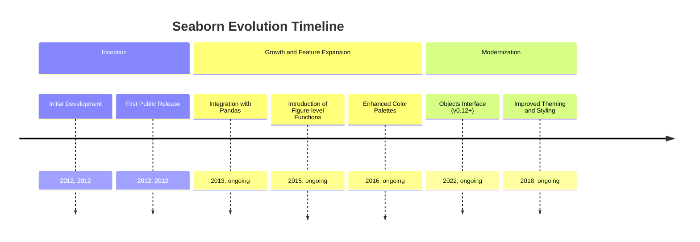
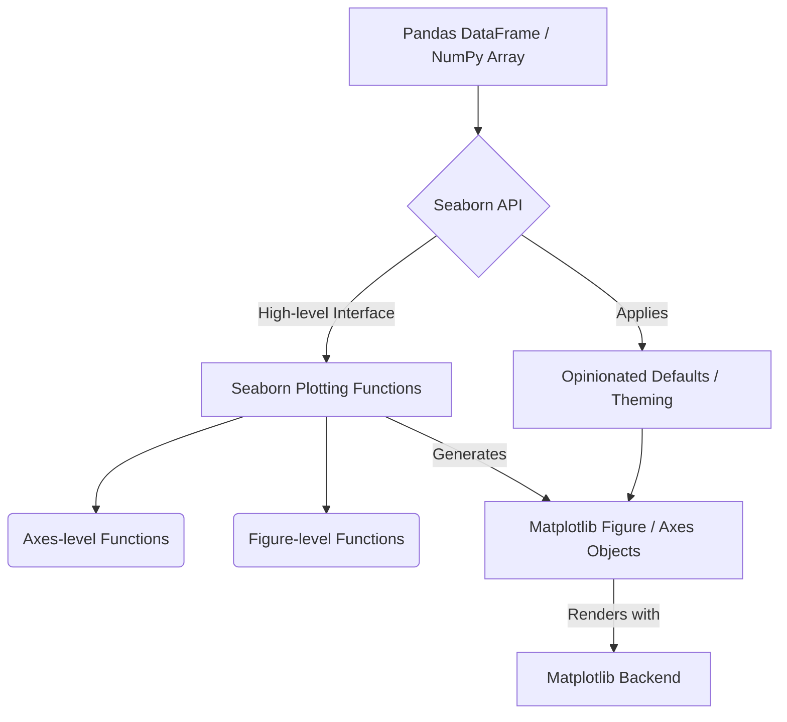
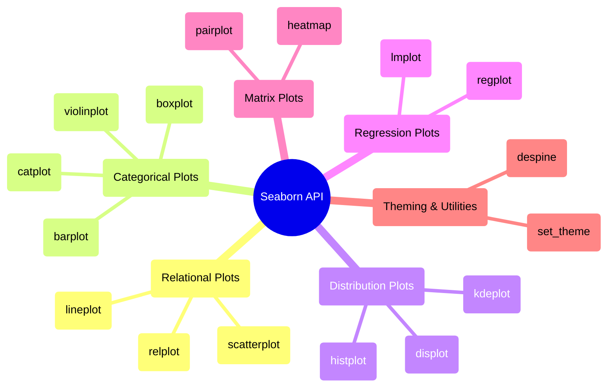

## Seaborn Evolution Document

### 1. Introduction and Historical Context

Seaborn is a Python data visualization library based on Matplotlib. It provides a high-level interface for drawing attractive and informative statistical graphics. While Matplotlib excels at providing fine-grained control over plots, Seaborn simplifies the process of creating complex statistical visualizations, making it easier to explore and understand data, especially when working with Pandas DataFrames.

Seaborn was created by Michael Waskom. It emerged to address the need for a more streamlined approach to generating aesthetically pleasing and statistically meaningful plots, building upon Matplotlib's foundational capabilities. The library's development has focused on providing a dataset-oriented API that automatically handles many of the underlying complexities of Matplotlib, allowing users to focus on the insights from their data rather than the intricacies of plotting.

### 1.1. Seaborn Evolution Timeline



### 2. Core Architecture

Seaborn's core architecture is built as a high-level abstraction layer on top of Matplotlib. It leverages Matplotlib's plotting capabilities while providing a more convenient and opinionated interface for statistical visualization. It is also deeply integrated with Pandas DataFrames, making it highly effective for working with tabular data.

#### 2.1. Matplotlib Backend

Seaborn relies on Matplotlib for its rendering backend. This means that any plot generated by Seaborn is ultimately a Matplotlib figure and axes object, allowing users to further customize Seaborn plots using Matplotlib's extensive API. This symbiotic relationship allows Seaborn to benefit from Matplotlib's robustness and flexibility while offering a simpler entry point for statistical plotting.

#### 2.2. Dataset-Oriented API

**Mental Model / Analogy for Dataset-Oriented API:**
Imagine you have a large spreadsheet (your Pandas DataFrame) full of data, and you want to create a beautiful chart from it. With Matplotlib, you often have to manually pick out columns, assign them to x and y axes, specify colors, and so on. It's like being a chef who has to meticulously chop every ingredient and follow a recipe step-by-step.

Seaborn's **dataset-oriented API** is like having a smart sous-chef. You hand the entire spreadsheet (DataFrame) to the sous-chef and simply tell them, "Make a scatter plot of 'temperature' vs. 'humidity', and color the points by 'season'." The sous-chef (Seaborn) then intelligently figures out how to get the 'temperature' and 'humidity' columns, how to assign colors based on 'season', and handles all the underlying plotting details with Matplotlib. You focus on *what* you want to visualize from your dataset, and Seaborn handles *how* to draw it beautifully and statistically correctly.

A key architectural principle of Seaborn is its **dataset-oriented API**. Instead of requiring users to manually map data columns to visual properties (like x-axis, y-axis, color), Seaborn functions often take entire Pandas DataFrames as input. It then intelligently maps columns to appropriate visual roles, performs necessary statistical aggregations, and handles the underlying Matplotlib calls to generate informative plots.

#### 2.3. Figure-level vs. Axes-level Functions

Seaborn categorizes its plotting functions into two main types:

*   **Axes-level functions**: These functions draw onto a single Matplotlib `Axes` object. Examples include `sns.scatterplot()`, `sns.histplot()`, `sns.boxplot()`. They are suitable for creating individual plots within a larger figure or when you need precise control over subplot placement.
*   **Figure-level functions**: These functions manage the entire figure and can create multiple plots (subplots) within a single figure. Examples include `sns.relplot()`, `sns.catplot()`, `sns.displot()`, `sns.jointplot()`, `sns.pairplot()`. They are powerful for exploring relationships across different subsets of data or variables, as they automatically handle the layout of multiple plots.

#### 2.4. Opinionated Defaults and Theming

Seaborn provides aesthetically pleasing default styles and color palettes. Functions like `sns.set_theme()` allow users to easily apply these themes, which then affect all subsequent Matplotlib plots, ensuring a consistent and professional look across visualizations.

**Mermaid Diagram: Seaborn Core Architecture**



### 3. Detailed API Overview

Seaborn's API is organized around different types of statistical relationships and plot categories.

#### 3.1. Relational Plots (`sns.relplot`, `sns.scatterplot`, `sns.lineplot`)

Used to visualize the relationship between two or more variables.

#### 3.1. Relational Plots (`sns.relplot`, `sns.scatterplot`, `sns.lineplot`)

Used to visualize the relationship between two or more variables.

##### 3.1.1. Creating a Scatter Plot

**`sns.scatterplot(data, x, y, ...)`**

**Goal:** Visualize the relationship between two numerical variables, with options to map additional variables to visual properties like color, size, or style of the markers.

**Code:**
```python
import seaborn as sns
import matplotlib.pyplot as plt
import pandas as pd

# Load a sample dataset
df = sns.load_dataset("penguins").dropna() # Drop NA values for clean plotting

# Create a scatter plot with semantic mappings
sns.scatterplot(
    data=df, 
    x="bill_length_mm", 
    y="bill_depth_mm", 
    hue="species", # Color points by species
    style="sex", # Vary marker style by sex
    size="body_mass_g", # Vary marker size by body mass
    alpha=0.7 # Set transparency
)

plt.title("Penguin Bill Dimensions and Body Mass")
plt.xlabel("Bill Length (mm)")
plt.ylabel("Bill Depth (mm)")
plt.legend(bbox_to_anchor=(1.05, 1), loc='upper left') # Place legend outside
plt.tight_layout() # Adjust layout
plt.show()
```

**Expected Output:**
(A scatter plot will be displayed showing the relationship between bill length and bill depth for penguins. Points will be colored by species, have different marker styles for sex, and varying sizes based on body mass. A legend will be placed outside the plot area.)

**Explanation:** `sns.scatterplot()` is an Axes-level function that creates a scatter plot. Its dataset-oriented API allows you to directly pass a DataFrame (`data`) and column names for `x`, `y`, `hue` (color), `style` (marker style), and `size` (marker size). This makes it incredibly easy to create rich, multi-dimensional scatter plots with minimal code. Matplotlib's `plt` functions are used for additional customizations like title and legend placement.

*   **`sns.lineplot(data, x, y, ...)`**: Draws a line plot with the possibility of several semantic groupings.

##### 3.1.3. Creating Relational Plots with `relplot` (Figure-level)

**`sns.relplot(data, x, y, kind='scatter', ...)`**

**Goal:** Create a figure-level plot that visualizes relationships between variables across different subsets of data, using a `FacetGrid` to arrange multiple subplots.

**Code:**
```python
import seaborn as sns
import matplotlib.pyplot as plt

# Load a sample dataset
df = sns.load_dataset("tips")

# Create a figure-level relational plot
sns.relplot(
    data=df, 
    x="total_bill", 
    y="tip", 
    col="time", # Create separate columns for each 'time' category
    hue="smoker", # Color points by 'smoker' status
    style="day", # Vary marker style by 'day'
    size="size", # Vary marker size by 'size' (number of people)
    kind="scatter", # Specify scatter plot
    height=4, aspect=1.2 # Adjust figure size
)

plt.suptitle("Tips vs. Total Bill by Time, Smoker, and Day", y=1.02) # Overall title
plt.tight_layout()
plt.show()
```

**Expected Output:**
(A figure with two subplots (one for 'Dinner' and one for 'Lunch') will be displayed. Each subplot shows a scatter plot of tip vs. total bill, with points colored by smoker status, styled by day, and sized by party size. The entire figure will have a main title.)

**Explanation:** `sns.relplot()` is a figure-level function that creates a `FacetGrid` and maps `sns.scatterplot()` or `sns.lineplot()` onto its facets. The `col`, `row`, and `hue` parameters are powerful for creating multi-panel plots that show relationships conditioned on different categorical variables. This is ideal for exploring complex relationships within your dataset by breaking them down into smaller, more manageable views.

*   **`sns.relplot(data, x, y, kind='scatter', ...)`**: A figure-level function for drawing relational plots onto a FacetGrid.
*   **`sns.scatterplot(data, x, y, ...)`**: Draws a scatter plot with the possibility of several semantic groupings.
*   **`sns.scatterplot(data, x, y, ...)`**: Draws a scatter plot with the possibility of several semantic groupings.

##### 3.1.2. Creating a Line Plot

**`sns.lineplot(data, x, y, ...)`**

**Goal:** Visualize the trend of a numerical variable over time or another continuous variable, often with confidence intervals.

**Code:**
```python
import seaborn as sns
import matplotlib.pyplot as plt

# Load a sample dataset (flights data is good for time series)
df = sns.load_dataset("flights")

# Create a line plot showing passenger growth over years
sns.lineplot(
    data=df, 
    x="year", 
    y="passengers", 
    hue="month", # Separate lines by month
    marker="o", # Add markers to points
    ci="sd" # Show standard deviation as confidence interval
)

plt.title("Monthly Passenger Count Over Years")
plt.xlabel("Year")
plt.ylabel("Number of Passengers")
plt.legend(bbox_to_anchor=(1.05, 1), loc='upper left')
plt.tight_layout()
plt.show()
```

**Expected Output:**
(A line plot will be displayed showing the number of passengers over years, with separate lines for each month, markers at data points, and shaded areas representing the standard deviation. A legend will be placed outside the plot area.)

**Explanation:** `sns.lineplot()` is an Axes-level function for drawing line plots. It automatically aggregates data (e.g., calculates mean and confidence interval by default) if multiple observations fall into the same `x` bin. The `hue` parameter is used to draw separate lines for different categories, and `ci` controls the confidence interval display. This is excellent for visualizing trends and variations in time-series data.

*   **`sns.lineplot(data, x, y, ...)`**: Draws a line plot with the possibility of several semantic groupings.

*   **`sns.relplot(data, x, y, kind='scatter', ...)`**: A figure-level function for drawing relational plots onto a FacetGrid.

##### 3.1.4. Quick Reference: Relational Plots

| Function | Description | When to Use |
| :--- | :--- | :--- |
| `sns.scatterplot()` | Scatter plot | Visualizing relationships between two numerical variables, with semantic mappings. |
| `sns.lineplot()` | Line plot | Showing trends of a numerical variable over time or another continuous variable. |
| `sns.relplot()` | Figure-level relational plot | Creating multi-panel plots to visualize relationships across different subsets of data. |

#### 3.2. Categorical Plots (`sns.catplot`, `sns.boxplot`, `sns.violinplot`, `sns.barplot`)

Used to visualize relationships between a numerical variable and one or more categorical variables.

#### 3.2. Categorical Plots (`sns.catplot`, `sns.boxplot`, `sns.violinplot`, `sns.barplot`)

Used to visualize relationships between a numerical variable and one or more categorical variables.

##### 3.2.1. Creating a Box Plot

**`sns.boxplot(data, x, y, ...)`**

**Goal:** Display the distribution of a numerical variable across different categories, showing quartiles, median, and outliers.

**Code:**
```python
import seaborn as sns
import matplotlib.pyplot as plt

# Load a sample dataset
df = sns.load_dataset("tips")

# Create a box plot of total bill by day, colored by smoker status
sns.boxplot(
    data=df, 
    x="day", 
    y="total_bill", 
    hue="smoker", # Separate boxes by smoker status
    palette="viridis" # Choose a color palette
)

plt.title("Total Bill Distribution by Day and Smoker Status")
plt.xlabel("Day of the Week")
plt.ylabel("Total Bill ($)")
plt.legend(title="Smoker", bbox_to_anchor=(1.05, 1), loc='upper left')
plt.tight_layout()
plt.show()
```

**Expected Output:**
(A box plot will be displayed showing the distribution of total bill for each day of the week, with separate boxes for smokers and non-smokers. The plot will have a title, axis labels, and a legend.)

**Explanation:** `sns.boxplot()` is an Axes-level function that is excellent for comparing the distribution of a numerical variable across different categories. It shows the five-number summary (minimum, first quartile, median, third quartile, maximum) and potential outliers. The `hue` parameter allows for further categorical breakdown, making it easy to compare distributions within subgroups.

*   **`sns.barplot(data, x, y, ...)`**: Shows point estimates and confidence intervals as rectangular bars.

##### 3.2.4. Creating Categorical Plots with `catplot` (Figure-level)

**`sns.catplot(data, x, y, kind='strip', ...)`**

**Goal:** Create a figure-level plot that visualizes relationships between numerical and categorical variables across different subsets of data, using a `FacetGrid` to arrange multiple subplots.

**Code:**
```python
import seaborn as sns
import matplotlib.pyplot as plt

# Load a sample dataset
df = sns.load_dataset("tips")

# Create a figure-level categorical plot (e.g., box plots)
sns.catplot(
    data=df, 
    x="day", 
    y="total_bill", 
    hue="smoker", # Color boxes by smoker status
    col="time", # Create separate columns for each 'time' category
    kind="box", # Specify box plot
    height=4, aspect=0.8, # Adjust figure size
    palette="viridis"
)

plt.suptitle("Total Bill Distribution by Day, Smoker, and Time", y=1.02) # Overall title
plt.tight_layout()
plt.show()
```

**Expected Output:**
(A figure with two subplots (one for 'Dinner' and one for 'Lunch') will be displayed. Each subplot shows box plots of total bill by day, with separate boxes for smokers and non-smokers. The entire figure will have a main title.)

**Explanation:** `sns.catplot()` is a figure-level function that provides a unified interface to draw various types of categorical plots (e.g., `"strip"`, `"swarm"`, `"box"`, `"violin"`, `"bar"`, `"count"`, `"point"`) onto a `FacetGrid`. Similar to `relplot`, it uses `col`, `row`, and `hue` to create multi-panel plots, making it highly effective for exploring complex categorical relationships in your data.

*   **`sns.catplot(data, x, y, kind='strip', ...)`**: A figure-level function for drawing categorical plots onto a FacetGrid.
*   **`sns.boxplot(data, x, y, ...)`**: Draws a box plot to show distributions with respect to categories.
*   **`sns.boxplot(data, x, y, ...)`**: Draws a box plot to show distributions with respect to categories.

##### 3.2.2. Creating a Violin Plot

**`sns.violinplot(data, x, y, ...)`**

**Goal:** Visualize the distribution of a numerical variable across different categories, combining the features of a box plot with a kernel density estimate to show the full distribution shape.

**Code:**
```python
import seaborn as sns
import matplotlib.pyplot as plt

# Load a sample dataset
df = sns.load_dataset("iris")

# Create a violin plot of sepal length by species
sns.violinplot(
    data=df, 
    x="species", 
    y="sepal_length", 
    hue="species", # Color violins by species
    inner="quartile", # Show quartiles inside the violins
    palette="muted" # Choose a color palette
)

plt.title("Sepal Length Distribution by Iris Species")
plt.xlabel("Species")
plt.ylabel("Sepal Length (cm)")
plt.tight_layout()
plt.show()
```

**Expected Output:**
(A violin plot will be displayed showing the distribution of sepal length for each iris species. Each violin will be colored by species and show inner quartile lines. The plot will have a title and axis labels.)

**Explanation:** `sns.violinplot()` is an Axes-level function that provides a richer view of data distribution than a simple box plot. It shows the kernel density estimate (the shape of the distribution) along with the box plot elements (median, quartiles). The `inner` parameter can be used to customize the internal representation (e.g., `"box"`, `"quartile"`, `"point"`, `"stick"`). This is particularly useful for comparing distributions that might have multiple modes or unusual shapes.

*   **`sns.violinplot(data, x, y, ...)`**: Draws a violin plot, which combines a box plot with a kernel density estimate.
*   **`sns.violinplot(data, x, y, ...)`**: Draws a violin plot, which combines a box plot with a kernel density estimate.

##### 3.2.3. Creating a Bar Plot

**`sns.barplot(data, x, y, ...)`**

**Goal:** Display the mean (or other estimator) of a numerical variable for each category, along with confidence intervals.

**Code:**
```python
import seaborn as sns
import matplotlib.pyplot as plt

# Load a sample dataset
df = sns.load_dataset("titanic")

# Create a bar plot of survival rate by class and sex
sns.barplot(
    data=df, 
    x="class", 
    y="survived", 
    hue="sex", # Separate bars by sex
    palette="pastel", # Choose a color palette
    errorbar=("ci", 95) # Show 95% confidence interval
)

plt.title("Survival Rate on Titanic by Class and Sex")
plt.xlabel("Passenger Class")
plt.ylabel("Survival Rate")
plt.legend(title="Sex", bbox_to_anchor=(1.05, 1), loc='upper left')
plt.tight_layout()
plt.show()
```

**Expected Output:**
(A bar plot will be displayed showing the mean survival rate for different passenger classes, separated by sex, with confidence interval bars. The plot will have a title, axis labels, and a legend.)

**Explanation:** `sns.barplot()` is an Axes-level function that shows the central tendency (by default, the mean) of a numerical variable for each category, along with an estimate of uncertainty (confidence intervals). The `hue` parameter allows for comparisons across another categorical variable. This is useful for quickly comparing aggregated statistics across different groups.

*   **`sns.barplot(data, x, y, ...)`**: Shows point estimates and confidence intervals as rectangular bars.

*   **`sns.catplot(data, x, y, kind='strip', ...)`**: A figure-level function for drawing categorical plots onto a FacetGrid.

##### 3.2.5. Quick Reference: Categorical Plots

| Function | Description | When to Use |
| :--- | :--- | :--- |
| `sns.boxplot()` | Box plot | Displaying the distribution of a numerical variable across categories, showing quartiles and outliers. |
| `sns.violinplot()` | Violin plot | Showing the full distribution shape of a numerical variable across categories, combining box plot with KDE. |
| `sns.barplot()` | Bar plot | Displaying the mean (or other estimator) and confidence intervals of a numerical variable for each category. |
| `sns.catplot()` | Figure-level categorical plot | Creating multi-panel categorical plots (e.g., box, violin, bar) across different subsets of data. |

#### 3.3. Distribution Plots (`sns.displot`, `sns.histplot`, `sns.kdeplot`)

Used to visualize the distribution of a single variable or the joint distribution of two variables.

#### 3.3. Distribution Plots (`sns.displot`, `sns.histplot`, `sns.kdeplot`)

Used to visualize the distribution of a single variable or the joint distribution of two variables.

##### 3.3.1. Creating a Histogram

**`sns.histplot(data, x, ...)`**

**Goal:** Visualize the distribution of a single numerical variable using bins to show frequency counts, with options to add a kernel density estimate.

**Code:**
```python
import seaborn as sns
import matplotlib.pyplot as plt

# Load a sample dataset
df = sns.load_dataset("tips")

# Create a histogram of total bill, with a kernel density estimate
sns.histplot(
    data=df, 
    x="total_bill", 
    kde=True, # Add a Kernel Density Estimate curve
    bins=15, # Number of bins
    hue="sex", # Separate histograms by sex
    palette="coolwarm" # Choose a color palette
)

plt.title("Distribution of Total Bill by Sex")
plt.xlabel("Total Bill ($)")
plt.ylabel("Count")
plt.tight_layout()
plt.show()
```

**Expected Output:**
(A histogram will be displayed showing the distribution of total bill, with separate histograms for males and females, each with a KDE curve. The plot will have a title and axis labels.)

**Explanation:** `sns.histplot()` is an Axes-level function for creating histograms. It automatically calculates bin sizes and counts. The `kde=True` argument overlays a Kernel Density Estimate, which provides a smoothed representation of the distribution. `hue` allows for comparing distributions across different categories. This is a fundamental plot for understanding the shape and characteristics of your numerical data.

*   **`sns.kdeplot(data, x, ...)`**: Plots a univariate or bivariate kernel density estimate.

##### 3.3.3. Creating Distribution Plots with `displot` (Figure-level)

**`sns.displot(data, x, kind='hist', ...)`**

**Goal:** Create a figure-level plot that visualizes the distribution of a variable, with options to create multiple subplots based on categorical variables.

**Code:**
```python
import seaborn as sns
import matplotlib.pyplot as plt

# Load a sample dataset
df = sns.load_dataset("penguins")

# Create a figure-level distribution plot (e.g., histograms)
sns.displot(
    data=df, 
    x="flipper_length_mm", 
    col="species", # Create separate columns for each 'species'
    row="sex", # Create separate rows for each 'sex'
    kind="hist", # Specify histogram
    kde=True, # Add KDE curve
    height=3, aspect=1.2, # Adjust figure size
    palette="viridis",
    col_wrap=2 # Wrap columns after 2 plots
)

plt.suptitle("Flipper Length Distribution by Species and Sex", y=1.02) # Overall title
plt.tight_layout()
plt.show()
```

**Expected Output:**
(A figure with multiple subplots will be displayed, showing the distribution of flipper length for different species and sexes. Each subplot will be a histogram with a KDE curve. The entire figure will have a main title.)

**Explanation:** `sns.displot()` is a figure-level function that provides a flexible interface for plotting various types of distributions (e.g., `"hist"`, `"kde"`, `"ecdf"`) onto a `FacetGrid`. It's particularly powerful for exploring how distributions vary across different categorical variables using `col`, `row`, and `hue`. This allows for a comprehensive understanding of data distributions within subgroups.

*   **`sns.displot(data, x, kind='hist', ...)`**: A figure-level function for drawing distribution plots onto a FacetGrid.
*   **`sns.histplot(data, x, ...)`**: Plots a histogram of the data.
*   **`sns.histplot(data, x, ...)`**: Plots a histogram of the data.

##### 3.3.2. Creating a Kernel Density Estimate (KDE) Plot

**`sns.kdeplot(data, x, ...)`**

**Goal:** Visualize the probability density function of a numerical variable, providing a smoothed representation of its distribution.

**Code:**
```python
import seaborn as sns
import matplotlib.pyplot as plt

# Load a sample dataset
df = sns.load_dataset("iris")

# Create a KDE plot of sepal length by species
sns.kdeplot(
    data=df, 
    x="sepal_length", 
    hue="species", # Separate KDEs by species
    fill=True, # Fill the area under the KDE curve
    alpha=0.5, # Set transparency for filled areas
    linewidth=2 # Set line width
)

plt.title("Kernel Density Estimate of Sepal Length by Species")
plt.xlabel("Sepal Length (cm)")
plt.ylabel("Density")
plt.tight_layout()
plt.show()
```

**Expected Output:**
(A KDE plot will be displayed showing the smoothed distribution of sepal length for each iris species, with filled areas and distinct colors. The plot will have a title and axis labels.)

**Explanation:** `sns.kdeplot()` is an Axes-level function that estimates and plots the probability density function. It's a non-parametric way to visualize the distribution of a variable, often providing a clearer picture of its shape than a histogram, especially for continuous data. The `hue` parameter is excellent for comparing distributions across different categories, and `fill=True` makes the areas under the curves more visually distinct.

*   **`sns.kdeplot(data, x, ...)`**: Plots a univariate or bivariate kernel density estimate.

*   **`sns.displot(data, x, kind='hist', ...)`**: A figure-level function for drawing distribution plots onto a FacetGrid.

##### 3.3.4. Quick Reference: Distribution Plots

| Function | Description | When to Use |
| :--- | :--- | :--- |
| `sns.histplot()` | Histogram | Visualizing the frequency distribution of a single numerical variable. |
| `sns.kdeplot()` | KDE plot | Visualizing the smoothed probability density function of a numerical variable. |
| `sns.displot()` | Figure-level distribution plot | Creating multi-panel distribution plots (e.g., histograms, KDEs) across different subsets of data. |

#### 3.4. Regression Plots (`sns.lmplot`, `sns.regplot`)

Used to visualize linear relationships between two variables.

#### 3.4. Regression Plots (`sns.lmplot`, `sns.regplot`)

Used to visualize linear relationships between two variables.

##### 3.4.1. Creating a Regression Plot

**`sns.regplot(data, x, y, ...)`**

**Goal:** Visualize the linear relationship between two numerical variables, along with a regression line and its confidence interval.

**Code:**
```python
import seaborn as sns
import matplotlib.pyplot as plt

# Load a sample dataset
df = sns.load_dataset("tips")

# Create a regression plot of total bill vs. tip
sns.regplot(
    data=df, 
    x="total_bill", 
    y="tip", 
    color="skyblue", # Color of the scatter points and regression line
    marker="+", # Marker style for scatter points
    scatter_kws={'alpha':0.6}, # Keyword arguments for scatter plot
    line_kws={'linestyle':'--', 'color':'red'} # Keyword arguments for regression line
)

plt.title("Regression of Tip vs. Total Bill")
plt.xlabel("Total Bill ($)")
plt.ylabel("Tip ($)")
plt.tight_layout()
plt.show()
```

**Expected Output:**
(A scatter plot will be displayed showing the relationship between total bill and tip, with a red dashed regression line and a shaded confidence interval. The plot will have a title and axis labels.)

**Explanation:** `sns.regplot()` is an Axes-level function that plots the relationship between `x` and `y` and fits a linear regression model. It automatically draws the regression line and a shaded confidence interval around it. You can customize the appearance of both the scatter points (`scatter_kws`) and the regression line (`line_kws`). This is a quick and effective way to assess linear relationships in your data.

*   **`sns.regplot(data, x, y, ...)`**: Plots data and a linear regression model fit.

##### 3.4.2. Creating Regression Plots with `lmplot` (Figure-level)

**`sns.lmplot(data, x, y, ...)`**

**Goal:** Visualize linear relationships between variables across different subsets of data, using a `FacetGrid` to arrange multiple subplots, each with its own regression line.

**Code:**
```python
import seaborn as sns
import matplotlib.pyplot as plt

# Load a sample dataset
df = sns.load_dataset("tips")

# Create a figure-level regression plot
sns.lmplot(
    data=df, 
    x="total_bill", 
    y="tip", 
    col="time", # Create separate columns for each 'time' category
    hue="smoker", # Color points and regression lines by 'smoker' status
    row="sex", # Create separate rows for each 'sex' category
    height=3, aspect=1.2, # Adjust figure size
    scatter_kws={'alpha':0.7},
    line_kws={'linestyle':'-'}
)

plt.suptitle("Regression of Tip vs. Total Bill by Time, Smoker, and Sex", y=1.02) # Overall title
plt.tight_layout()
plt.show()
```

**Expected Output:**
(A figure with multiple subplots will be displayed, showing the regression of tip vs. total bill for different combinations of time, smoker status, and sex. Each subplot will have its own regression line and confidence interval. The entire figure will have a main title.)

**Explanation:** `sns.lmplot()` is a figure-level function that combines `sns.regplot()` with `FacetGrid`. It's ideal for exploring how linear relationships vary across different categorical variables. By using `col`, `row`, and `hue`, you can create a grid of regression plots, allowing for detailed comparative analysis of linear trends within your data. This is a powerful tool for understanding conditional relationships.

*   **`sns.lmplot(data, x, y, ...)`**: A figure-level function for drawing linear models plots onto a FacetGrid.
*   **`sns.regplot(data, x, y, ...)`**: Plots data and a linear regression model fit.

*   **`sns.lmplot(data, x, y, ...)`**: A figure-level function for drawing linear models plots onto a FacetGrid.

##### 3.4.3. Quick Reference: Regression Plots

| Function | Description | When to Use |
| :--- | :--- | :--- |
| `sns.regplot()` | Regression plot (Axes-level) | Visualizing linear relationships between two numerical variables on a single subplot. |
| `sns.lmplot()` | Regression plot (Figure-level) | Creating multi-panel regression plots to explore conditional linear relationships across categories. |

#### 3.5. Matrix Plots (`sns.heatmap`, `sns.clustermap`, `sns.pairplot`)

Used for visualizing relationships in matrix format.

#### 3.5. Matrix Plots (`sns.heatmap`, `sns.clustermap`, `sns.pairplot`)

Used for visualizing relationships in matrix format.

##### 3.5.1. Creating a Heatmap

**`sns.heatmap(data, ...)`**

**Goal:** Visualize matrix-like data (e.g., correlation matrices, feature importance) where values are represented by colors, providing a quick overview of patterns.

**Code:**
```python
import seaborn as sns
import matplotlib.pyplot as plt
import pandas as pd
import numpy as np

# Create a dummy correlation matrix
data = np.random.rand(5, 5)
corr_matrix = pd.DataFrame(data, columns=[f'Feature_{i}' for i in range(5)],
                           index=[f'Feature_{i}' for i in range(5)])

# Create a heatmap
sns.heatmap(
    corr_matrix, 
    annot=True, # Annotate cells with data values
    cmap="viridis", # Colormap
    fmt=".2f", # Format annotations to 2 decimal places
    linewidths=.5, # Line width between cells
    cbar_kws={'label': 'Correlation Value'} # Color bar label
)

plt.title("Feature Correlation Heatmap")
plt.tight_layout()
plt.show()
```

**Expected Output:**
(A heatmap will be displayed showing a 5x5 matrix with color-encoded values. Each cell will be annotated with its numerical value, and a color bar will indicate the correlation scale. The plot will have a title.)

**Explanation:** `sns.heatmap()` is an Axes-level function that visualizes tabular data as a color-encoded matrix. It's commonly used for correlation matrices, confusion matrices, or any data where values can be represented by color intensity. `annot=True` displays the numerical values in each cell, `cmap` sets the color scheme, and `fmt` controls the annotation format. This provides an intuitive way to spot patterns and relationships in matrix data.

*   **`sns.heatmap(data, ...)`**: Plots rectangular data as a color-encoded matrix.
*   **`sns.heatmap(data, ...)`**: Plots rectangular data as a color-encoded matrix.

##### 3.5.2. Creating a Pair Plot

**`sns.pairplot(data, ...)`**

**Goal:** Visualize pairwise relationships between all numerical variables in a dataset, creating a grid of scatter plots and histograms/KDEs.

**Code:**
```python
import seaborn as sns
import matplotlib.pyplot as plt

# Load a sample dataset
df = sns.load_dataset("iris")

# Create a pair plot
sns.pairplot(
    data=df, 
    hue="species", # Color points by species
    diag_kind="kde", # Show KDE plots on the diagonal
    palette="deep" # Choose a color palette
)

plt.suptitle("Pairwise Relationships in Iris Dataset", y=1.02) # Overall title
plt.tight_layout()
plt.show()
```

**Expected Output:**
(A grid of plots will be displayed. The off-diagonal plots will be scatter plots showing the relationship between each pair of numerical variables, colored by species. The diagonal plots will be KDE plots showing the distribution of each numerical variable, also colored by species. The entire figure will have a main title.)

**Explanation:** `sns.pairplot()` is a figure-level function that creates a grid of plots, showing pairwise relationships between all numerical variables in a DataFrame. By default, it plots scatter plots for non-diagonal cells and histograms for diagonal cells. The `hue` parameter allows for coloring points and distributions based on a categorical variable, and `diag_kind` can be set to `"kde"` for smoothed distributions. This is an excellent tool for quickly exploring multivariate relationships and identifying patterns in your dataset.

*   **`sns.pairplot(data, ...)`**: Plots pairwise relationships in a dataset.

*   **`sns.pairplot(data, ...)`**: Plots pairwise relationships in a dataset.

##### 3.5.3. Quick Reference: Matrix Plots

| Function | Description | When to Use |
| :--- | :--- | :--- |
| `sns.heatmap()` | Heatmap | Visualizing matrix-like data (e.g., correlations, confusion matrices) with color encoding. |
| `sns.pairplot()` | Pair plot | Exploring pairwise relationships between all numerical variables in a dataset. |

#### 3.6. Theming and Utilities

#### 3.6. Theming and Utilities

##### 3.6.1. Setting the Aesthetic Theme

**`sns.set_theme(style='darkgrid', palette='deep', ...)`**

**Goal:** Apply predefined aesthetic styles and color palettes to quickly change the appearance of all Matplotlib and Seaborn plots, ensuring a consistent and professional look.

**Code:**
```python
import seaborn as sns
import matplotlib.pyplot as plt
import numpy as np

# 1. Set a theme
sns.set_theme(style="whitegrid", palette="pastel")

# 2. Create a simple line plot
x = np.linspace(0, 10, 100)
y = np.sin(x)
sns.lineplot(x=x, y=y)
plt.title("Plot with 'whitegrid' style and 'pastel' palette")
plt.show()

# 3. Change to another theme
sns.set_theme(style="darkgrid", palette="deep")

# 4. Create another plot to see the effect of the new theme
y_cos = np.cos(x)
sns.lineplot(x=x, y=y_cos)
plt.title("Plot with 'darkgrid' style and 'deep' palette")
plt.show()
```

**Expected Output:**
(Two separate plots will be displayed. The first plot will have a white grid background and pastel colors. The second plot will have a dark grid background and deeper colors.)

**Explanation:** `sns.set_theme()` is a powerful function for globally controlling the aesthetics of your Matplotlib and Seaborn plots. The `style` parameter (e.g., `"darkgrid"`, `"whitegrid"`, `"dark"`, `"white"`, `"ticks"`) controls the background and grid style, while the `palette` parameter (e.g., `"deep"`, `"muted"`, `"pastel"`, `"bright"`, `"dark"`, `"colorblind"`) defines the color cycle used for plot elements. This makes it incredibly easy to maintain a consistent visual style across your analysis or reports.

*   **`sns.set_theme(style='darkgrid', palette='deep', ...)`**: Sets the aesthetic style of the plots.
*   **`sns.set_theme(style='darkgrid', palette='deep', ...)`**: Sets the aesthetic style of the plots.

##### 3.6.2. Removing Plot Spines

**`sns.despine(fig=None, ax=None, top=True, right=True, left=False, bottom=False, offset=None, trim=False)`**

**Goal:** Remove the top and right (or other) spines from a Matplotlib plot, often used to create a cleaner, less cluttered aesthetic.

**Code:**
```python
import seaborn as sns
import matplotlib.pyplot as plt
import numpy as np

# 1. Create a simple plot with default spines
sns.set_theme(style="white")
fig, ax = plt.subplots(figsize=(6, 4))
ax.plot(np.sin(np.linspace(0, 10, 50)))
ax.set_title("Plot with Default Spines")
plt.show()

# 2. Create another plot and despine it
sns.set_theme(style="white") # Reset theme for consistent comparison
fig2, ax2 = plt.subplots(figsize=(6, 4))
ax2.plot(np.cos(np.linspace(0, 10, 50)), color='orange')
ax2.set_title("Plot with Despined Top and Right")
sns.despine(ax=ax2, top=True, right=True) # Remove top and right spines
plt.show()

# 3. Despine all sides except bottom
sns.set_theme(style="white")
fig3, ax3 = plt.subplots(figsize=(6, 4))
ax3.plot(np.tan(np.linspace(0, 10, 50)), color='green')
ax3.set_title("Plot with Only Bottom Spine")
sns.despine(ax=ax3, top=True, right=True, left=True) # Remove top, right, left
plt.show()
```

**Expected Output:**
(Three separate plots will be displayed. The first will have all four default spines. The second will have the top and right spines removed. The third will only have the bottom spine remaining.)

**Explanation:** `sns.despine()` is a utility function that removes the specified spines (the lines forming the boundaries of the plot area) from a Matplotlib `Axes`. By default, it removes the top and right spines, which often helps in creating a cleaner, more modern look for statistical graphics. You can control which spines to remove using the `top`, `right`, `left`, and `bottom` arguments. This is a simple yet effective way to refine the aesthetics of your plots.

*   **`sns.despine()`**: Removes the top and right spines from plots.

*   **`sns.despine()`**: Removes the top and right spines from plots.

##### 3.6.3. Quick Reference: Theming and Utilities

| Function | Description | When to Use |
| :--- | :--- | :--- |
| `sns.set_theme()` | Set aesthetic theme | Globally controlling plot styles and color palettes for consistent aesthetics. |
| `sns.despine()` | Remove spines | Cleaning up plot aesthetics by removing unnecessary plot borders. |

### 3.7. API Mindmap



### 4. Evolution and Impact

*   **Enhanced Statistical Visualization:** Seaborn has significantly improved the quality and ease of creating statistical visualizations in Python, making it a go-to library for exploratory data analysis.
*   **Bridging Matplotlib and Pandas:** It effectively bridges the gap between Matplotlib's low-level control and Pandas' high-level data structures, providing a powerful and intuitive workflow for data scientists.
*   **Aesthetic Defaults:** Seaborn's opinionated defaults for styles and color palettes have raised the bar for the aesthetic quality of plots in the Python ecosystem, making it easier for users to create professional-looking visualizations.
*   **Dataset-Oriented Approach:** Its dataset-oriented API encourages users to think about the statistical relationships within their data, rather than just the mechanics of plotting, leading to more insightful visualizations.
*   **Objects Interface (v0.12+):** The introduction of the Objects Interface in recent versions marks a significant evolution, offering a more declarative and flexible way to build complex plots, aligning with modern grammar-of-graphics principles.

### 5. Conclusion

Seaborn has established itself as an indispensable library for statistical data visualization in Python. By building upon Matplotlib and integrating seamlessly with Pandas, it provides a powerful, high-level, and aesthetically pleasing approach to exploring and understanding data. Its continuous evolution, including the recent Objects Interface, ensures that Seaborn remains at the forefront of data visualization, empowering users to communicate insights effectively and efficiently.
