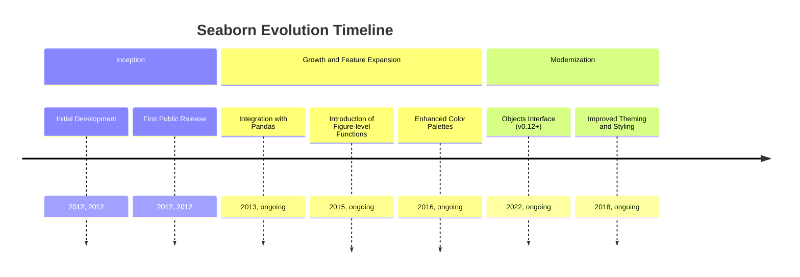
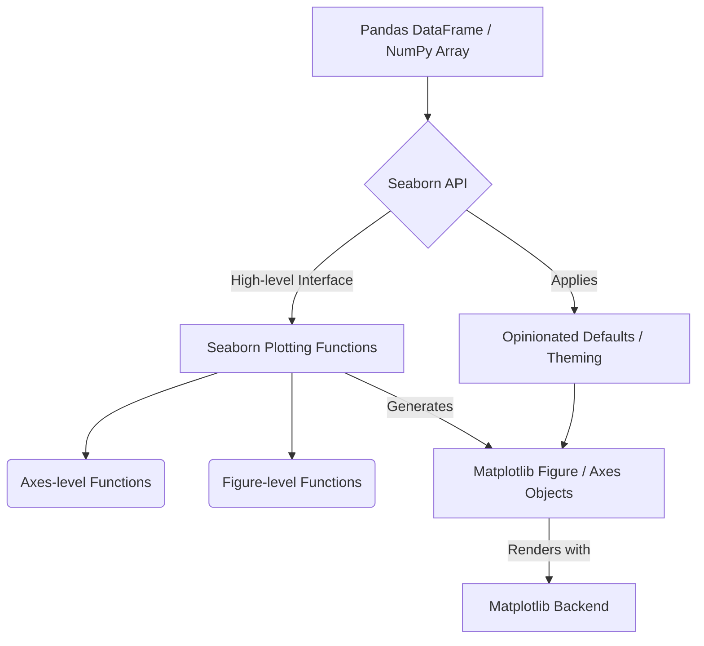
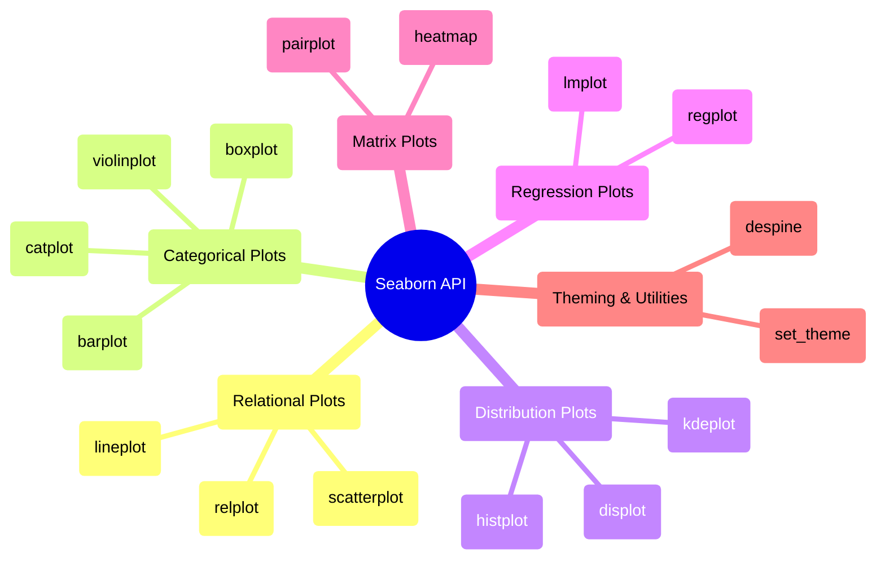

## Seaborn Evolution Document

### 1. Introduction and Historical Context

Seaborn is a Python data visualization library based on Matplotlib. It provides a high-level interface for drawing attractive and informative statistical graphics. While Matplotlib excels at providing fine-grained control over plots, Seaborn simplifies the process of creating complex statistical visualizations, making it easier to explore and understand data, especially when working with Pandas DataFrames.

Seaborn was created by Michael Waskom. It emerged to address the need for a more streamlined approach to generating aesthetically pleasing and statistically meaningful plots, building upon Matplotlib's foundational capabilities. The library's development has focused on providing a dataset-oriented API that automatically handles many of the underlying complexities of Matplotlib, allowing users to focus on the insights from their data rather than the intricacies of plotting.

### 1.1. Seaborn Evolution Timeline

### 2. Core Architecture

Seaborn's core architecture is built as a high-level abstraction layer on top of Matplotlib. It leverages Matplotlib's plotting capabilities while providing a more convenient and opinionated interface for statistical visualization. It is also deeply integrated with Pandas DataFrames, making it highly effective for working with tabular data.

#### 2.1. Matplotlib Backend

Seaborn relies on Matplotlib for its rendering backend. This means that any plot generated by Seaborn is ultimately a Matplotlib figure and axes object, allowing users to further customize Seaborn plots using Matplotlib's extensive API. This symbiotic relationship allows Seaborn to benefit from Matplotlib's robustness and flexibility while offering a simpler entry point for statistical plotting.

#### 2.2. Dataset-Oriented API

A key architectural principle of Seaborn is its **dataset-oriented API**. Instead of requiring users to manually map data columns to visual properties (like x-axis, y-axis, color), Seaborn functions often take entire Pandas DataFrames as input. It then intelligently maps columns to appropriate visual roles, performs necessary statistical aggregations, and handles the underlying Matplotlib calls to generate informative plots.

#### 2.3. Figure-level vs. Axes-level Functions

Seaborn categorizes its plotting functions into two main types:

*   **Axes-level functions**: These functions draw onto a single Matplotlib `Axes` object. Examples include `sns.scatterplot()`, `sns.histplot()`, `sns.boxplot()`. They are suitable for creating individual plots within a larger figure or when you need precise control over subplot placement.
*   **Figure-level functions**: These functions manage the entire figure and can create multiple plots (subplots) within a single figure. Examples include `sns.relplot()`, `sns.catplot()`, `sns.displot()`, `sns.jointplot()`, `sns.pairplot()`. They are powerful for exploring relationships across different subsets of data or variables, as they automatically handle the layout of multiple plots.

#### 2.4. Opinionated Defaults and Theming

Seaborn provides aesthetically pleasing default styles and color palettes. Functions like `sns.set_theme()` allow users to easily apply these themes, which then affect all subsequent Matplotlib plots, ensuring a consistent and professional look across visualizations.

**Mermaid Diagram: Seaborn Core Architecture**

### 3. Detailed API Overview

Seaborn's API is organized around different types of statistical relationships and plot categories.

#### 3.1. Relational Plots (`sns.relplot`, `sns.scatterplot`, `sns.lineplot`)

Used to visualize the relationship between two or more variables.

*   **`sns.relplot(data, x, y, kind='scatter', ...)`**: A figure-level function for drawing relational plots onto a FacetGrid.
*   **`sns.scatterplot(data, x, y, ...)`**: Draws a scatter plot with the possibility of several semantic groupings.
*   **`sns.lineplot(data, x, y, ...)`**: Draws a line plot with the possibility of several semantic groupings.

#### 3.2. Categorical Plots (`sns.catplot`, `sns.boxplot`, `sns.violinplot`, `sns.barplot`)

Used to visualize relationships between a numerical variable and one or more categorical variables.

*   **`sns.catplot(data, x, y, kind='strip', ...)`**: A figure-level function for drawing categorical plots onto a FacetGrid.
*   **`sns.boxplot(data, x, y, ...)`**: Draws a box plot to show distributions with respect to categories.
*   **`sns.violinplot(data, x, y, ...)`**: Draws a violin plot, which combines a box plot with a kernel density estimate.
*   **`sns.barplot(data, x, y, ...)`**: Shows point estimates and confidence intervals as rectangular bars.

#### 3.3. Distribution Plots (`sns.displot`, `sns.histplot`, `sns.kdeplot`)

Used to visualize the distribution of a single variable or the joint distribution of two variables.

*   **`sns.displot(data, x, kind='hist', ...)`**: A figure-level function for drawing distribution plots onto a FacetGrid.
*   **`sns.histplot(data, x, ...)`**: Plots a histogram of the data.
*   **`sns.kdeplot(data, x, ...)`**: Plots a univariate or bivariate kernel density estimate.

#### 3.4. Regression Plots (`sns.lmplot`, `sns.regplot`)

Used to visualize linear relationships between two variables.

*   **`sns.lmplot(data, x, y, ...)`**: A figure-level function for drawing linear models plots onto a FacetGrid.
*   **`sns.regplot(data, x, y, ...)`**: Plots data and a linear regression model fit.

#### 3.5. Matrix Plots (`sns.heatmap`, `sns.clustermap`, `sns.pairplot`)

Used for visualizing relationships in matrix format.

*   **`sns.heatmap(data, ...)`**: Plots rectangular data as a color-encoded matrix.
*   **`sns.pairplot(data, ...)`**: Plots pairwise relationships in a dataset.

#### 3.6. Theming and Utilities

*   **`sns.set_theme(style='darkgrid', palette='deep', ...)`**: Sets the aesthetic style of the plots.
*   **`sns.despine()`**: Removes the top and right spines from plots.

### 3.7. API Mindmap

### 4. Evolution and Impact

*   **Enhanced Statistical Visualization:** Seaborn has significantly improved the quality and ease of creating statistical visualizations in Python, making it a go-to library for exploratory data analysis.
*   **Bridging Matplotlib and Pandas:** It effectively bridges the gap between Matplotlib's low-level control and Pandas' high-level data structures, providing a powerful and intuitive workflow for data scientists.
*   **Aesthetic Defaults:** Seaborn's opinionated defaults for styles and color palettes have raised the bar for the aesthetic quality of plots in the Python ecosystem, making it easier for users to create professional-looking visualizations.
*   **Dataset-Oriented Approach:** Its dataset-oriented API encourages users to think about the statistical relationships within their data, rather than just the mechanics of plotting, leading to more insightful visualizations.
*   **Objects Interface (v0.12+):** The introduction of the Objects Interface in recent versions marks a significant evolution, offering a more declarative and flexible way to build complex plots, aligning with modern grammar-of-graphics principles.

### 5. Conclusion

Seaborn has established itself as an indispensable library for statistical data visualization in Python. By building upon Matplotlib and integrating seamlessly with Pandas, it provides a powerful, high-level, and aesthetically pleasing approach to exploring and understanding data. Its continuous evolution, including the recent Objects Interface, ensures that Seaborn remains at the forefront of data visualization, empowering users to communicate insights effectively and efficiently.
