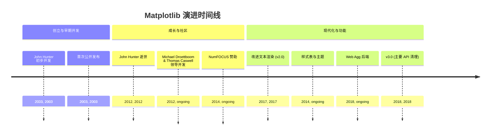
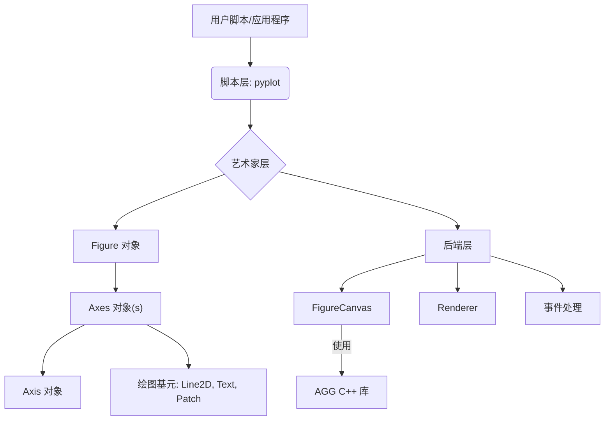
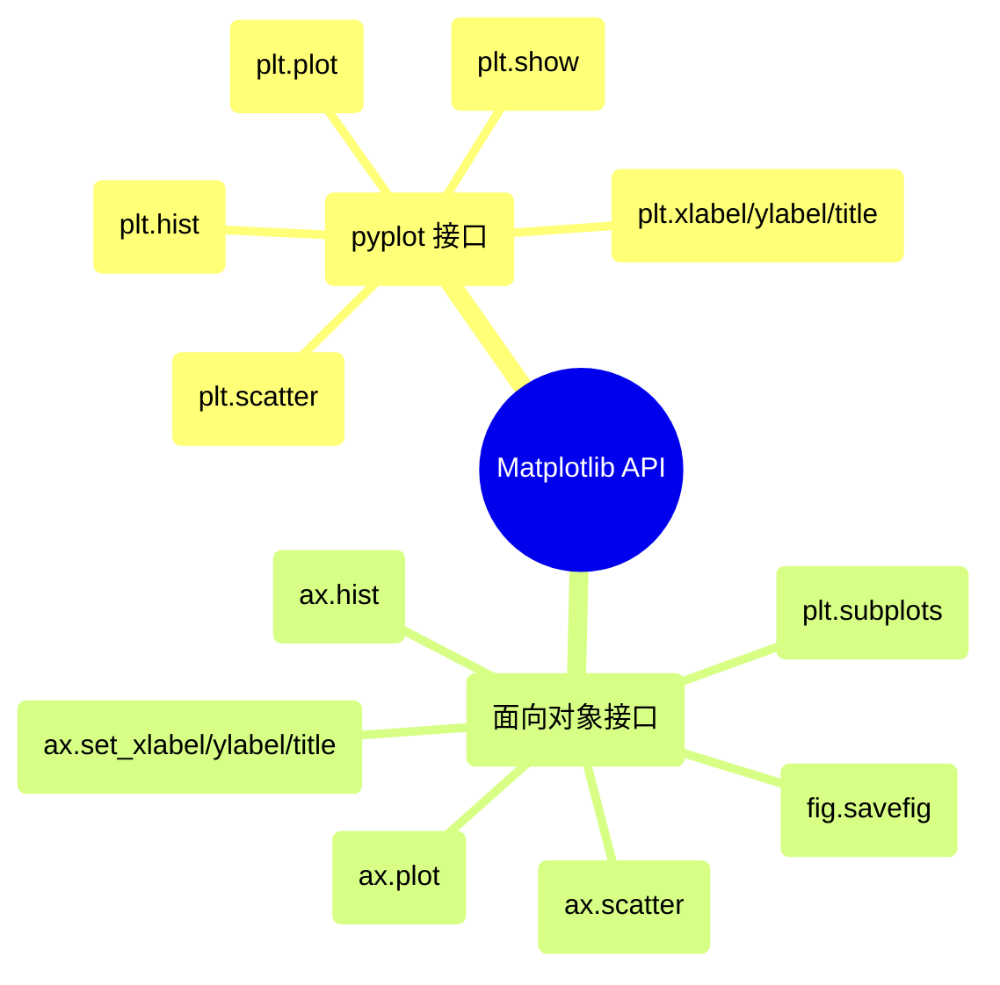

## Matplotlib 演进文档

### 1. 引言与历史背景

Matplotlib 是一个用于在 Python 中创建静态、动画和交互式可视化的综合库。它是科学 Python 生态系统的基石，提供了一个灵活而强大的工具，用于在数据科学、工程和研究等各个领域生成高质量的图表和图形。

Matplotlib 最初由 John Hunter 于 2003 年构思和开发。作为一名神经生物学家，Hunter 试图用一个开源的、基于 Python 的替代方案来取代专有的基于 MATLAB 的工具，用于分析脑电图 (ECOG) 信号。他的目标是创建一个绘图库，该库提供与 MATLAB 绘图函数类似的接口和功能，但位于 Python 环境中，从而实现研究人员之间更大的可扩展性和协作。

自成立以来，Matplotlib 已从一个类似 MATLAB 的脚本界面发展成为一个健壮的、面向对象的绘图库。它广泛利用 NumPy 进行数值运算，并培育了一个充满活力的开源社区，该社区继续推动其开发和维护。

### 1.1. Matplotlib 演进时间线



### 2. 核心架构

Matplotlib 的架构采用分层结构，提供不同级别的控制和抽象。这种设计允许用户使用高级接口快速创建简单图表，或使用更面向对象的方法对图表的每个元素进行精细控制。

#### 2.1. 后端层 (The Backend Layer)

这是最低层，负责处理实际的绘图并与操作系统的图形工具包交互。它由三个抽象接口类组成：

*   **`FigureCanvas`**: 绘制和显示图表的区域。它处理渲染到各种输出格式 (例如，屏幕、PNG、PDF)。
*   **`Renderer`**: 负责将抽象绘图命令转换为 `FigureCanvas` 上的特定绘图操作。Matplotlib 通常使用 Anti-Grain Geometry (AGG) C++ 库进行高性能 2D 渲染。
*   **`Event`**: 处理用户交互，例如键盘按键和鼠标点击，从而实现图表中的交互功能。

#### 2.2. 艺术家层 (The Artist Layer)

这是中间层，大部分绘图逻辑都位于此处。Matplotlib 图表上可见的一切都是 `Artist` 对象。Artist 可以是原始的 (例如，`Line2D`、`Rectangle`、`Text`) 或复合的 (其他 Artist 的集合)。

**心智模型 / 类比：**
*   **`Figure` (图表)：** 将 `Figure` 想象成一张完整的画布或一张空白纸，您将在上面绘制图表。它是包含所有与可视化相关内容的顶级容器。
*   **`Axes` (轴域)：** 现在，想象在这张纸上绘制一个或多个独立的图表（例如，条形图、折线图或散点图）。这些独立的图表中的每一个都是一个 `Axes` 对象。一个 `Axes` 有自己的 x 轴、y 轴、标题和标签。一个 `Figure` 上可以有多个 `Axes`（子图）。

*   **`Figure`**: 所有绘图元素的顶级容器。它可以包含多个 `Axes` 对象、标题、图例和其他 Artist。
*   **`Axes`**: 最重要的 `Artist` 对象，表示单个绘图区。大多数绘图方法 (例如，`plot()`、`scatter()`、`hist()`) 都定义为 `Axes` 对象的方法。一个 `Axes` 对象包含两个 (或 3D 中的三个) `Axis` 对象，它们处理刻度、刻度标签和轴标签。

#### 2.3. 脚本层 (`pyplot`)

这是最高级接口，旨在快速轻松地生成图表，模仿 MATLAB 的过程式绘图风格。`matplotlib.pyplot` 模块提供了一系列函数，它们隐式地创建和管理图表和轴，使其方便进行交互式绘图和简单脚本。

**Mermaid 图：Matplotlib 核心架构**



### 3. 详细 API 概述

Matplotlib 提供了两种主要的绘图方法：方便的 `pyplot` 接口用于快速绘图，以及更强大的面向对象 (OO) 接口用于精细控制。虽然 `pyplot` 通常用于初步探索，但 OO API 推荐用于复杂的可视化和程序化控制。

#### 3.1. `matplotlib.pyplot` 接口

这个过程式接口提供了一个状态机环境，其中函数隐式地对“当前”图表和轴进行操作。它非常适合交互式会话和简单图表。

##### 3.1.1. 创建折线图

**`plt.plot(x, y, ...)`**

**目标：** 创建 `y` 对 `x` 的二维折线图。

**代码：**
```python
import matplotlib.pyplot as plt
import numpy as np

x = np.linspace(0, 10, 100)
y = np.sin(x)

plt.plot(x, y, label='sin(x)', color='blue', linestyle='--')
plt.xlabel('X-axis')
plt.ylabel('Y-axis')
plt.title('Simple Sine Wave')
plt.legend()
plt.grid(True)
plt.show()
```

**预期输出：**
(一个绘图窗口，显示从 0 到 10 的蓝色虚线正弦波，带有 x 轴和 y 轴标签、标题、图例和网格。)

**解释：** `plt.plot()` 是最基本的绘图函数。它接受 x 和 y 坐标并绘制线条和/或标记。您可以自定义线条样式、颜色并添加图例标签。`plt.show()` 对于显示图表是必需的。

*   **背景:** 在当前 `Axes` 上绘制线条和/或标记。
*   **参数:**
        *   `x`, `y`: 数据点的水平和垂直坐标。
        *   `fmt`: (可选) 格式字符串，例如 `'ro-'` 表示带实线的红色圆圈。
    *   **返回:** `Line2D` 对象列表。

*   **`plt.scatter(x, y, ...)`**

##### 3.1.2. 创建散点图

**`plt.scatter(x, y, ...)`**

**目标：** 创建 `y` 对 `x` 的散点图，并可自定义标记。

**代码：**
```python
import matplotlib.pyplot as plt
import numpy as np

np.random.seed(42)
x = np.random.rand(50)
y = np.random.rand(50)
sizes = np.random.randint(20, 200, 50) # 标记大小
colors = np.random.rand(50) # 标记颜色

plt.scatter(x, y, s=sizes, c=colors, alpha=0.7, cmap='viridis')
plt.xlabel('X-value')
plt.ylabel('Y-value')
plt.title('Random Scatter Plot')
plt.colorbar(label='Color Value') # 添加颜色条
plt.grid(True)
plt.show()
```

**预期输出：**
(一个绘图窗口，显示包含 50 个点的散点图，点的大小和颜色各不相同，带有 x 轴和 y 轴标签、标题、颜色条和网格。)

**解释：** `plt.scatter()` 用于可视化两个变量之间的关系，通常用标记大小 (`s`) 和颜色 (`c`) 表示附加维度。`alpha` 控制透明度，`cmap` 设置颜色映射。

*   **背景:** 创建 `x` 对 `y` 的散点图。
*   **参数:**
        *   `x`, `y`: 数据位置。
        *   `s`: (可选) 标记大小，单位为点^2。
        *   `c`: (可选) 标记颜色。
    *   **返回:** `PathCollection` 对象。

*   **`plt.hist(x, bins=10, ...)`**

##### 3.1.3. 创建直方图

**`plt.hist(x, bins=10, ...)`**

**目标：** 生成直方图以可视化数据集的分布。

**代码：**
```python
import matplotlib.pyplot as plt
import numpy as np

np.random.seed(42)
data = np.random.randn(1000) # 1000 个来自正态分布的随机数

plt.hist(data, bins=30, color='skyblue', edgecolor='black', alpha=0.7)
plt.xlabel('Value')
plt.ylabel('Frequency')
plt.title('Distribution of Random Data')
plt.grid(axis='y', alpha=0.75)
plt.show()
```

**预期输出：**
(一个绘图窗口，显示一个包含 30 个 bin 的直方图，天蓝色条形，黑色边缘，x 轴和 y 轴标签、标题和网格。)

**解释：** `plt.hist()` 用于表示数值数据的频率分布。`bins` 参数控制数据被划分成的区间（bin）数量。`edgecolor` 和 `alpha` 是常见的审美定制。

*   **背景:** 绘制直方图。
*   **参数:**
        *   `x`: 被分箱的输入数据。
        *   `bins`: (可选) 直方图的 bin 数量。
    *   **返回:** `(n, bins, patches)` 元组。

*   **`plt.xlabel(label)`, `plt.ylabel(label)`, `plt.title(title)`**

##### 3.1.4. 自定义图表标签和标题

**`plt.xlabel(label)`, `plt.ylabel(label)`, `plt.title(title)`**

**目标：** 为 x 轴和 y 轴添加描述性标签，并为图表添加标题。

**代码：**
```python
import matplotlib.pyplot as plt
import numpy as np

x = np.array([1, 2, 3, 4])
y = x**2

plt.plot(x, y)
plt.xlabel('Input Value') # 设置 x 轴标签
plt.ylabel('Squared Value') # 设置 y 轴标签
plt.title('Relationship between Input and Squared Value') # 设置图表标题
plt.show()
```

**预期输出：**
(一个绘图窗口，显示一个折线图，x 轴标记为“Input Value”，y 轴标记为“Squared Value”，标题为“Relationship between Input and Squared Value”。)

**解释：** 这些函数直接用于为图表添加必要的描述性文本，使其易于理解。在 `pyplot` 中，它们作用于当前活动的 `Axes`。

*   **背景:** 分别设置 x 轴、y 轴的标签和当前 `Axes` 的标题。

*   **`plt.show()`**

##### 3.1.5. 显示图表

**`plt.show()`**

**目标：** 显示所有打开的 Matplotlib 图表并阻塞执行，直到它们关闭。

**代码：**
```python
import matplotlib.pyplot as plt
import numpy as np

plt.plot([1, 2, 3], [4, 5, 6])
plt.title("First Plot")

# 在新图中创建第二个图表
plt.figure() # 创建一个新图表
plt.scatter(np.random.rand(10), np.random.rand(10))
plt.title("Second Plot")

plt.show() # 显示两个图表
print("Plots displayed and closed.") # 此行在图表关闭后执行
```

**预期输出：**
(将出现两个独立的绘图窗口：一个带有标题为“First Plot”的折线图，另一个带有标题为“Second Plot”的散点图。手动关闭两个窗口后，控制台将打印“Plots displayed and closed。”。)

**解释：** `plt.show()` 对于渲染图表至关重要。在交互式环境（如 Jupyter Notebook）中，图表可能会自动显示，但在脚本中，`plt.show()` 是必需的。它会暂停脚本执行，直到绘图窗口关闭。

*   **背景:** 显示所有打开的图表。此函数会阻塞执行，直到所有图表关闭。

##### 3.1.6. 快速参考：`pyplot` 接口

| 函数 | 描述 | 何时使用 |
| :--- | :--- | :--- |
| `plt.plot()` | 折线图 | 简单的二维折线图和系列数据。 |
| `plt.scatter()` | 散点图 | 可视化两个变量之间的关系，通常带有大小/颜色编码。 |
| `plt.hist()` | 直方图 | 显示单个数值变量的分布。 |
| `plt.xlabel()`、`plt.ylabel()`、`plt.title()` | 标签和标题 | 添加描述性文本以使图表易于理解。 |
| `plt.show()` | 显示图表 | 渲染和显示生成的图表。 |

#### 3.2. 面向对象 (OO) 接口

这种方法提供了对图表和轴对象的显式控制，使其适用于复杂图表、嵌入到 GUI 应用程序以及创建可重用的绘图函数。

##### 3.2.1. 创建图表和轴域

**`fig, ax = plt.subplots(nrows=1, ncols=1, ...)`**

**目标：** 创建一个 `Figure` 对象和一个或多个 `Axes` 对象，它们是实际的绘图区域。

**代码：**
```python
import matplotlib.pyplot as plt
import numpy as np

# 创建一个图表和一个轴域
fig1, ax1 = plt.subplots() # 默认 1x1 网格
ax1.plot([1, 2, 3], [1, 4, 9])
ax1.set_title('Single Subplot')

# 创建一个包含 1x2 子图网格的图表
fig2, (ax2, ax3) = plt.subplots(1, 2, figsize=(10, 4))
ax2.plot(np.sin(np.linspace(0, 2*np.pi, 50)))
ax2.set_title('Sine Wave')
ax3.plot(np.cos(np.linspace(0, 2*np.pi, 50)), color='orange')
ax3.set_title('Cosine Wave')
fig2.suptitle('Two Subplots on One Figure') # 整个图表的标题

plt.tight_layout() # 调整子图参数以实现紧凑布局
plt.show()
```

**预期输出：**
(将出现两个独立的绘图窗口。第一个显示一个带有抛物线的图表。第二个显示一个包含两个并排子图的图表，一个带有正弦波，一个带有余弦波，以及整个图表的主标题。)

**解释：** `plt.subplots()` 是开始使用 OO 接口的推荐方式。它返回一个 `Figure` 对象 (`fig`) 和一个 `Axes` 对象（如果 `nrows` 或 `ncols` > 1，则返回 `Axes` 对象的数组）。然后，您直接在这些 `ax` 对象上调用绘图方法。

*   **背景:** 创建一个图表和一组子图。这是开始使用 OO 接口最常见的方式。
*   **参数:**
        *   `nrows`, `ncols`: 子图网格的行数和列数。
    *   **返回:** `(Figure, Axes)` 元组或 `(Figure, Axes 的 ndarray)`。

*   **`ax.plot(x, y, ...)`**, **`ax.scatter(x, y, ...)`**, **`ax.hist(x, bins=10, ...)`**

##### 3.2.2. 在特定轴域上绘图

**`ax.plot(x, y, ...)`**, **`ax.scatter(x, y, ...)`**, **`ax.hist(x, bins=10, ...)`**

**目标：** 直接在特定的 `Axes` 对象上创建各种类型的图表，从而实现多面板图表。

**代码：**
```python
import matplotlib.pyplot as plt
import numpy as np

fig, axes = plt.subplots(1, 3, figsize=(15, 5)) # 一行三列子图

x_data = np.linspace(0, 10, 50)
y_data = np.sin(x_data)

# 在第一个轴域上绘制折线图
axes[0].plot(x_data, y_data, color='red')
axes[0].set_title('Line Plot')
axes[0].set_xlabel('X')
axes[0].set_ylabel('sin(X)')

# 在第二个轴域上绘制散点图
np.random.seed(0)
scatter_x = np.random.rand(30)
scatter_y = np.random.rand(30)
axes[1].scatter(scatter_x, scatter_y, color='green', alpha=0.6)
axes[1].set_title('Scatter Plot')

# 在第三个轴域上绘制直方图
hist_data = np.random.randn(1000)
axes[2].hist(hist_data, bins=20, color='purple', edgecolor='black')
axes[2].set_title('Histogram')

plt.tight_layout() # 调整布局以防止重叠
plt.show()
```

**预期输出：**
(一个绘图窗口，显示三个并排的子图：一个红色折线图、一个绿色散点图和一个紫色直方图，每个都有自己的标题和标签。)

**解释：** 在 OO 接口中，绘图方法直接在 `Axes` 对象上调用（例如，`ax.plot()`）。这使您可以明确控制哪个子图接收哪个图表，从而轻松创建具有多个可视化的复杂布局。

*   **背景:** 这些是 `pyplot` 函数的 OO 等效项，直接在 `Axes` 对象上调用。

*   **`ax.set_xlabel(label)`, `ax.set_ylabel(label)`, `ax.set_title(title)`**

##### 3.2.3. 自定义轴域标签和标题

**`ax.set_xlabel(label)`, `ax.set_ylabel(label)`, `ax.set_title(title)`**

**目标：** 为特定的 `Axes` 对象设置 x 轴和 y 轴的描述性标签以及标题。

**代码：**
```python
import matplotlib.pyplot as plt

fig, ax = plt.subplots()
ax.plot([1, 2, 3], [10, 20, 15])
ax.set_xlabel('Experiment Duration (hours)') # 设置此轴域的 x 轴标签
ax.set_ylabel('Measured Value') # 设置此轴域的 y 轴标签
ax.set_title('Results of Experiment A') # 设置此轴域的标题
plt.show()
```

**预期输出：**
(一个绘图窗口，显示一个折线图，x 轴标记为“Experiment Duration (hours)”，y 轴标记为“Measured Value”，标题为“Results of Experiment A”。)

**解释：** 在 OO 接口中，您直接在 `Axes` 对象上使用 `set_xlabel()`、`set_ylabel()` 和 `set_title()` 方法来自定义其特定的标签和标题。这在处理单个图表上的多个子图时至关重要。

*   **背景:** 为特定的 `Axes` 对象设置标签和标题。

*   **`fig.savefig(fname, ...)`**

##### 3.2.4. 将图表保存到文件

**`fig.savefig(fname, ...)`**

**目标：** 将整个 `Figure` 保存到各种格式（例如，PNG、PDF、SVG）的文件中。

**代码：**
```python
import matplotlib.pyplot as plt
import numpy as np
import os

fig, ax = plt.subplots(figsize=(8, 6))
ax.plot(np.linspace(0, 10, 100), np.cos(np.linspace(0, 10, 100)))
ax.set_title('Cosine Wave Plot')
ax.set_xlabel('X')
ax.set_ylabel('cos(X)')

filename = "cosine_plot.png"
fig.savefig(filename, dpi=300, bbox_inches='tight')
print(f"Figure saved to {filename}")

# 清理创建的文件
os.remove(filename)
print(f"Cleaned up {filename}")
```

**预期输出：**
```
Figure saved to cosine_plot.png
Cleaned up cosine_plot.png
```
(将在当前目录中创建一个名为 `cosine_plot.png` 的文件，其中包含该图表。然后该文件将被删除。)

**解释：** `fig.savefig()` 用于导出您的可视化。您可以指定文件名、分辨率 (`dpi`)，并使用 `bbox_inches='tight'` 以确保所有元素（如标签）都包含在内而不会被裁剪。Matplotlib 会根据文件扩展名推断文件格式。

*   **背景:** 将当前图表保存到文件。
*   **参数:**
        *   `fname`: 文件名或类文件对象。
        *   `dpi`: (可选) 每英寸点数的分辨率。

##### 3.2.5. 快速参考：面向对象接口

| 函数/方法 | 描述 | 何时使用 |
| :--- | :--- | :--- |
| `plt.subplots()` | 创建图表和轴域 | 大多数 OO 绘图的起点，特别是包含多个子图时。 |
| `ax.plot()`、`ax.scatter()`、`ax.hist()` | 在轴域上绘图 | 在指定的子图上创建特定类型的图表。 |
| `ax.set_xlabel()`、`ax.set_ylabel()`、`ax.set_title()` | 轴域标签和标题 | 自定义单个子图的标签和标题。 |
| `fig.savefig()` | 保存图表 | 将整个图表导出到文件。 |

### 3.3. API 思维导图

### 3.3. API 思维导图



### 4. 演变与影响

*   **多功能性与定制性:** Matplotlib 的优势在于其无与伦比的多功能性和定制选项。它允许用户创建几乎任何类型的静态、动画或交互式可视化，并对每个美学细节进行精细控制。
*   **其他库的基础:** Matplotlib 作为许多其他 Python 可视化库的底层绘图引擎，例如 Seaborn (用于统计图形) 和 Pandas (用于 DataFrame 绘图方法)。这使得它成为任何在 Python 中进行数据可视化的人的基本技能。
*   **持续发展:** 尽管 Matplotlib 已经成熟，但它仍在不断发展。最近的发展包括改进的文本渲染、新的样式表、更好的 Web 后端以及持续的 API 清理 (例如，在 v3.0 中) 以增强一致性和可用性。
*   **社区与文档:** 强大的开源社区为其开发做出贡献，提供广泛的文档，并提供支持，确保其持续的相关性和健壮性。

### 5. 结论

Matplotlib 已经巩固了其作为 Python 不可或缺的绘图库的地位。它诞生于对开源科学可视化的需求，现已发展成为一个强大、灵活且高度可定制的工具。其分层架构、双重 API 接口和持续演进确保它始终处于数据可视化的前沿，使研究人员和开发人员能够通过引人注目的图形有效地传达见解。