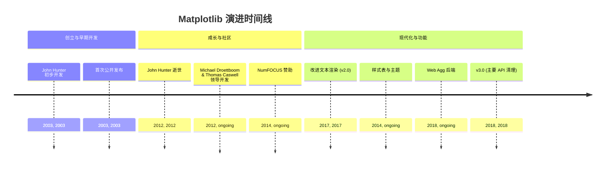
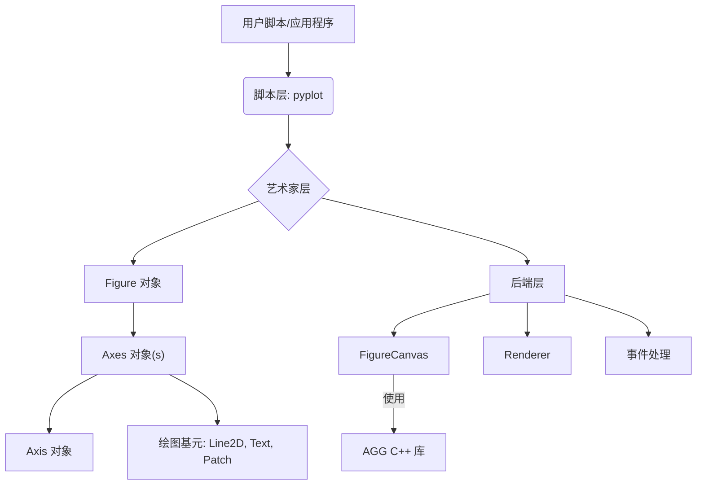
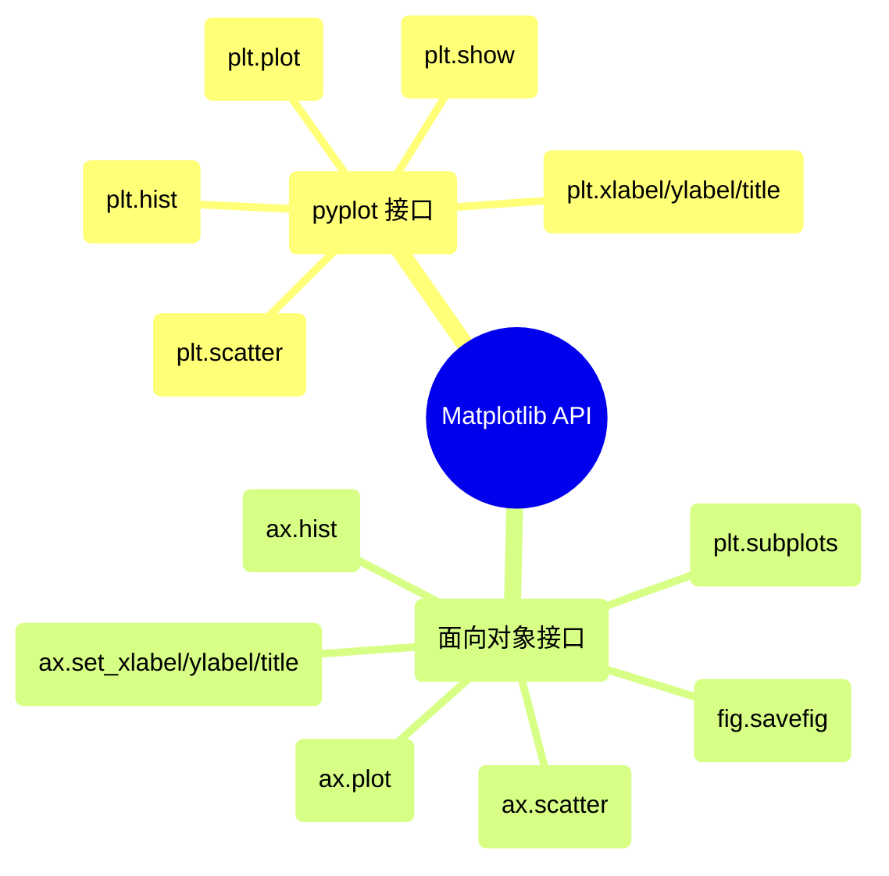

## Matplotlib 演进文档

### 1. 引言与历史背景

Matplotlib 是一个用于在 Python 中创建静态、动画和交互式可视化的综合库。它是科学 Python 生态系统的基石，提供了一个灵活而强大的工具，用于在数据科学、工程和研究等各个领域生成高质量的图表和图形。

Matplotlib 最初由 John Hunter 于 2003 年构思和开发。作为一名神经生物学家，Hunter 试图用一个开源的、基于 Python 的替代方案来取代专有的基于 MATLAB 的工具，用于分析脑电图 (ECOG) 信号。他的目标是创建一个绘图库，该库提供与 MATLAB 绘图函数类似的接口和功能，但位于 Python 环境中，从而实现研究人员之间更大的可扩展性和协作。

自成立以来，Matplotlib 已从一个类似 MATLAB 的脚本界面发展成为一个健壮的、面向对象的绘图库。它广泛利用 NumPy 进行数值运算，并培育了一个充满活力的开源社区，该社区继续推动其开发和维护。

### 1.1. Matplotlib 演进时间线



### 2. 核心架构

Matplotlib 的架构采用分层结构，提供不同级别的控制和抽象。这种设计允许用户使用高级接口快速创建简单图表，或使用更面向对象的方法对图表的每个元素进行精细控制。

#### 2.1. 后端层 (The Backend Layer)

这是最低层，负责处理实际的绘图并与操作系统的图形工具包交互。它由三个抽象接口类组成：

*   **`FigureCanvas`**: 绘制和显示图表的区域。它处理渲染到各种输出格式 (例如，屏幕、PNG、PDF)。
*   **`Renderer`**: 负责将抽象绘图命令转换为 `FigureCanvas` 上的特定绘图操作。Matplotlib 通常使用 Anti-Grain Geometry (AGG) C++ 库进行高性能 2D 渲染。
*   **`Event`**: 处理用户交互，例如键盘按键和鼠标点击，从而实现图表中的交互功能。

#### 2.2. 艺术家层 (The Artist Layer)

这是中间层，大部分绘图逻辑都位于此处。Matplotlib 图表上可见的一切都是 `Artist` 对象。Artist 可以是原始的 (例如，`Line2D`、`Rectangle`、`Text`) 或复合的 (其他 Artist 的集合)。

*   **`Figure`**: 所有绘图元素的顶级容器。它可以包含多个 `Axes` 对象、标题、图例和其他 Artist。
*   **`Axes`**: 最重要的 `Artist` 对象，表示单个绘图区。大多数绘图方法 (例如，`plot()`、`scatter()`、`hist()`) 都定义为 `Axes` 对象的方法。一个 `Axes` 对象包含两个 (或 3D 中的三个) `Axis` 对象，它们处理刻度、刻度标签和轴标签。

#### 2.3. 脚本层 (`pyplot`)

这是最高级接口，旨在快速轻松地生成图表，模仿 MATLAB 的过程式绘图风格。`matplotlib.pyplot` 模块提供了一系列函数，它们隐式地创建和管理图表和轴，使其方便进行交互式绘图和简单脚本。

**Mermaid 图：Matplotlib 核心架构**



### 3. 详细 API 概述

Matplotlib 提供了两种主要的绘图方法：方便的 `pyplot` 接口用于快速绘图，以及更强大的面向对象 (OO) 接口用于精细控制。虽然 `pyplot` 通常用于初步探索，但 OO API 推荐用于复杂的可视化和程序化控制。

#### 3.1. `matplotlib.pyplot` 接口

这个过程式接口提供了一个状态机环境，其中函数隐式地对“当前”图表和轴进行操作。它非常适合交互式会话和简单图表。

*   **`plt.plot(x, y, ...)`**
    *   **背景:** 在当前 `Axes` 上绘制线条和/或标记。
    *   **参数:**
        *   `x`, `y`: 数据点的水平和垂直坐标。
        *   `fmt`: (可选) 格式字符串，例如 `'ro-'` 表示带实线的红色圆圈。
    *   **返回:** `Line2D` 对象列表。

*   **`plt.scatter(x, y, ...)`**
    *   **背景:** 创建 `x` 对 `y` 的散点图。
    *   **参数:**
        *   `x`, `y`: 数据位置。
        *   `s`: (可选) 标记大小，单位为点^2。
        *   `c`: (可选) 标记颜色。
    *   **返回:** `PathCollection` 对象。

*   **`plt.hist(x, bins=10, ...)`**
    *   **背景:** 绘制直方图。
    *   **参数:**
        *   `x`: 被分箱的输入数据。
        *   `bins`: (可选) 直方图的 bin 数量。
    *   **返回:** `(n, bins, patches)` 元组。

*   **`plt.xlabel(label)`, `plt.ylabel(label)`, `plt.title(title)`**
    *   **背景:** 分别设置 x 轴、y 轴的标签和当前 `Axes` 的标题。

*   **`plt.show()`**
    *   **背景:** 显示所有打开的图表。此函数会阻塞执行，直到所有图表关闭。

#### 3.2. 面向对象 (OO) 接口

这种方法提供了对图表和轴对象的显式控制，使其适用于复杂图表、嵌入到 GUI 应用程序以及创建可重用的绘图函数。

*   **`fig, ax = plt.subplots(nrows=1, ncols=1, ...)`**
    *   **背景:** 创建一个图表和一组子图。这是开始使用 OO 接口最常见的方式。
    *   **参数:**
        *   `nrows`, `ncols`: 子图网格的行数和列数。
    *   **返回:** `(Figure, Axes)` 元组或 `(Figure, Axes 的 ndarray)`。

*   **`ax.plot(x, y, ...)`**, **`ax.scatter(x, y, ...)`**, **`ax.hist(x, bins=10, ...)`**
    *   **背景:** 这些是 `pyplot` 函数的 OO 等效项，直接在 `Axes` 对象上调用。

*   **`ax.set_xlabel(label)`, `ax.set_ylabel(label)`, `ax.set_title(title)`**
    *   **背景:** 为特定的 `Axes` 对象设置标签和标题。

*   **`fig.savefig(fname, ...)`**
    *   **背景:** 将当前图表保存到文件。
    *   **参数:**
        *   `fname`: 文件名或类文件对象。
        *   `dpi`: (可选) 每英寸点数的分辨率。

### 3.3. API 思维导图



### 3.3. API 思维导图


### 4. 演变与影响

*   **多功能性与定制性:** Matplotlib 的优势在于其无与伦比的多功能性和定制选项。它允许用户创建几乎任何类型的静态、动画或交互式可视化，并对每个美学细节进行精细控制。
*   **其他库的基础:** Matplotlib 作为许多其他 Python 可视化库的底层绘图引擎，例如 Seaborn (用于统计图形) 和 Pandas (用于 DataFrame 绘图方法)。这使得它成为任何在 Python 中进行数据可视化的人的基本技能。
*   **持续发展:** 尽管 Matplotlib 已经成熟，但它仍在不断发展。最近的发展包括改进的文本渲染、新的样式表、更好的 Web 后端以及持续的 API 清理 (例如，在 v3.0 中) 以增强一致性和可用性。
*   **社区与文档:** 强大的开源社区为其开发做出贡献，提供广泛的文档，并提供支持，确保其持续的相关性和健壮性。

### 5. 结论

Matplotlib 已经巩固了其作为 Python 不可或缺的绘图库的地位。它诞生于对开源科学可视化的需求，现已发展成为一个强大、灵活且高度可定制的工具。其分层架构、双重 API 接口和持续演进确保它始终处于数据可视化的前沿，使研究人员和开发人员能够通过引人注目的图形有效地传达见解。

### 6. 典型用例

- 使用 pyplot 快速绘图

```python
import matplotlib.pyplot as plt
import numpy as np

x = np.linspace(0, 2*np.pi, 200)
y = np.sin(x)

plt.plot(x, y, label="sin(x)")
plt.xlabel("x")
plt.ylabel("y")
plt.title("快速绘制正弦波")
plt.legend()
plt.show()
```

- 面向对象的子图与定制

```python
import matplotlib.pyplot as plt
import numpy as np

x = np.linspace(0, 2*np.pi, 200)
fig, axes = plt.subplots(1, 2, figsize=(8, 3))
axes[0].plot(x, np.sin(x), color="tab:blue")
axes[0].set_title("sin(x)")
axes[1].plot(x, np.cos(x), color="tab:orange", linestyle="--")
axes[1].set_title("cos(x)")
fig.suptitle("三角函数")
fig.tight_layout()
plt.show()
```

- 使用样式表进行美化

```python
import matplotlib.pyplot as plt
import numpy as np

plt.style.use("seaborn-v0_8-darkgrid")
x = np.linspace(0, 10, 100)
plt.scatter(x, np.sqrt(x), s=30, c=x, cmap="viridis")
plt.colorbar(label="x")
plt.title("带颜色映射的样式化散点图")
plt.show()
```

- 保存高分辨率图片

```python
import matplotlib.pyplot as plt

fig, ax = plt.subplots()
ax.bar(["A", "B", "C"], [3, 5, 2])
fig.savefig("bar_high_res.png", dpi=300, bbox_inches="tight")
```