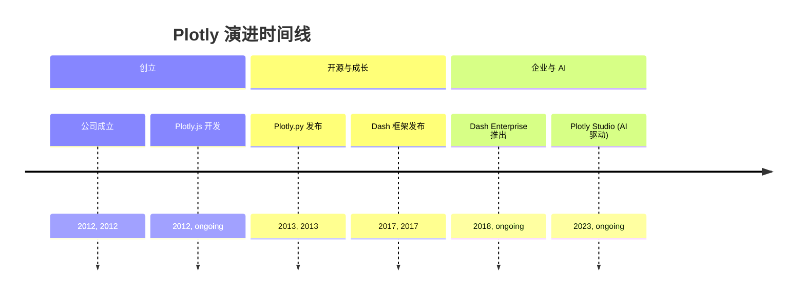
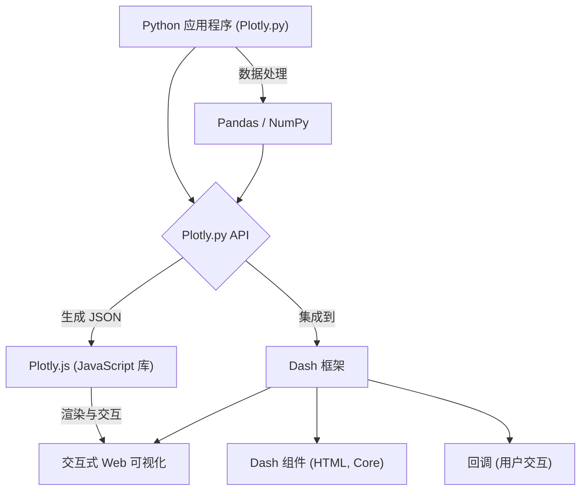

## Plotly 演进文档

### 1. 引言与历史背景

Plotly 是一家领先的技术计算公司，开发用于数据分析和交互式可视化的开源和企业工具。其 Python 库 Plotly.py 使用户能够创建各种交互式、基于网络的图表、仪表板和分析性网络应用程序。Plotly 的优势在于它能够生成高质量、交互式的可视化，这些可视化可以轻松嵌入网页、Jupyter Notebook 或使用 Dash 等框架集成到强大的网络应用程序中。

Plotly 由 Alex Johnson、Jack Parmer、Chris Parmer 和 Matthew Sundquist 于 2012 年创立。公司最初的重点是创建用户友好、交互式、基于网络的數據可视化工具，特别是针对科学和工程领域。Plotly 历史上的一个重要里程碑是其开源工具的开发，包括 **Plotly.js**（为 Plotly 提供支持的 JavaScript 图形库）、**Plotly.py**（Python 包装器）和 **Dash**（用于构建分析性网络应用程序的开源框架）。

Dash 于 2017 年发布，通过允许用户完全使用 Python（或 R 和 Julia）构建交互式网络应用程序，而无需广泛的网络开发知识，彻底改变了分析性网络应用程序的创建。Plotly 继续通过 Dash Enterprise 等产品扩展其产品，Dash Enterprise 是一个旨在帮助组织扩展、发布和安全共享其数据应用程序的平台，最近还推出了 Plotly Studio，这是一款由 AI 驱动的工具，旨在快速将数据转换为交互式应用程序。

### 1.1. Plotly 演进时间线



### 2. 核心架构

Plotly 的核心架构旨在通过利用 Web 技术（JavaScript、HTML、CSS）在网页或应用程序中渲染交互式图表。Python 库（`Plotly.py`）充当一个强大的接口，用于生成必要的 JSON 结构，然后由底层 JavaScript 库 Plotly.js 消费和渲染。

#### 2.1. Plotly.js: 渲染引擎

Plotly 可视化功能的核心是 **Plotly.js**，一个强大的开源 JavaScript 图形库。当您使用 Plotly.py 创建图表时，Python 代码会生成图表的 JSON 表示。然后将此 JSON 传递给 Plotly.js，由其处理客户端渲染、交互性（缩放、平移、悬停）和可视化的响应性。这种关注点分离允许在 Web 环境中轻松嵌入丰富的交互式图形。

#### 2.2. Python API (Plotly.py)

Plotly.py 提供了 Plotly.js 的全面 Python 接口。它允许用户使用 Python 对象定义图表、轨迹（数据系列）、布局和其他绘图属性。然后将这些 Python 对象序列化为 Plotly.js 理解的 JSON。这种抽象允许 Python 用户创建复杂的交互式可视化，而无需编写任何 JavaScript。

#### 2.3. Dash 框架集成

**Dash** 是 Plotly 生态系统的一个关键组件，它支持创建交互式分析性网络应用程序。Dash 应用程序通过组合组件（HTML、核心组件、自定义组件）的布局并定义回调来构建，这些回调根据用户交互更新应用程序的输出。Plotly 图表无缝集成到 Dash 应用程序中，从而实现动态和交互式仪表板。

**Mermaid 图：Plotly 核心架构**



### 3. 详细 API 概述

Plotly 的 Python API 主要围绕两个不同的接口构建：Plotly Express 用于高级、快速绘图，Plotly Graph Objects 用于细粒度控制。

#### 3.1. Plotly Express (`plotly.express`)

Plotly Express (`px`) 是一个高级 API，旨在以最少的代码快速生成各种常见图表类型。它非常适合快速数据探索和可视化。

*   **`px.scatter(data_frame, x, y, ...)`**: 创建散点图。
*   **`px.line(data_frame, x, y, ...)`**: 创建折线图。
*   **`px.bar(data_frame, x, y, ...)`**: 创建条形图。
*   **`px.histogram(data_frame, x, ...)`**: 创建直方图。
*   **`px.choropleth(data_frame, locations, color, ...)`**: 创建等值线图。

#### 3.2. Plotly Graph Objects (`plotly.graph_objects`)

Plotly Graph Objects (`go`) 是一个低级 API，它提供对绘图各个方面的广泛控制和自定义。它使用 `Figure`、`layout` 和 `data` 等基本对象进行操作。

*   **`go.Figure(data=None, layout=None)`**: 用于创建和操作图表的主要类。
*   **`go.Scatter(x, y, mode, ...)`**: 表示散点图轨迹。
*   **`go.Bar(x, y, ...)`**: 表示条形图轨迹。
*   **`go.Layout(title, xaxis, yaxis, ...)`**: 定义图表的布局（标题、轴、注释）。
*   **`fig.add_trace(trace)`**: 向图表添加轨迹。
*   **`fig.update_layout(title_text, ...)`**: 更新布局属性。

#### 3.3. 子图 (`plotly.subplots`)

*   **`plotly.subplots.make_subplots(rows, cols, ...)`**: 创建带有子图网格的图表。

#### 3.4. 输入/输出 (`plotly.io`)

*   **`plotly.io.write_html(fig, file, ...)`**: 将图表写入 HTML 文件。
*   **`plotly.io.to_json(fig)`**: 将图表转换为其 JSON 表示。

### 3.5. API 思维导图

```mermaid
mindmap
  root((Plotly API))
    (Plotly Express (px))
      (px.scatter)
      (px.line)
      (px.bar)
      (px.histogram)
      (px.choropleth)
    (Plotly Graph Objects (go))
      (go.Figure)
      (go.Scatter)
      (go.Bar)
      (go.Layout)
      (fig.add_trace)
      (fig.update_layout)
    (子图)
      (make_subplots)
    (输入/输出)
      (write_html)
      (to_json)
```

### 4. 演变与影响

*   **交互式可视化标准:** Plotly 为 Python 中的交互式、基于网络的數據可视化设定了高标准，使其成为动态和引人入胜的图表的首选。
*   **Dash: 彻底改变分析应用程序:** Dash 的引入具有变革性，使数据科学家能够完全使用 Python 构建复杂的交互式网络应用程序，弥合了数据科学与网络开发之间的鸿沟。
*   **开源生态系统:** Plotly 对开源（Plotly.js、Plotly.py、Dash）的承诺培养了一个充满活力的社区以及丰富的工具和资源生态系统。
*   **企业解决方案:** 借助 Dash Enterprise，Plotly 为组织提供了强大的解决方案，以安全地扩展、部署和管理其分析应用程序，满足生产环境的需求。
*   **AI 驱动工具 (Plotly Studio):** 最近推出的 AI 驱动工具（如 Plotly Studio）展示了其持续创新，旨在进一步简化和加速创建交互式数据应用程序的过程。

### 5. 结论

Plotly 已发展成为一个用于交互式数据可视化和分析性网络应用程序开发的综合平台。其强大的 Python API，由健壮的 Plotly.js 库支持，使用户能够创建令人惊叹且富有洞察力的交互式图表。开创性的 Dash 框架进一步扩大了其影响力，使数据科学家能够轻松构建和部署功能齐全的网络应用程序。Plotly 从开源工具到企业解决方案和 AI 驱动功能的持续创新，巩固了其在数据可视化和分析应用程序领域的领导地位。
