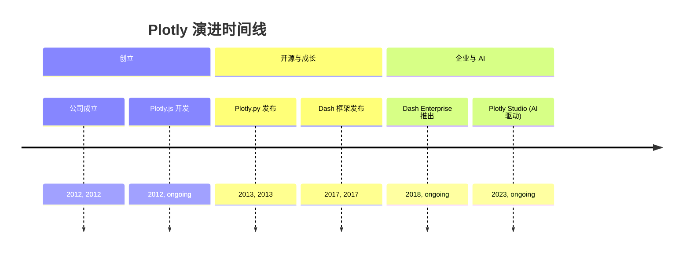
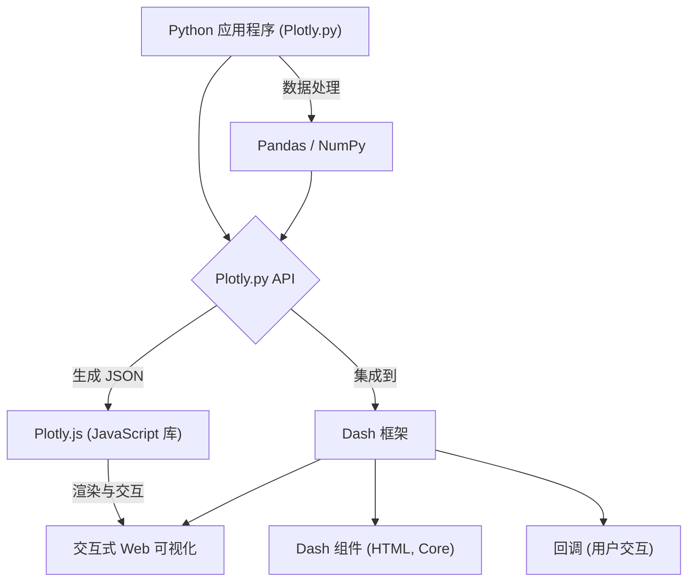
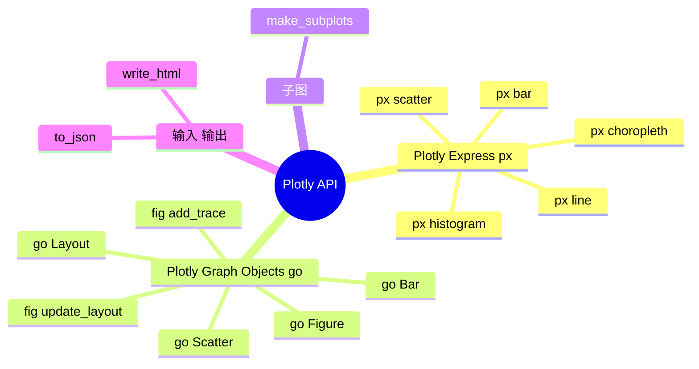

## Plotly 演进文档

### 1. 引言与历史背景

Plotly 是一家领先的技术计算公司，开发用于数据分析和交互式可视化的开源和企业工具。其 Python 库 Plotly.py 使用户能够创建各种交互式、基于网络的图表、仪表板和分析性网络应用程序。Plotly 的优势在于它能够生成高质量、交互式的可视化，这些可视化可以轻松嵌入网页、Jupyter Notebook 或使用 Dash 等框架集成到强大的网络应用程序中。

Plotly 由 Alex Johnson、Jack Parmer、Chris Parmer 和 Matthew Sundquist 于 2012 年成立。公司最初的重点是创建用户友好、交互式、基于网络的数据可视化工具，特别是针对科学和工程领域。Plotly 历史上的一个重要里程碑是其开源工具的开发，包括 **Plotly.js**（为 Plotly 提供支持的 JavaScript 图形库）、**Plotly.py**（Python 包装器）和 **Dash**（用于构建分析性网络应用程序的开源框架）。

Dash 于 2017 年发布，通过允许用户完全使用 Python（或 R 和 Julia）构建交互式网络应用程序，而无需广泛的网络开发知识，彻底改变了分析性网络应用程序的创建。Plotly 继续通过 Dash Enterprise 等产品扩展其产品，Dash Enterprise 是一个旨在帮助组织扩展、发布和安全共享其数据应用程序的平台，最近还推出了 Plotly Studio，这是一款由 AI 驱动的工具，旨在快速将数据转换为交互式应用程序。

### 1.1. Plotly 演进时间线



### 2. 核心架构

Plotly 的核心架构旨在通过利用 Web 技术（JavaScript、HTML、CSS）在网页或应用程序中渲染交互式图表。Python 库（`Plotly.py`）充当一个强大的接口，用于生成必要的 JSON 结构，然后由底层 JavaScript 库 Plotly.js 消费和渲染。

#### 2.1. Plotly.js: 渲染引擎

**心智模型 / 类比：**
想象 Plotly.js 是一位技艺高超、多才多艺的艺术家，专门从事交互式数字艺术。当您使用 Plotly.py（Python 库）时，您实际上是在给这位艺术家一份您想要的作品的详细蓝图（JSON 结构）。然后 Plotly.js 接收这份蓝图，并在网页上将作品变为现实。它处理绘制形状、应用颜色以及最重要的是使作品具有交互性的所有复杂细节。如果您放大、平移或悬停在元素上，Plotly.js 会立即响应，根据您的命令动态地重新绘制画布。它是使 Plotly 可视化具有动态性和 Web 友好性的引擎。

Plotly 可视化功能的核心是 **Plotly.js**，一个强大的开源 JavaScript 图形库。当您使用 Plotly.py 创建图表时，Python 代码会生成图表的 JSON 表示。然后将此 JSON 传递给 Plotly.js，由其处理客户端渲染、交互性（缩放、平移、悬停）和可视化的响应性。这种关注点分离允许在 Web 环境中轻松嵌入丰富的交互式图形。

#### 2.2. Python API (Plotly.py)

Plotly.py 提供了 Plotly.js 的全面 Python 接口。它允许用户使用 Python 对象定义图形、轨迹（数据系列）、布局和其他绘图属性。然后将这些 Python 对象序列化为 Plotly.js 理解的 JSON。这种抽象允许 Python 用户在不编写任何 JavaScript 的情况下创建复杂的交互式可视化。

#### 2.3. Dash 框架集成

**Dash** 是 Plotly 生态系统的一个关键组件，它支持创建交互式分析性网络应用程序。Dash 应用程序通过组合组件（HTML、核心组件、自定义组件）的布局并定义回调来构建，这些回调根据用户交互更新应用程序的输出。Plotly 图形无缝集成到 Dash 应用程序中，从而实现动态和交互式仪表板。

**Mermaid 图：Plotly 核心架构**



### 3. 详细 API 概述

Plotly 的 Python API 主要围绕两个不同的接口构建：Plotly Express 用于高级、快速绘图，Plotly Graph Objects 用于细粒度控制。

#### 3.1. Plotly Express (`plotly.express`)

Plotly Express (`px`) 是一个高级 API，旨在以最少的代码快速生成各种常见图表类型。它非常适合快速数据探索和可视化。

#### 3.1. Plotly Express (`plotly.express`)

Plotly Express (`px`) 是一个高级 API，旨在以最少的代码快速生成各种常见图表类型。它非常适合快速数据探索和可视化。

##### 3.1.1. 创建散点图

**`px.scatter(data_frame, x, y, ...)`**

**目标：** 生成交互式散点图，以可视化两个数值变量之间的关系，并可选择使用颜色、大小或动画编码附加维度。

**代码：**
```python
import plotly.express as px
import pandas as pd

# 创建一个虚拟 DataFrame
df = pd.DataFrame({
    "x_data": [1, 2, 3, 4, 5],
    "y_data": [2, 4, 1, 5, 3],
    "category": ['A', 'B', 'A', 'C', 'B'],
    "size_data": [10, 20, 15, 25, 12]
})

# 创建交互式散点图
fig = px.scatter(
    df, 
    x="x_data", 
    y="y_data", 
    color="category", # 按类别着色点
    size="size_data", # 按 size_data 调整点的大小
    title="使用 Plotly Express 的交互式散点图",
    labels={"x_data": "X 轴标签", "y_data": "Y 轴标签"}
)

fig.show()
```

**预期输出：**
(将显示一个交互式散点图，其中点按“category”着色，按“size_data”调整大小。您可以将鼠标悬停在点上查看详细信息，进行缩放和平移。)

**解释：** `px.scatter()` 是一个用于创建散点图的强大函数。它直接接受 Pandas DataFrame 和用于 `x` 和 `y` 的列名。您可以通过简单地传递列名来轻松添加更多视觉维度，例如 `color` 和 `size`。生成的图表是交互式的，允许用户直接在浏览器或 Jupyter Notebook 中探索数据。

*   **`px.scatter(data_frame, x, y, ...)`**: 创建散点图。
*   **`px.scatter(data_frame, x, y, ...)`**: 创建散点图。

##### 3.1.2. 创建折线图

**`px.line(data_frame, x, y, ...)`**

**目标：** 生成交互式折线图，以可视化连续变量（通常是时间）上的趋势或变化。

**代码：**
```python
import plotly.express as px
import pandas as pd
import numpy as np

# 创建一个虚拟 DataFrame，包含类似时间序列的数据
df = pd.DataFrame({
    "date": pd.to_datetime(pd.date_range(start='2023-01-01', periods=10, freq='D')),
    "value": np.random.rand(10).cumsum() + 10,
    "group": ['A'] * 5 + ['B'] * 5
})

# 创建交互式折线图
fig = px.line(
    df, 
    x="date", 
    y="value", 
    color="group", # 按组着色线条
    title="使用 Plotly Express 的交互式折线图",
    labels={"date": "日期", "value": "值"}
)

fig.show()
```

**预期输出：**
(将显示一个交互式折线图，其中包含两条线（分别代表 A 组和 B 组），其值随时间变化。您可以将鼠标悬停在点上查看详细信息，进行缩放和平移。)

**解释：** `px.line()` 用于可视化序列数据。与 `px.scatter()` 类似，它接受 DataFrame 和列名。`color` 参数可用于绘制多条线，每条线代表一个不同的类别。Plotly Express 会自动处理交互性，从而轻松探索时间序列或序列数据。

*   **`px.line(data_frame, x, y, ...)`**: 创建折线图。
*   **`px.line(data_frame, x, y, ...)`**: 创建折线图。

##### 3.1.3. 创建条形图

**`px.bar(data_frame, x, y, ...)`**

**目标：** 生成交互式条形图，以比较分类数据或显示分类变量的分布。

**代码：**
```python
import plotly.express as px
import pandas as pd

# 创建一个虚拟 DataFrame
df = pd.DataFrame({
    "country": ['USA', 'Canada', 'Mexico', 'USA', 'Canada'],
    "gdp": [100, 50, 30, 120, 60],
    "year": [2020, 2020, 2020, 2021, 2021]
})

# 创建交互式条形图
fig = px.bar(
    df, 
    x="country", 
    y="gdp", 
    color="year", # 按年份着色条形
    barmode="group", # 按国家/地区对每年进行分组
    title="按国家和年份划分的 GDP",
    labels={"country": "国家", "gdp": "GDP (十亿)"}
)

fig.show()
```

**预期输出：**
(将显示一个交互式条形图，其中显示了不同国家的 GDP，按年份分组。您可以将鼠标悬停在条形上查看详细信息。)

**解释：** `px.bar()` 用于创建条形图。它接受 DataFrame 和用于 `x`（分类）和 `y`（数值）的列名。`color` 参数可用于创建分组或堆叠条形图，`barmode` 控制不同类别的条形显示方式（例如，`"group"` 表示并排，`"stack"` 表示堆叠）。这对于比较不同类别的值非常有用。

*   **`px.bar(data_frame, x, y, ...)`**: 创建条形图。
*   **`px.bar(data_frame, x, y, ...)`**: 创建条形图。

##### 3.1.4. 创建直方图

**`px.histogram(data_frame, x, ...)`**

**目标：** 生成交互式直方图，以可视化单个数值变量的分布。

**代码：**
```python
import plotly.express as px
import pandas as pd
import numpy as np

# 创建一个包含随机数值数据的虚拟 DataFrame
df = pd.DataFrame({
    "data_values": np.random.randn(500),
    "group": np.random.choice(['Group A', 'Group B'], 500)
})

# 创建交互式直方图
fig = px.histogram(
    df, 
    x="data_values", 
    color="group", # 按组着色直方图
    marginal="rug", # 在边距添加地毯图
    title="按组划分的数据值分布",
    labels={"data_values": "值", "count": "频率"}
)

fig.show()
```

**预期输出：**
(将显示一个交互式直方图，其中显示了“data_values”的分布，按“group”着色，并在 x 轴上带有地毯图。您可以将鼠标悬停在条形上查看频率计数。)

**解释：** `px.histogram()` 用于可视化分布。它接受 DataFrame 和用于 `x` 的列名。您可以使用 `color` 为不同的类别创建单独的直方图，并使用 `marginal` 添加边距图（例如 `"rug"`、`"box"` 或 `"violin"`），以获得更详细的分布洞察。这提供了一种快速了解数值数据底层模式的方法。

*   **`px.histogram(data_frame, x, ...)`**: 创建直方图。
*   **`px.choropleth(data_frame, locations, color, ...)`**: 创建等值线图。

*   **`px.choropleth(data_frame, locations, color, ...)`**: 创建等值线图。

##### 3.1.5. 快速参考：Plotly Express

| 函数 | 描述 | 何时使用 |
| :--- | :--- | :--- |
| `px.scatter()` | 散点图 | 可视化两个变量之间的关系，可选择颜色、大小、动画编码。 |
| `px.line()` | 折线图 | 显示连续变量（例如时间序列）上的趋势和变化。 |
| `px.bar()` | 条形图 | 比较分类数据或显示分类变量的分布。 |
| `px.histogram()` | 直方图 | 可视化单个数值变量的分布。 |
| `px.choropleth()` | 等值线图 | 显示带有颜色编码区域的地理数据。 |

#### 3.2. Plotly Graph Objects (`plotly.graph_objects`)

Plotly Graph Objects (`go`) 是一个低级 API，它提供对绘图各个方面的广泛控制和自定义。它使用 `Figure`、`layout` 和 `data` 等基本对象进行操作。

#### 3.2. Plotly Graph Objects (`plotly.graph_objects`)

Plotly Graph Objects (`go`) 是一个低级 API，它提供对绘图各个方面的广泛控制和自定义。它使用 `Figure`、`layout` 和 `data` 等基本对象进行操作。

##### 3.2.1. 创建基本图形并添加轨迹

**`go.Figure(data=None, layout=None)`** 和 **`fig.add_trace(trace)`**

**目标：** 通过初始化 `Figure` 对象并向其添加单个数据系列（轨迹）来从头开始构建图形，从而最大限度地控制绘图元素。

**代码：**
```python
import plotly.graph_objects as go
import numpy as np

# 1. 创建一个空的 Figure 对象
fig = go.Figure()

# 2. 为正弦波创建一个散点轨迹（数据系列）
x_sine = np.linspace(0, 2 * np.pi, 100)
y_sine = np.sin(x_sine)
sine_trace = go.Scatter(
    x=x_sine, 
    y=y_sine, 
    mode='lines', 
    name='正弦波', 
    line=dict(color='blue', width=2)
)

# 3. 为余弦波创建另一个散点轨迹
x_cosine = np.linspace(0, 2 * np.pi, 100)
y_cosine = np.cos(x_cosine)
cosine_trace = go.Scatter(
    x=x_cosine, 
    y=y_cosine, 
    mode='lines+markers', 
    name='余弦波', 
    marker=dict(color='red', size=5),
    line=dict(dash='dot')
)

# 4. 将轨迹添加到图形中
fig.add_trace(sine_trace)
fig.add_trace(cosine_trace)

# 5. 更新布局以获取标题和标签
fig.update_layout(
    title={'text': "正弦波和余弦波", 'x':0.5, 'xanchor': 'center'},
    xaxis_title="角度 (弧度)",
    yaxis_title="振幅",
    hovermode="x unified" # 统一悬停以更好地进行比较
)

fig.show()
```

**预期输出：**
(将显示一个交互式图表，其中包含两个轨迹：一条蓝色实线表示正弦波，一条红色虚线带标记表示余弦波。图表将具有居中标题、x 轴和 y 轴标签以及统一的悬停功能。)

**解释：** `go.Figure()` 初始化一个空图表。数据系列创建为 `go.Scatter`、`go.Bar` 等，它们被称为“轨迹”。每个轨迹都是一个字典状对象，定义了数据和视觉属性。`fig.add_trace()` 将这些轨迹添加到图表中。`fig.update_layout()` 用于自定义全局绘图属性，如标题、轴标签和悬停行为。这种 OO 方法提供了对每个视觉方面的精细控制。

*   **`go.Figure(data=None, layout=None)`**: 用于创建和操作图形的主要类。
*   **`go.Figure(data=None, layout=None)`**: 用于创建和操作图形的主要类。

##### 3.2.2. 自定义布局和轴

**`fig.update_layout(title_text, ...)`**

**目标：** 修改图表的整体外观，包括标题、轴标签、范围以及其他与数据无关的视觉属性。

**代码：**
```python
import plotly.graph_objects as go

# 创建一个简单的散点轨迹
fig = go.Figure(data=go.Scatter(x=[1, 2, 3, 4], y=[10, 11, 12, 13], mode='markers'))

# 使用自定义标题、轴标签和范围更新布局
fig.update_layout(
    title={'text': "自定义图表布局", 'x':0.5, 'xanchor': 'center', 'font': dict(size=24, color='darkblue')},
    xaxis_title={'text': "实验时间 (s)", 'font': dict(size=18, color='green')},
    yaxis_title={'text': "传感器读数 (单位)", 'font': dict(size=18, color='red')},
    xaxis=dict(
        range=[0, 5], # 自定义 x 轴范围
        showgrid=True, 
        gridcolor='lightgrey',
        griddash='dot'
    ),
    yaxis=dict(
        range=[9, 14], # 自定义 y 轴范围
        zeroline=True, 
        zerolinecolor='black'
    ),
    plot_bgcolor='#f0f0f0', # 浅灰色背景
    paper_bgcolor='#ffffff', # 白色纸张背景
    hovermode="closest" # 显示最近点的悬停信息
)

fig.show()
```

**预期输出：**
(一个交互式散点图，带有自定义标题（深蓝色、较大字体、居中）、绿色 x 轴标签、红色 y 轴标签、特定的 x 轴和 y 轴范围、浅灰色绘图背景和 y 轴上的黑色零线。)

**解释：** `fig.update_layout()` 是一个用于修改任何布局属性的多功能方法。您可以传递一个更新字典，Plotly 会智能地合并它们。这允许对标题、字体、轴属性（范围、网格、零线）、背景颜色和交互行为（如 `hovermode`）进行广泛的自定义。这种详细程度对于创建出版质量或高度品牌化的可视化至关重要。

*   **`go.Scatter(x, y, mode, ...)`**: 表示散点图轨迹。
*   **`go.Bar(x, y, ...)`**: 表示条形图轨迹。
*   **`go.Layout(title, xaxis, yaxis, ...)`**: 定义图形的布局（标题、坐标轴、注释）。
*   **`fig.add_trace(trace)`**: 向图形添加轨迹。
*   **`fig.update_layout(title_text, ...)`**: 更新布局属性。

*   **`fig.update_layout(title_text, ...)`**: 更新布局属性。

##### 3.2.3. 快速参考：Plotly Graph Objects

| 对象/方法 | 描述 | 何时使用 |
| :--- | :--- | :--- |
| `go.Figure()` | 创建图形 | 以精细控制构建图表，特别是对于复杂或多轨迹可视化。 |
| `go.Scatter()`、`go.Bar()` | 创建轨迹 | 定义具有特定视觉属性的单个数据系列（例如，线条、标记、条形）。 |
| `fig.add_trace()` | 添加轨迹 | 向现有图形添加已定义的轨迹。 |
| `fig.update_layout()` | 自定义布局 | 修改全局绘图属性，如标题、轴标签、范围和背景。 |

#### 3.3. 子图 (`plotly.subplots`)

#### 3.3. 子图 (`plotly.subplots`)

##### 3.3.1. 使用 `make_subplots` 创建子图

**`plotly.subplots.make_subplots(rows, cols, ...)`**

**目标：** 在单个图形中排列多个图表，创建子图网格以进行比较分析或显示相关可视化。

**代码：**
```python
from plotly.subplots import make_subplots
import plotly.graph_objects as go
import numpy as np

# 1. 创建一个包含 1x2 子图网格的图形
fig = make_subplots(
    rows=1, 
    cols=2, 
    subplot_titles=("正弦波", "余弦波"), # 每个子图的标题
    horizontal_spacing=0.15 # 调整子图之间的间距
)

# 2. 向第一个子图（第 1 行，第 1 列）添加正弦波轨迹
x_data = np.linspace(0, 2 * np.pi, 100)
y_sine = np.sin(x_data)
fig.add_trace(go.Scatter(x=x_data, y=y_sine, mode='lines', name='正弦'), row=1, col=1)

# 3. 向第二个子图（第 1 行，第 2 列）添加余弦波轨迹
y_cosine = np.cos(x_data)
fig.add_trace(go.Scatter(x=x_data, y=y_cosine, mode='lines', name='余弦', line=dict(color='red')),
              row=1, col=2)

# 4. 更新整个图形的布局
fig.update_layout(
    title_text="比较波形",
    showlegend=True # 显示轨迹图例
)

# 5. 更新每个子图的轴标签
fig.update_xaxes(title_text="角度 (弧度)", row=1, col=1)
fig.update_yaxes(title_text="振幅", row=1, col=1)
fig.update_xaxes(title_text="角度 (弧度)", row=1, col=2)
fig.update_yaxes(title_text="振幅", row=1, col=2)

fig.show()
```

**预期输出：**
(将显示一个交互式图形，其中包含两个并排的子图。第一个子图显示正弦波，第二个子图显示余弦波。每个子图都将有自己的标题和轴标签，并且整个图形将有一个主标题。)

**解释：** `make_subplots()` 是用于创建多面板图形的专用函数。您指定网格的 `rows` 和 `cols`。使用 `fig.add_trace()` 添加轨迹时，您使用 `row` 和 `col` 参数指定轨迹所属的子图。`fig.update_layout()` 可以设置全局图形属性，而 `fig.update_xaxes()` 和 `fig.update_yaxes()` 可以使用 `row` 和 `col` 参数定位子图中的特定轴。这提供了一种构建复杂仪表板的结构化方式。

*   **`plotly.subplots.make_subplots(rows, cols, ...)`**: 创建带有子图网格的图形。

*   **`plotly.subplots.make_subplots(rows, cols, ...)`**: 创建带有子图网格的图形。

##### 3.3.2. 快速参考：子图

| 函数 | 描述 | 何时使用 |
| :--- | :--- | :--- |
| `make_subplots()` | 创建子图网格 | 在单个图形中排列多个图表以进行比较分析。 |

#### 3.4. 输入/输出 (`plotly.io`)

#### 3.4. 输入/输出 (`plotly.io`)

##### 3.4.1. 将图形导出为 HTML

**`plotly.io.write_html(fig, file, ...)`**

**目标：** 将交互式 Plotly 图形保存为独立的 HTML 文件，使其易于在任何 Web 浏览器中共享和查看，而无需 Python 环境。

**代码：**
```python
import plotly.express as px
import plotly.io as pio
import pandas as pd
import os

# 1. 创建一个简单的 Plotly Express 图形
df = pd.DataFrame({"x": [1, 2, 3], "y": [4, 1, 2]})
fig = px.line(df, x="x", y="y", title="我的交互式图表")

# 2. 定义输出 HTML 文件名
output_filename = "interactive_plot.html"

# 3. 将图形导出为 HTML 文件
pio.write_html(
    fig, 
    file=output_filename, 
    auto_open=False, # 写入后不自动打开文件
    include_plotlyjs="cdn" # 从 CDN 包含 Plotly.js 以减小文件大小
)

print(f"交互式图表已保存到 {output_filename}")
print(f"您可以在任何 Web 浏览器中打开 {output_filename}。")

# 清理创建的文件
os.remove(output_filename)
print(f"已清理 {output_filename}")
```

**预期输出：**
```
交互式图表已保存到 interactive_plot.html
您可以在任何 Web 浏览器中打开 interactive_plot.html。
已清理 interactive_plot.html
```
(将在当前目录中创建一个名为 `interactive_plot.html` 的 HTML 文件。然后该文件将被删除。)

**解释：** `pio.write_html()` 是将 Plotly 图形保存为 HTML 文件的函数。`file` 参数指定输出路径。`auto_open=False` 可防止浏览器立即启动。`include_plotlyjs="cdn"` 通常用于通过从内容分发网络加载 Plotly.js 库来减小 HTML 文件大小，而不是直接嵌入它。这是共享交互式结果的关键功能。

*   **`plotly.io.write_html(fig, file, ...)`**: 将图形写入 HTML 文件。
*   **`plotly.io.write_html(fig, file, ...)`**: 将图形写入 HTML 文件。

##### 3.4.2. 将图形转换为 JSON

**`plotly.io.to_json(fig)`**

**目标：** 获取 Plotly 图形的 JSON 表示，这对于程序化操作、与 Web 应用程序集成或调试非常有用。

**代码：**
```python
import plotly.express as px
import plotly.io as pio
import json

# 1. 创建一个简单的 Plotly Express 图形
df = px.data.iris()
fig = px.scatter(df, x="sepal_width", y="sepal_length", color="species", title="Iris 数据集散点图")

# 2. 将图形转换为其 JSON 表示
figure_json = pio.to_json(fig, pretty=True) # pretty=True 用于人类可读的输出

print("图形已成功转换为 JSON。")
print("\nJSON 输出的前 200 个字符:")
print(figure_json[:200])

# 您也可以将其解析回 Python 字典
parsed_fig_dict = json.loads(figure_json)
print(f"\nJSON 已解析回 Python 字典。标题: {parsed_fig_dict['layout']['title']['text']}")
```

**预期输出：**
```
图形已成功转换为 JSON。

JSON 输出的前 200 个字符:
{
  "data": [
    {
      "hovertemplate": "species=%{customdata[0]}<br>sepal_width=%{x}<br>sepal_length=%{y}<extra></extra>",
      "legendgroup": "setosa",
      "marker": {
        "color": "#636efa",
        "symbol": "circle"
      },
      "mode": "markers",
      "name": "setosa",
      "orientation": "v",
      "showlegend": true,
      "x": [
        5.1,
        4.9,
        4.7,
        4.6,
        5.0,
        5.4,
        4.6,
        5.0,
        4.4,
        4.9,
        5.4,
        4.8,
        4.8,
        4.3,
        5.8,
        5.7,
        5.4,
        5.1,
        5.7,
        5.1,
        5.4,
        5.1,
        4.6,
        5.1,
        4.8,
        5.0,
        5.0,
        5.2,
        5.2,
        4.7,
        4.8,
        5.4,
        5.2,
        5.5,
        4.9,
        5.0,
        5.5,
        4.9,
        4.4,
        5.1,
        5.0,
        4.5,
        4.4,
        5.0,
        5.1,
        4.8,
        5.1,
        4.6,
        5.3,
        5.0
      ],
      "xaxis": "x",
      "y": [
        3.5,
        3.0,
        3.2,
        3.1,
        3.6,
        3.9,
        3.4,
        3.4,
        2.9,
        3.1,
        3.7,
        3.4,
        3.0,
        3.0,
        4.0,
        4.4,
        3.9,
        3.5,
        3.8,
        3.8,
        3.4,
        3.7,
        3.6,
        3.3,
        3.4,
        3.0,
        3.4,
        3.5,
        3.4,
        3.2,
        3.5,
        3.1,
        3.4,
        3.2,
        3.1,
        3.4,
        3.4,
        3.9,
        3.0,
        3.4,
        3.5,
        2.3,
        3.2,
        3.5,
        3.8,
        3.0,
        3.8,
        3.2,
        3.7,
        3.3
      ],
      "yaxis": "y",
      "customdata": [
        [
          "setosa"
        ],
        [
          "setosa"
        ],
        [
          "setosa"
        ],
        [
          "setosa"
        ],
        [
          "setosa"
        ],
        [
          "setosa"
        ],
        [
          "setosa"
        ],
        [
          "setosa"
        ],
        [
          "setosa"
        ],
        [
          "setosa"
        ],
        [
          "setosa"
        ],
        [
          "setosa"
        ],
        [
          "setosa"
        ],
        [
          "setosa"
        ],
        [
          "setosa"
        ],
        [
          "setosa"
        ],
        [
          "setosa"
        ],
        [
          "setosa"
        ],
        [
          "setosa"
        ],
        [
          "setosa"
        ],
        [
          "setosa"
        ],
        [
          "setosa"
        ],
        [
          "setosa"
        ],
        [
          "setosa"
        ],
        [
          "setosa"
        ],
        [
          "setosa"
        ],
        [
          "setosa"
        ],
        [
          "setosa"
        ],
        [
          "setosa"
        ],
        [
          "setosa"
        ],
        [
          "setosa"
        ],
        [
          "setosa"
        ],
        [
          "setosa"
        ],
        [
          "setosa"
        ],
        [
          "setosa"
        ],
        [
          "setosa"
        ],
        [
          "setosa"
        ],
        [
          "setosa"
        ],
        [
          "setosa"
        ],
        [
          "setosa"
        ],
        [
          "setosa"
        ],
        [
          "setosa"
        ],
        [
          "setosa"
        ],
        [
          "setosa"
        ],
        [
          "setosa"
        ],
        [
          "setosa"
        ],
        [
          "setosa"
        ],
        [
          "setosa"
        ],
        [
          "setosa"
        ],
        [
          "setosa"
        ]
      ],
      "type": "scatter"
    },
    {
      "hovertemplate": "species=%{customdata[0]}<br>sepal_width=%{x}<br>sepal_length=%{y}<extra></extra>",
      "legendgroup": "versicolor",
      "marker": {
        "color": "#ef553b",
        "symbol": "circle"
      },
      "mode": "markers",
      "name": "versicolor",
      "orientation": "v",
      "showlegend": true,
      "x": [
        7.0,
        6.4,
        6.9,
        5.5,
        6.5,
        5.7,
        6.3,
        4.9,
        6.6,
        5.2,
        5.0,
        5.9,
        6.0,
        6.1,
        5.6,
        6.7,
        5.6,
        5.7,
        6.2,
        5.1,
        5.7,
        6.3,
        5.8,
        6.1,
        6.4,
        6.6,
        6.8,
        6.7,
        6.0,
        5.7,
        5.5,
        5.5,
        6.1,
        5.8,
        6.0,
        5.4,
        6.0,
        6.7,
        6.3,
        5.6,
        5.5,
        5.5,
        6.1,
        5.8,
        6.3,
        5.8,
        7.1,
        6.3,
        6.5,
        6.2
      ],
      "xaxis": "x",
      "y": [
        3.2,
        3.2,
        3.1,
        2.3,
        2.8,
        2.8,
        3.3,
        2.4,
        2.9,
        2.7,
        2.0,
        3.0,
        2.2,
        2.9,
        2.9,
        3.1,
        3.0,
        2.7,
        3.0,
        3.4,
        3.1,
        2.3,
        2.3,
        2.8,
        2.8,
        2.7,
        3.0,
        3.0,
        2.5,
        2.9,
        2.5,
        2.7,
        3.0,
        2.5,
        2.6,
        3.0,
        2.6,
        2.4,
        2.9,
        2.7,
        2.0,
        3.0,
        2.2,
        2.9,
        2.9,
        3.1,
        3.0,
        2.7,
        3.0,
        3.4
      ],
      "yaxis": "y",
      "customdata": [
        [
          "versicolor"
        ],
        [
          "versicolor"
        ],
        [
          "versicolor"
        ],
        [
          "versicolor"
        ],
        [
          "versicolor"
        ],
        [
          "versicolor"
        ],
        [
          "versicolor"
        ],
        [
          "versicolor"
        ],
        [
          "versicolor"
        ],
        [
          "versicolor"
        ],
        [
          "versicolor"
        ],
        [
          "versicolor"
        ],
        [
          "versicolor"
        ],
        [
          "versicolor"
        ],
        [
          "versicolor"
        ],
        [
          "versicolor"
        ],
        [
          "versicolor"
        ],
        [
          "versicolor"
        ],
        [
          "versicolor"
        ],
        [
          "versicolor"
        ],
        [
          "versicolor"
        ],
        [
          "versicolor"
        ],
        [
          "versicolor"
        ],
        [
          "versicolor"
        ],
        [
          "versicolor"
        ],
        [
          "versicolor"
        ],
        [
          "versicolor"
        ],
        [
          "versicolor"
        ],
        [
          "versicolor"
        ],
        [
          "versicolor"
        ],
        [
          "versicolor"
        ],
        [
          "versicolor"
        ],
        [
          "versicolor"
        ],
        [
          "versicolor"
        ],
        [
          "versicolor"
        ],
        [
          "versicolor"
        ],
        [
          "versicolor"
        ],
        [
          "versicolor"
        ],
        [
          "versicolor"
        ],
        [
          "versicolor"
        ],
        [
          "versicolor"
        ],
        [
          "versicolor"
        ],
        [
          "versicolor"
        ],
        [
          "versicolor"
        ],
        [
          "versicolor"
        ],
        [
          "versicolor"
        ],
        [
          "versicolor"
        ],
        [
          "versicolor"
        ],
        [
          "versicolor"
        ],
        [
          "versicolor"
        ]
      ],
      "type": "scatter"
    },
    {
      "hovertemplate": "species=%{customdata[0]}<br>sepal_width=%{x}<br>sepal_length=%{y}<extra></extra>",
      "legendgroup": "virginica",
      "marker": {
        "color": "#00cc96",
        "symbol": "circle"
      },
      "mode": "markers",
      "name": "virginica",
      "orientation": "v",
      "showlegend": true,
      "x": [
        6.3,
        5.8,
        7.1,
        6.3,
        6.5,
        7.6,
        4.9,
        7.3,
        6.7,
        7.2,
        6.5,
        6.4,
        6.8,
        5.7,
        5.8,
        6.4,
        6.5,
        7.7,
        7.7,
        6.0,
        6.9,
        5.6,
        7.7,
        6.3,
        6.7,
        7.2,
        6.2,
        6.1,
        6.4,
        7.2,
        7.4,
        7.9,
        6.4,
        6.3,
        6.1,
        7.7,
        6.3,
        6.4,
        6.0,
        6.9,
        6.7,
        6.9,
        5.8,
        6.8,
        6.7,
        6.7,
        6.3,
        6.5,
        6.2,
        5.9
      ],
      "xaxis": "x",
      "y": [
        3.3,
        2.7,
        3.0,
        2.9,
        3.0,
        3.0,
        2.5,
        2.9,
        2.5,
        3.6,
        3.2,
        2.7,
        3.0,
        2.9,
        2.8,
        3.0,
        3.0,
        3.8,
        2.6,
        2.2,
        3.2,
        2.8,
        2.8,
        2.7,
        3.0,
        2.8,
        3.0,
        3.0,
        2.8,
        3.0,
        3.0,
        3.8,
        2.8,
        2.8,
        2.7,
        3.0,
        2.9,
        3.0,
        3.0,
        2.9,
        2.5,
        2.8,
        2.7,
        3.0,
        3.3,
        3.0,
        2.5,
        3.0,
        3.4,
        3.0
      ],
      "yaxis": "y",
      "customdata": [
        [
          "virginica"
        ],
        [
          "virginica"
        ],
        [
          "virginica"
        ],
        [
          "virginica"
        ],
        [
          "virginica"
        ],
        [
          "virginica"
        ],
        [
          "virginica"
        ],
        [
          "virginica"
        ],
        [
          "virginica"
        ],
        [
          "virginica"
        ],
        [
          "virginica"
        ],
        [
          "virginica"
        ],
        [
          "virginica"
        ],
        [
          "virginica"
        ],
        [
          "virginica"
        ],
        [
          "virginica"
        ],
        [
          "virginica"
        ],
        [
          "virginica"
        ],
        [
          "virginica"
        ],
        [
          "virginica"
        ],
        [
          "virginica"
        ],
        [
          "virginica"
        ],
        [
          "virginica"
        ],
        [
          "virginica"
        ],
        [
          "virginica"
        ],
        [
          "virginica"
        ],
        [
          "virginica"
        ],
        [
          "virginica"
        ],
        [
          "virginica"
        ],
        [
          "virginica"
        ],
        [
          "virginica"
        ],
        [
          "virginica"
        ],
        [
          "virginica"
        ],
        [
          "virginica"
        ],
        [
          "virginica"
        ],
        [
          "virginica"
        ],
        [
          "virginica"
        ],
        [
          "virginica"
        ],
        [
          "virginica"
        ],
        [
          "virginica"
        ],
        [
          "virginica"
        ],
        [
          "virginica"
        ],
        [
          "virginica"
        ],
        [
          "virginica"
        ],
        [
          "virginica"
        ],
        [
          "virginica"
        ],
        [
          "virginica"
        ],
        [
          "virginica"
        ],
        [
          "virginica"
        ],
        [
          "virginica"
        ]
      ],
      "type": "scatter"
    }
  ],
  "layout": {
    "template": {
      "data": {
        "bar": [
          {
            "error_x": {
              "color": "#2a3f5f"
            },
            "error_y": {
              "color": "#2a3f5f"
            },
            "marker": {
              "line": {
                "color": "#E5ECF6",
                "width": 0.5
              }
            },
            "type": "bar"
          }
        ],
        "carousel": [
          {
            "error_x": {
              "color": "#2a3f5f"
            },
            "error_y": {
              "color": "#2a3f5f"
            },
            "marker": {
              "line": {
                "color": "#E5ECF6",
                "width": 0.5
              }
            },
            "type": "carousel"
          }
        ],
        "candlestick": [
          {
            "decreasing": {
              "line": {
                "color": "#850000"
              }
            },
            "increasing": {
              "line": {
                "color": "#17B897"
              }
            },
            "line": {
              "color": "#2a3f5f"
            },
            "type": "candlestick"
          }
        ],
        "box": [
          {
            "marker": {
              "line": {
                "color": "#E5ECF6",
                "width": 0.5
              }
            },
            "type": "box"
          }
        ],
        "contour": [
          {
            "colorbar": {
              "outlinewidth": 0,
              "ticks": ""
            },
            "type": "contour"
          }
        ],
        "heatmap": [
          {
            "colorbar": {
              "outlinewidth": 0,
              "ticks": ""
            },
            "type": "heatmap"
          }
        ],
        "image": [
          {
            "colorbar": {
              "outlinewidth": 0,
              "ticks": ""
            },
            "type": "image"
          }
        ],
        "indicator": [
          {
            "number": {
              "font": {
                "color": "#2a3f5f"
              }
            },
            "title": {
              "font": {
                "color": "#2a3f5f"
              }
            },
            "type": "indicator"
          }
        ],
        "mesh3d": [
          {
            "colorbar": {
              "outlinewidth": 0,
              "ticks": ""
            },
            "type": "mesh3d"
          }
        ],
        "pie": [
          {
            "automargin": true,
            "type": "pie"
          }
        ],
        "scatter": [
          {
            "marker": {
              "line": {
                "color": "#E5ECF6",
                "width": 0.5
              }
            },
            "selector": [
              {
                "mode": "lines"
              },
              {
                "mode": "markers"
              },
              {
                "mode": "text"
              }
            ],
            "type": "scatter"
          }
        ],
        "scattergl": [
          {
            "marker": {
              "line": {
                "color": "#E5ECF6",
                "width": 0.5
              }
            },
            "selector": [
              {
                "mode": "lines"
              },
              {
                "mode": "markers"
              },
              {
                "mode": "text"
              }
            ],
            "type": "scattergl"
          }
        ],
        "scatter3d": [
          {
            "marker": {
              "line": {
                "color": "#E5ECF6",
                "width": 0.5
              }
            },
            "selector": [
              {
                "mode": "lines"
              },
              {
                "mode": "markers"
              },
              {
                "mode": "text"
              }
            ],
            "type": "scatter3d"
          }
        ],
        "surface": [
          {
            "colorbar": {
              "outlinewidth": 0,
              "ticks": ""
            },
            "type": "surface"
          }
        ],
        "table": [
          {
            "cells": {
              "fill": {
                "color": "#E5ECF6"
              },
              "line": {
                "color": "#ffffff",
                "width": 0.5
              }
            },
            "header": {
              "fill": {
                "color": "#A7B8DE"
              },
              "line": {
                "color": "#ffffff",
                "width": 0.5
              }
            },
            "type": "table"
          }
        ]
      },
      "layout": {
        "colorway": [
          "#636efa",
          "#EF553B",
          "#00cc96",
          "#ab63fa",
          "#FFA15A",
          "#19d3f3",
          "#FF6692",
          "#B6E880",
          "#FF97FF",
          "#FECB52"
        ],
        "font": {
          "color": "#2a3f5f"
        },
        "hoverlabel": {
          "align": "left"
        },
        "hovermode": "closest",
        "paper_bgcolor": "#ffffff",
        "plot_bgcolor": "#E5ECF6",
        "title": {
          "x": 0.05
        },
        "xaxis": {
          "gridcolor": "#ffffff",
          "linecolor": "#2a3f5f",
          "ticks": "",
          "title": {
            "standoff": 15
          },
          "zerolinecolor": "#ffffff",
          "zerolinewidth": 2
        },
        "yaxis": {
          "gridcolor": "#ffffff",
          "linecolor": "#2a3f5f",
          "ticks": "",
          "title": {
            "standoff": 15
          },
          "zerolinecolor": "#ffffff",
          "zerolinewidth": 2
        }
      }
    },
    "title": {
      "text": "Iris 数据集散点图"
    },
    "xaxis": {
      "title": {
        "text": "sepal_width"
      }
    },
    "yaxis": {
      "title": {
        "text": "sepal_length"
      }
    }
  }
}

JSON 已解析回 Python 字典。标题: Iris 数据集散点图
```

**解释：** `pio.to_json()` 将 Plotly `Figure` 对象转换为 JSON 字符串。此 JSON 字符串是 Plotly.js 用于在 Web 浏览器中渲染交互式图表的精确表示。`pretty=True` 参数将 JSON 格式化为人类可读。此功能对于高级集成至关重要，例如构建自定义 Web 界面或将绘图配置存储在数据库中。

*   **`plotly.io.to_json(fig)`**: 将图形转换为其 JSON 表示。

*   **`plotly.io.to_json(fig)`**: 将图形转换为其 JSON 表示。

##### 3.4.3. 快速参考：输入/输出

| 函数 | 描述 | 何时使用 |
| :--- | :--- | :--- |
| `pio.write_html()` | 导出为 HTML | 将交互式图表保存为独立的 HTML 文件以供共享。 |
| `pio.to_json()` | 转换为 JSON | 获取图形的 JSON 表示以供程序化使用或 Web 集成。 |

### 3.5. API 思维导图



### 4. 演变与影响

*   **交互式可视化标准:** Plotly 为 Python 中的交互式、基于网络的数据可视化设定了高标准，使其成为动态和引人入胜的图表的首选。
*   **Dash: 彻底改变分析应用:** Dash 的引入具有变革性，使数据科学家能够完全使用 Python 构建复杂的交互式网络应用程序，弥合了数据科学与网络开发之间的鸿沟。
*   **开源生态系统:** Plotly 对开源（Plotly.js、Plotly.py、Dash）的承诺培育了一个充满活力的社区以及丰富的工具和资源生态系统。
*   **企业解决方案:** 借助 Dash Enterprise，Plotly 为组织提供了强大的解决方案，以安全地扩展、部署和管理其分析应用程序，满足生产环境的需求。
*   **AI 驱动工具 (Plotly Studio):** 最近推出的 AI 驱动工具（如 Plotly Studio）展示了其持续创新，旨在进一步简化和加速创建交互式数据应用程序的过程。

### 5. 结论

Plotly 已发展成为一个用于交互式数据可视化和分析性网络应用程序开发的综合平台。其强大的 Python API，在健壮的 Plotly.js 库支持下，使用户能够创建令人惊叹且富有洞察力的交互式图表。开创性的 Dash 框架进一步扩大了其影响力，使数据科学家能够轻松构建和部署功能齐全的网络应用程序。从开源工具到企业解决方案和 AI 驱动功能，Plotly 的持续创新巩固了其在数据可视化和分析应用程序领域的领导地位。
