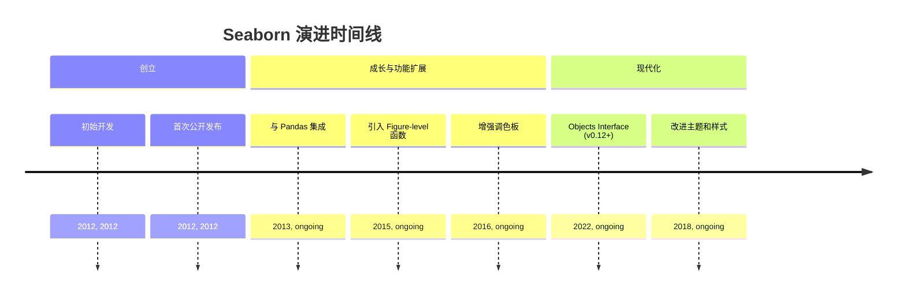
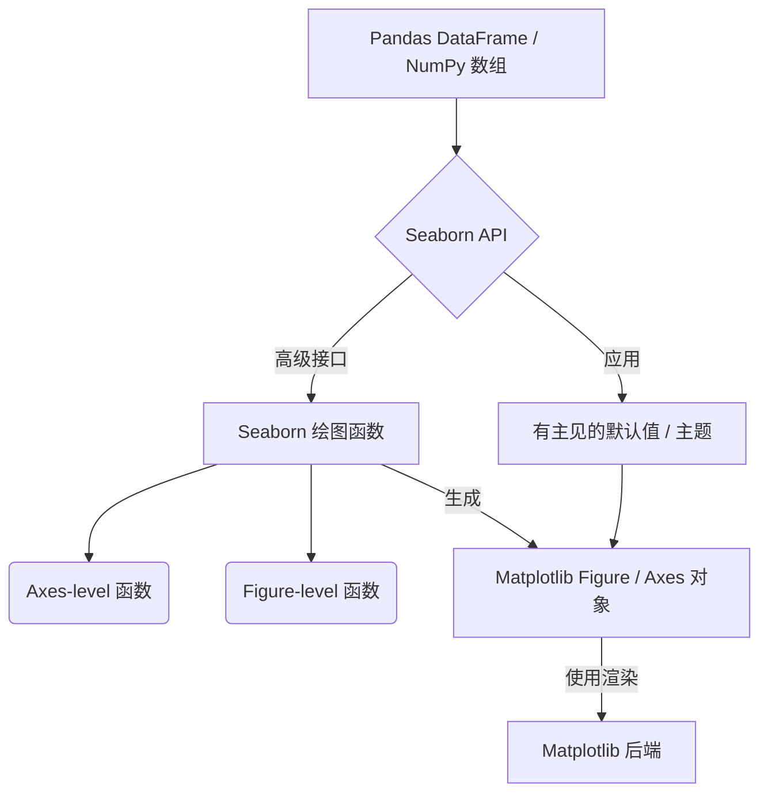
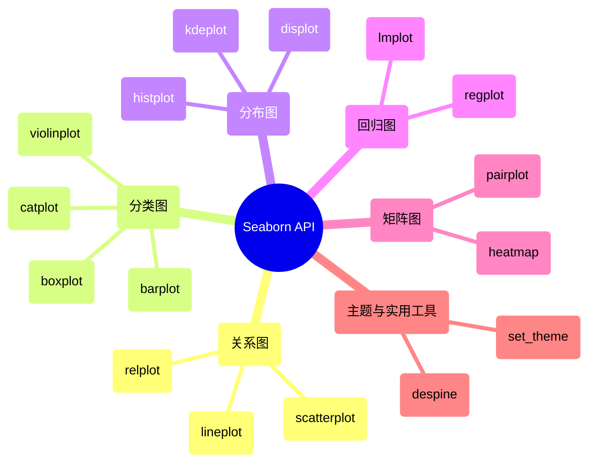

## Seaborn 演进文档

### 1. 引言与历史背景

Seaborn 是一个基于 Matplotlib 的 Python 数据可视化库。它提供了一个高级接口，用于绘制美观且信息丰富的统计图形。虽然 Matplotlib 在提供对绘图的精细控制方面表现出色，但 Seaborn 简化了创建复杂统计可视化的过程，使其更容易探索和理解数据，尤其是在使用 Pandas DataFrame 时。

Seaborn 由 Michael Waskom 创建。它的出现是为了满足一种更精简的方法来生成美观且具有统计意义的图表的需求，它建立在 Matplotlib 的基础功能之上。该库的开发重点是提供一个面向数据集的 API，该 API 自动处理 Matplotlib 的许多底层复杂性，允许用户专注于数据中的洞察力，而不是绘图的复杂性。

### 1.1. Seaborn 演进时间线



### 2. 核心架构

Seaborn 的核心架构是建立在 Matplotlib 之上的高级抽象层。它利用 Matplotlib 的绘图功能，同时为统计可视化提供更方便且有主见的接口。它还与 Pandas DataFrame 深度集成，使其在处理表格数据时非常有效。

#### 2.1. Matplotlib 后端

Seaborn 依赖 Matplotlib 作为其渲染后端。这意味着 Seaborn 生成的任何图表最终都是 Matplotlib 的 Figure 和 Axes 对象，允许用户使用 Matplotlib 的广泛 API 进一步自定义 Seaborn 图表。这种共生关系使 Seaborn 能够受益于 Matplotlib 的健壮性和灵活性，同时为统计绘图提供更简单的入口点。

#### 2.2. 面向数据集的 API

**心智模型 / 类比：**
想象您有一个包含大量数据的大型电子表格（您的 Pandas DataFrame），并且您想从中创建一个漂亮的图表。使用 Matplotlib，您通常需要手动选择列，将它们分配给 x 轴和 y 轴，指定颜色等等。这就像一位厨师必须一丝不苟地切碎每种食材并一步一步地遵循食谱。

Seaborn 的**面向数据集的 API** 就像有一个聪明的副厨师。您将整个电子表格（DataFrame）交给副厨师，然后简单地告诉他们：“制作一个‘温度’与‘湿度’的散点图，并按‘季节’为点着色。”副厨师（Seaborn）然后智能地找出如何获取‘温度’和‘湿度’列，如何根据‘季节’分配颜色，并处理所有底层的 Matplotlib 调用以生成信息丰富的图表。您专注于您想从数据集中可视化*什么*，而 Seaborn 处理*如何*美观且统计正确地绘制它。

Seaborn 的一个关键架构原则是其**面向数据集的 API**。Seaborn 函数通常将整个 Pandas DataFrame 作为输入，而不是要求用户手动将数据列映射到视觉属性（如 x 轴、y 轴、颜色）。然后，它智能地将列映射到适当的视觉角色，执行必要的统计聚合，并处理底层的 Matplotlib 调用以生成信息丰富的图表。

#### 2.3. Figure-level 与 Axes-level 函数

Seaborn 将其绘图函数分为两种主要类型：

*   **Axes-level 函数**: 这些函数绘制到单个 Matplotlib `Axes` 对象上。示例包括 `sns.scatterplot()`、`sns.histplot()`、`sns.boxplot()`。它们适用于在更大的图中创建单个图表，或者当您需要精确控制子图位置时。
*   **Figure-level 函数**: 这些函数管理整个 Figure，并可以在单个 Figure 中创建多个图表（子图）。示例包括 `sns.relplot()`、`sns.catplot()`、`sns.displot()`、`sns.jointplot()`、`sns.pairplot()`。它们对于探索数据不同子集或变量之间的关系非常强大，因为它们会自动处理多个图表的布局。

#### 2.4. 有主见的默认值和主题

Seaborn 提供美观的默认样式和调色板。`sns.set_theme()` 等函数允许用户轻松应用这些主题，然后这些主题会影响所有后续的 Matplotlib 图表，确保可视化效果一致且专业。

**Mermaid 图：Seaborn 核心架构**



### 3. 详细 API 概述

Seaborn 的 API 围绕不同类型的统计关系和绘图类别进行组织。

#### 3.1. 关系图 (`sns.relplot`, `sns.scatterplot`, `sns.lineplot`)

用于可视化两个或多个变量之间的关系。

#### 3.1. 关系图 (`sns.relplot`, `sns.scatterplot`, `sns.lineplot`)

用于可视化两个或多个变量之间的关系。

##### 3.1.1. 创建散点图

**`sns.scatterplot(data, x, y, ...)`**

**目标：** 可视化两个数值变量之间的关系，并可选择将附加变量映射到视觉属性，例如标记的颜色、大小或样式。

**代码：**
```python
import seaborn as sns
import matplotlib.pyplot as plt
import pandas as pd

# 加载示例数据集
df = sns.load_dataset("penguins").dropna() # 删除 NA 值以进行清晰绘图

# 创建带有语义映射的散点图
sns.scatterplot(
    data=df, 
    x="bill_length_mm", 
    y="bill_depth_mm", 
    hue="species", # 按物种着色点
    style="sex", # 按性别改变标记样式
    size="body_mass_g", # 按体重改变标记大小
    alpha=0.7 # 设置透明度
)

plt.title("企鹅喙尺寸和体重")
plt.xlabel("喙长 (mm)")
plt.ylabel("喙深 (mm)")
plt.legend(bbox_to_anchor=(1.05, 1), loc='upper left') # 将图例放置在外部
plt.tight_layout() # 调整布局
plt.show()
```

**预期输出：**
(将显示一个散点图，显示企鹅喙长和喙深之间的关系。点将按物种着色，按性别具有不同的标记样式，并根据体重具有不同的大小。图例将放置在绘图区域之外。)

**解释：** `sns.scatterplot()` 是一个 Axes-level 函数，用于创建散点图。其面向数据集的 API 允许您直接传递 DataFrame (`data`) 和用于 `x`、`y`、`hue`（颜色）、`style`（标记样式）和 `size`（标记大小）的列名。这使得使用最少的代码创建丰富、多维的散点图变得非常容易。Matplotlib 的 `plt` 函数用于额外的自定义，例如标题和图例位置。

*   **`sns.lineplot(data, x, y, ...)`**: 绘制折线图，可以进行多个语义分组。

##### 3.1.3. 使用 `relplot` 创建关系图 (Figure-level)

**`sns.relplot(data, x, y, kind='scatter', ...)`**

**目标：** 创建一个 Figure-level 图表，通过使用 `FacetGrid` 排列多个子图，可视化数据不同子集之间变量的关系。

**代码：**
```python
import seaborn as sns
import matplotlib.pyplot as plt

# 加载示例数据集
df = sns.load_dataset("tips")

# 创建 Figure-level 关系图
sns.relplot(
    data=df, 
    x="total_bill", 
    y="tip", 
    col="time", # 为每个 'time' 类别创建单独的列
    hue="smoker", # 按 'smoker' 状态着色点
    style="day", # 按 'day' 改变标记样式
    size="size", # 按 'size'（人数）改变标记大小
    kind="scatter", # 指定散点图
    height=4, aspect=1.2 # 调整图表大小
)

plt.suptitle("小费与总账单按时间、吸烟者和日期划分", y=1.02) # 整体标题
plt.tight_layout()
plt.show()
```

**预期输出：**
(将显示一个包含两个子图（一个用于“晚餐”，一个用于“午餐”）的图表。每个子图都显示小费与总账单的散点图，其中点按吸烟者状态着色，按日期样式化，并按聚会大小调整大小。整个图表将有一个主标题。)

**解释：** `sns.relplot()` 是一个 Figure-level 函数，它创建一个 `FacetGrid` 并将 `sns.scatterplot()` 或 `sns.lineplot()` 映射到其分面上。`col`、`row` 和 `hue` 参数对于创建多面板图表非常强大，这些图表显示了以不同分类变量为条件的关系。这对于通过将复杂关系分解为更小、更易于管理视图来探索数据集中的复杂关系非常有用。

*   **`sns.relplot(data, x, y, kind='scatter', ...)`**: 用于在 FacetGrid 上绘制关系图的 Figure-level 函数。
*   **`sns.scatterplot(data, x, y, ...)`**: 绘制散点图，可以进行多个语义分组。
*   **`sns.scatterplot(data, x, y, ...)`**: 绘制散点图，可以进行多个语义分组。

##### 3.1.2. 创建折线图

**`sns.lineplot(data, x, y, ...)`**

**目标：** 可视化数值变量随时间或其他连续变量的变化趋势，通常带有置信区间。

**代码：**
```python
import seaborn as sns
import matplotlib.pyplot as plt

# 加载示例数据集（航班数据适用于时间序列）
df = sns.load_dataset("flights")

# 创建显示乘客数量随年份增长的折线图
sns.lineplot(
    data=df, 
    x="year", 
    y="passengers", 
    hue="month", # 按月份分隔线条
    marker="o", # 在数据点添加标记
    ci="sd" # 显示标准差作为置信区间
)

plt.title("每年每月乘客数量")
plt.xlabel("年份")
plt.ylabel("乘客数量")
plt.legend(bbox_to_anchor=(1.05, 1), loc='upper left')
plt.tight_layout()
plt.show()
```

**预期输出：**
(将显示一个折线图，显示乘客数量随年份的变化，每个月有单独的线条，数据点有标记，阴影区域表示标准差。图例将放置在绘图区域之外。)

**解释：** `sns.lineplot()` 是一个 Axes-level 函数，用于绘制折线图。如果多个观测值落在同一个 `x` bin 中，它会自动聚合数据（例如，默认计算均值和置信区间）。`hue` 参数用于为不同类别绘制单独的线条，`ci` 控制置信区间显示。这对于可视化时间序列数据中的趋势和变化非常有用。

*   **`sns.lineplot(data, x, y, ...)`**: 绘制折线图，可以进行多个语义分组。

*   **`sns.relplot(data, x, y, kind='scatter', ...)`**: 用于在 FacetGrid 上绘制关系图的 Figure-level 函数。

##### 3.1.4. 快速参考：关系图

| 函数 | 描述 | 何时使用 |
| :--- | :--- | :--- |
| `sns.scatterplot()` | 散点图 | 可视化两个数值变量之间的关系，带有语义映射。 |
| `sns.lineplot()` | 折线图 | 显示数值变量随时间或其他连续变量的趋势。 |
| `sns.relplot()` | Figure-level 关系图 | 创建多面板图表以可视化数据不同子集之间的关系。 |

#### 3.2. 分类图 (`sns.catplot`, `sns.boxplot`, `sns.violinplot`, `sns.barplot`)

用于可视化数值变量与一个或多个分类变量之间的关系。

#### 3.2. 分类图 (`sns.catplot`, `sns.boxplot`, `sns.violinplot`, `sns.barplot`)

用于可视化数值变量与一个或多个分类变量之间的关系。

##### 3.2.1. 创建箱线图

**`sns.boxplot(data, x, y, ...)`**

**目标：** 显示数值变量在不同类别中的分布，显示四分位数、中位数和异常值。

**代码：**
```python
import seaborn as sns
import matplotlib.pyplot as plt

# 加载示例数据集
df = sns.load_dataset("tips")

# 创建按日期划分的总账单箱线图，按吸烟者状态着色
sns.boxplot(
    data=df, 
    x="day", 
    y="total_bill", 
    hue="smoker", # 按吸烟者状态分隔箱线
    palette="viridis" # 选择调色板
)

plt.title("按日期和吸烟者状态划分的总账单分布")
plt.xlabel("星期几")
plt.ylabel("总账单 ($)")
plt.legend(title="吸烟者", bbox_to_anchor=(1.05, 1), loc='upper left') # 将图例放置在外部
plt.tight_layout() # 调整布局
plt.show()
```

**预期输出：**
(将显示一个箱线图，显示每周每天的总账单分布，吸烟者和非吸烟者有单独的箱线。图表将有一个标题、轴标签和图例。)

**解释：** `sns.boxplot()` 是一个 Axes-level 函数，非常适合比较数值变量在不同类别中的分布。它显示了五数概括（最小值、第一四分位数、中位数、第三四分位数、最大值）和潜在异常值。`hue` 参数允许进一步的分类细分，从而轻松比较子组内的分布。

*   **`sns.barplot(data, x, y, ...)`**: 将点估计和置信区间显示为矩形条。

##### 3.2.4. 使用 `catplot` 创建分类图 (Figure-level)

**`sns.catplot(data, x, y, kind='strip', ...)`**

**目标：** 创建一个 Figure-level 图表，通过使用 `FacetGrid` 排列多个子图，可视化数值变量和分类变量之间在数据不同子集中的关系。

**代码：**
```python
import seaborn as sns
import matplotlib.pyplot as plt

# 加载示例数据集
df = sns.load_dataset("tips")

# 创建 Figure-level 分类图（例如箱线图）
sns.catplot(
    data=df, 
    x="day", 
    y="total_bill", 
    hue="smoker", # 按吸烟者状态着色箱线
    col="time", # 为每个 'time' 类别创建单独的列
    kind="box", # 指定箱线图
    height=4, aspect=0.8, # 调整图表大小
    palette="viridis"
)

plt.suptitle("按日期、吸烟者和时间划分的总账单分布", y=1.02) # 整体标题
plt.tight_layout()
plt.show()
```

**预期输出：**
(将显示一个包含两个子图（一个用于“晚餐”，一个用于“午餐”）的图表。每个子图都显示按日期划分的总账单箱线图，吸烟者和非吸烟者有单独的箱线。整个图表将有一个主标题。)

**解释：** `sns.catplot()` 是一个 Figure-level 函数，它提供了一个统一的接口，用于在 `FacetGrid` 上绘制各种类型的分类图（例如 `"strip"`、`"swarm"`、`"box"`、`"violin"`、`"bar"`、`"count"`、`"point"`）。与 `relplot` 类似，它使用 `col`、`row` 和 `hue` 创建多面板图表，使其在探索数据中复杂的分类关系时非常有效。

*   **`sns.catplot(data, x, y, kind='strip', ...)`**: 用于在 FacetGrid 上绘制分类图的 Figure-level 函数。
*   **`sns.boxplot(data, x, y, ...)`**: 绘制箱线图以显示相对于类别的分布。
*   **`sns.boxplot(data, x, y, ...)`**: 绘制箱线图以显示相对于类别的分布。

##### 3.2.2. 创建小提琴图

**`sns.violinplot(data, x, y, ...)`**

**目标：** 可视化数值变量在不同类别中的分布，结合箱线图和核密度估计的特征，以显示完整的分布形状。

**代码：**
```python
import seaborn as sns
import matplotlib.pyplot as plt

# 加载示例数据集
df = sns.load_dataset("iris")

# 创建按物种划分的萼片长度小提琴图
sns.violinplot(
    data=df, 
    x="species", 
    y="sepal_length", 
    hue="species", # 按物种着色小提琴
    inner="quartile", # 在小提琴内部显示四分位数
    palette="muted" # 选择调色板
)

plt.title("鸢尾花物种萼片长度分布")
plt.xlabel("物种")
plt.ylabel("萼片长度 (cm)")
plt.tight_layout()
plt.show()
```

**预期输出：**
(将显示一个显示每个鸢尾花物种萼片长度分布的小提琴图。每个小提琴将按物种着色并显示内部四分位数线。图表将有一个标题和轴标签。)

**解释：** `sns.violinplot()` 是一个 Axes-level 函数，它提供了比简单箱线图更丰富的数据分布视图。它显示了核密度估计（分布的形状）以及箱线图元素（中位数、四分位数）。`inner` 参数可用于自定义内部表示（例如，`"box"`、`"quartile"`、`"point"`、`"stick"`）。这对于比较可能具有多个模式或不寻常形状的分布特别有用。

*   **`sns.violinplot(data, x, y, ...)`**: 绘制小提琴图，它结合了箱线图和核密度估计。
*   **`sns.violinplot(data, x, y, ...)`**: 绘制小提琴图，它结合了箱线图和核密度估计。

##### 3.2.3. 创建条形图

**`sns.barplot(data, x, y, ...)`**

**目标：** 显示每个类别的数值变量的均值（或其他估计量）以及置信区间。

**代码：**
```python
import seaborn as sns
import matplotlib.pyplot as plt

# 加载示例数据集
df = sns.load_dataset("titanic")

# 创建按类别和性别划分的生存率条形图
sns.barplot(
    data=df, 
    x="class", 
    y="survived", 
    hue="sex", # 按性别分隔条形
    palette="pastel", # 选择调色板
    errorbar=("ci", 95) # 显示 95% 置信区间
)

plt.title("泰坦尼克号生存率按类别和性别划分")
plt.xlabel("乘客类别")
plt.ylabel("生存率")
plt.legend(title="性别", bbox_to_anchor=(1.05, 1), loc='upper left')
plt.tight_layout()
plt.show()
```

**预期输出：**
(将显示一个条形图，显示不同乘客类别的平均生存率，按性别分隔，并带有置信区间条。图表将有一个标题、轴标签和图例。)

**解释：** `sns.barplot()` 是一个 Axes-level 函数，它显示数值变量在每个类别中的中心趋势（默认情况下为均值）以及不确定性估计（置信区间）。`hue` 参数允许跨另一个分类变量进行比较。这对于快速比较不同组的聚合统计数据很有用。

*   **`sns.barplot(data, x, y, ...)`**: 将点估计和置信区间显示为矩形条。

*   **`sns.catplot(data, x, y, kind='strip', ...)`**: 用于在 FacetGrid 上绘制分类图的 Figure-level 函数。

##### 3.2.5. 快速参考：分类图

| 函数 | 描述 | 何时使用 |
| :--- | :--- | :--- |
| `sns.boxplot()` | 箱线图 | 显示数值变量在不同类别中的分布，显示四分位数和异常值。 |
| `sns.violinplot()` | 小提琴图 | 显示数值变量在不同类别中的完整分布形状，结合箱线图和 KDE。 |
| `sns.barplot()` | 条形图 | 显示每个类别的数值变量的均值（或其他估计量）和置信区间。 |
| `sns.catplot()` | Figure-level 分类图 | 创建多面板分类图（例如箱线图、小提琴图、条形图）以显示数据不同子集中的关系。 |

#### 3.3. 分布图 (`sns.displot`, `sns.histplot`, `sns.kdeplot`)

用于可视化单个变量的分布或两个变量的联合分布。

#### 3.3. 分布图 (`sns.displot`, `sns.histplot`, `sns.kdeplot`)

用于可视化单个变量的分布或两个变量的联合分布。

##### 3.3.1. 创建直方图

**`sns.histplot(data, x, ...)`**

**目标：** 使用 bin 可视化单个数值变量的分布，以显示频率计数，并可选择添加核密度估计。

**代码：**
```python
import seaborn as sns
import matplotlib.pyplot as plt

# 加载示例数据集
df = sns.load_dataset("tips")

# 创建总账单的直方图，带有核密度估计
sns.histplot(
    data=df, 
    x="total_bill", 
    kde=True, # 添加核密度估计曲线
    bins=15, # bin 数量
    hue="sex", # 按性别分隔直方图
    palette="coolwarm" # 选择调色板
)

plt.title("按性别划分的总账单分布")
plt.xlabel("总账单 ($)")
plt.ylabel("计数")
plt.tight_layout()
plt.show()
```

**预期输出：**
(将显示一个直方图，显示总账单的分布，男性和女性有单独的直方图，每个直方图都带有 KDE 曲线。图表将有一个标题和轴标签。)

**解释：** `sns.histplot()` 是一个 Axes-level 函数，用于创建直方图。它会自动计算 bin 大小和计数。`kde=True` 参数叠加核密度估计，它提供了分布的平滑表示。`hue` 允许跨不同类别比较分布。这是理解数值数据形状和特征的基本图表。

*   **`sns.kdeplot(data, x, ...)`**: 绘制单变量或双变量核密度估计。

##### 3.3.3. 使用 `displot` 创建分布图 (Figure-level)

**`sns.displot(data, x, kind='hist', ...)`**

**目标：** 创建一个 Figure-level 图表，可视化变量的分布，并可选择根据分类变量创建多个子图。

**代码：**
```python
import seaborn as sns
import matplotlib.pyplot as plt

# 加载示例数据集
df = sns.load_dataset("penguins")

# 创建 Figure-level 分布图（例如直方图）
sns.displot(
    data=df, 
    x="flipper_length_mm", 
    col="species", # 为每个 'species' 创建单独的列
    row="sex", # 为每个 'sex' 创建单独的行
    kind="hist", # 指定直方图
    kde=True, # 添加 KDE 曲线
    height=3, aspect=1.2, # 调整图表大小
    palette="viridis",
    col_wrap=2 # 2 个图表后换行
)

plt.suptitle("按物种和性别划分的鳍状肢长度分布", y=1.02) # 整体标题
plt.tight_layout()
plt.show()
```

**预期输出：**
(将显示一个包含多个子图的图表，显示不同物种和性别的鳍状肢长度分布。每个子图都将是一个带有 KDE 曲线的直方图。整个图表将有一个主标题。)

**解释：** `sns.displot()` 是一个 Figure-level 函数，它提供了一个灵活的接口，用于在 `FacetGrid` 上绘制各种类型的分布（例如 `"hist"`、`"kde"`、`"ecdf"`）。它对于使用 `col`、`row` 和 `hue` 探索分布如何随不同分类变量而变化特别强大。这有助于全面了解子组内的数据分布。

*   **`sns.displot(data, x, kind='hist', ...)`**: 用于在 FacetGrid 上绘制分布图的 Figure-level 函数。
*   **`sns.histplot(data, x, ...)`**: 绘制数据的直方图。
*   **`sns.histplot(data, x, ...)`**: 绘制数据的直方图。

##### 3.3.2. 创建核密度估计 (KDE) 图

**`sns.kdeplot(data, x, ...)`**

**目标：** 可视化数值变量的概率密度函数，提供其分布的平滑表示。

**代码：**
```python
import seaborn as sns
import matplotlib.pyplot as plt

# 加载示例数据集
df = sns.load_dataset("iris")

# 创建按物种划分的萼片长度 KDE 图
sns.kdeplot(
    data=df, 
    x="sepal_length", 
    hue="species", # 按物种分隔 KDE
    fill=True, # 填充 KDE 曲线下的区域
    alpha=0.5, # 设置填充区域的透明度
    linewidth=2 # 设置线宽
)

plt.title("按物种划分的萼片长度核密度估计")
plt.xlabel("萼片长度 (cm)")
plt.ylabel("密度")
plt.tight_layout()
plt.show()
```

**预期输出：**
(将显示一个 KDE 图，显示每个鸢尾花物种萼片长度的平滑分布，带有填充区域和不同的颜色。图表将有一个标题和轴标签。)

**解释：** `sns.kdeplot()` 是一个 Axes-level 函数，它估计并绘制概率密度函数。这是一种可视化变量分布的非参数方法，通常比直方图更清晰地显示其形状，特别是对于连续数据。`hue` 参数非常适合比较不同类别之间的分布，`fill=True` 使曲线下的区域在视觉上更清晰。

*   **`sns.kdeplot(data, x, ...)`**: 绘制单变量或双变量核密度估计。

*   **`sns.displot(data, x, kind='hist', ...)`**: 用于在 FacetGrid 上绘制分布图的 Figure-level 函数。

##### 3.3.4. 快速参考：分布图

| 函数 | 描述 | 何时使用 |
| :--- | :--- | :--- |
| `sns.histplot()` | 直方图 | 可视化单个数值变量的频率分布。 |
| `sns.kdeplot()` | KDE 图 | 可视化数值变量的平滑概率密度函数。 |
| `sns.displot()` | Figure-level 分布图 | 创建多面板分布图（例如直方图、KDE）以显示数据不同子集中的关系。 |

#### 3.4. 回归图 (`sns.lmplot`, `sns.regplot`)

用于可视化两个变量之间的线性关系。

#### 3.4. 回归图 (`sns.lmplot`, `sns.regplot`)

用于可视化两个变量之间的线性关系。

##### 3.4.1. 创建回归图

**`sns.regplot(data, x, y, ...)`**

**目标：** 可视化两个数值变量之间的线性关系，以及回归线及其置信区间。

**代码：**
```python
import seaborn as sns
import matplotlib.pyplot as plt

# 加载示例数据集
df = sns.load_dataset("tips")

# 创建总账单与小费的回归图
sns.regplot(
    data=df, 
    x="total_bill", 
    y="tip", 
    color="skyblue", # 散点和回归线的颜色
    marker="+", # 散点的标记样式
    scatter_kws={'alpha':0.6}, # 散点图的关键字参数
    line_kws={'linestyle':'--', 'color':'red'} # 回归线的关键字参数
)

plt.title("小费与总账单的回归")
plt.xlabel("总账单 ($)")
plt.ylabel("小费 ($)")
plt.tight_layout()
plt.show()
```

**预期输出：**
(将显示一个散点图，显示总账单与小费之间的关系，带有红色虚线回归线和阴影置信区间。图表将有一个标题和轴标签。)

**解释：** `sns.regplot()` 是一个 Axes-level 函数，它绘制 `x` 和 `y` 之间的关系并拟合线性回归模型。它会自动绘制回归线和其周围的阴影置信区间。您可以自定义散点 (`scatter_kws`) 和回归线 (`line_kws`) 的外观。这是一种快速有效地评估数据中线性关系的方法。

*   **`sns.regplot(data, x, y, ...)`**: 绘制数据和线性回归模型拟合。

##### 3.4.2. 使用 `lmplot` 创建回归图 (Figure-level)

**`sns.lmplot(data, x, y, ...)`**

**目标：** 通过使用 `FacetGrid` 排列多个子图，可视化数据不同子集之间变量的线性关系，每个子图都有自己的回归线。

**代码：**
```python
import seaborn as sns
import matplotlib.pyplot as plt

# 加载示例数据集
df = sns.load_dataset("tips")

# 创建 Figure-level 回归图
sns.lmplot(
    data=df, 
    x="total_bill", 
    y="tip", 
    col="time", # 为每个 'time' 类别创建单独的列
    hue="smoker", # 按 'smoker' 状态着色点和回归线
    row="sex", # 为每个 'sex' 类别创建单独的行
    height=3, aspect=1.2, # 调整图表大小
    scatter_kws={'alpha':0.7},
    line_kws={'linestyle':'-'}
)

plt.suptitle("小费与总账单按时间、吸烟者和性别划分的回归", y=1.02) # 整体标题
plt.tight_layout()
plt.show()
```

**预期输出：**
(将显示一个包含多个子图的图表，显示小费与总账单按时间、吸烟者状态和性别不同组合的回归。每个子图都将有自己的回归线和置信区间。整个图表将有一个主标题。)

**解释：** `sns.lmplot()` 是一个 Figure-level 函数，它将 `sns.regplot()` 与 `FacetGrid` 结合起来。它非常适合探索线性关系如何随不同分类变量而变化。通过使用 `col`、`row` 和 `hue`，您可以创建回归图网格，从而对数据中的线性趋势进行详细的比较分析。这是理解条件关系的强大工具。

*   **`sns.lmplot(data, x, y, ...)`**: 用于在 FacetGrid 上绘制线性模型图的 Figure-level 函数。
*   **`sns.regplot(data, x, y, ...)`**: 绘制数据和线性回归模型拟合。

*   **`sns.lmplot(data, x, y, ...)`**: 用于在 FacetGrid 上绘制线性模型图的 Figure-level 函数。

##### 3.4.3. 快速参考：回归图

| 函数 | 描述 | 何时使用 |
| :--- | :--- | :--- |
| `sns.regplot()` | 回归图 (Axes-level) | 在单个子图上可视化两个数值变量之间的线性关系。 |
| `sns.lmplot()` | 回归图 (Figure-level) | 创建多面板回归图以探索跨类别的条件线性关系。 |

#### 3.5. 矩阵图 (`sns.heatmap`, `sns.clustermap`, `sns.pairplot`)

用于以矩阵形式可视化关系。

#### 3.5. 矩阵图 (`sns.heatmap`, `sns.clustermap`, `sns.pairplot`)

用于以矩阵形式可视化关系。

##### 3.5.1. 创建热力图

**`sns.heatmap(data, ...)`**

**目标：** 可视化矩阵状数据（例如，相关矩阵、特征重要性），其中值由颜色表示，提供模式的快速概览。

**代码：**
```python
import seaborn as sns
import matplotlib.pyplot as plt
import pandas as pd
import numpy as np

# 创建一个虚拟相关矩阵
data = np.random.rand(5, 5)
corr_matrix = pd.DataFrame(data, columns=[f'Feature_{i}' for i in range(5)],
                           index=[f'Feature_{i}' for i in range(5)])

# 创建热力图
sns.heatmap(
    corr_matrix, 
    annot=True, # 用数据值注释单元格
    cmap="viridis", # 颜色映射
    fmt=".2f", # 将注释格式化为 2 位小数
    linewidths=.5, # 单元格之间的线宽
    cbar_kws={'label': '相关值'} # 颜色条标签
)

plt.title("特征相关性热力图")
plt.tight_layout()
plt.show()
```

**预期输出：**
(将显示一个热力图，显示一个 5x5 矩阵，其中包含颜色编码的值。每个单元格都将用其数值进行注释，并且颜色条将指示相关性比例。图表将有一个标题。)

**解释：** `sns.heatmap()` 是一个 Axes-level 函数，它将表格数据可视化为颜色编码的矩阵。它通常用于相关矩阵、混淆矩阵或任何可以用颜色强度表示值的其他数据。`annot=True` 在每个单元格中显示数值，`cmap` 设置颜色方案，`fmt` 控制注释格式。这提供了一种直观的方式来发现矩阵数据中的模式和关系。

*   **`sns.heatmap(data, ...)`**: 将矩形数据绘制为颜色编码的矩阵。
*   **`sns.heatmap(data, ...)`**: 将矩形数据绘制为颜色编码的矩阵。

##### 3.5.2. 创建成对图

**`sns.pairplot(data, ...)`**

**目标：** 可视化数据集中所有数值变量之间的成对关系，创建散点图和直方图/KDE 的网格。

**代码：**
```python
import seaborn as sns
import matplotlib.pyplot as plt

# 加载示例数据集
df = sns.load_dataset("iris")

# 创建成对图
sns.pairplot(
    data=df, 
    hue="species", # 按物种着色点
    diag_kind="kde", # 在对角线上显示 KDE 图
    palette="deep" # 选择调色板
)

plt.suptitle("鸢尾花数据集中成对关系", y=1.02) # 整体标题
plt.tight_layout()
plt.show()
```

**预期输出：**
(将显示一个图表网格。非对角线图表将是散点图，显示每对数值变量之间的关系，按物种着色。对角线图表将是 KDE 图，显示每个数值变量的分布，也按物种着色。整个图表将有一个主标题。)

**解释：** `sns.pairplot()` 是一个 Figure-level 函数，它创建一个图表网格，显示 DataFrame 中所有数值变量之间的成对关系。默认情况下，它为非对角线单元格绘制散点图，为对角线单元格绘制直方图。`hue` 参数允许根据分类变量为点和分布着色，`diag_kind` 可以设置为 `"kde"` 以获得平滑分布。这是快速探索多变量关系和识别数据集中模式的绝佳工具。

*   **`sns.pairplot(data, ...)`**: 绘制数据集中成对的关系。

*   **`sns.pairplot(data, ...)`**: 绘制数据集中成对的关系。

##### 3.5.3. 快速参考：矩阵图

| 函数 | 描述 | 何时使用 |
| :--- | :--- | :--- |
| `sns.heatmap()` | 热力图 | 可视化颜色编码的矩阵状数据（例如，相关性、混淆矩阵）。 |
| `sns.pairplot()` | 成对图 | 探索数据集中所有数值变量之间的成对关系。 |

#### 3.6. 主题和实用工具

#### 3.6. 主题和实用工具

##### 3.6.1. 设置美学主题

**`sns.set_theme(style='darkgrid', palette='deep', ...)`**

**目标：** 应用预定义的美学样式和颜色调色板，以快速更改所有 Matplotlib 和 Seaborn 图表的外观，确保一致且专业的视觉效果。

**代码：**
```python
import seaborn as sns
import matplotlib.pyplot as plt
import numpy as np

# 1. 设置一个主题
sns.set_theme(style="whitegrid", palette="pastel")

# 2. 创建一个简单的折线图
x = np.linspace(0, 10, 100)
y = np.sin(x)
sns.lineplot(x=x, y=y)
plt.title("使用 'whitegrid' 样式和 'pastel' 调色板的图表")
plt.show()

# 3. 更改为另一个主题
sns.set_theme(style="darkgrid", palette="deep")

# 4. 创建另一个图表以查看新主题的效果
y_cos = np.cos(x)
sns.lineplot(x=x, y=y_cos)
plt.title("使用 'darkgrid' 样式和 'deep' 调色板的图表")
plt.show()
```

**预期输出：**
(将显示两个独立的图表。第一个图表将具有白色网格背景和柔和的颜色。第二个图表将具有深色网格背景和更深的颜色。)

**解释：** `sns.set_theme()` 是一个强大的函数，用于全局控制 Matplotlib 和 Seaborn 图表的美学。`style` 参数（例如 `"darkgrid"`、`"whitegrid"`、`"dark"`、`"white"`、`"ticks"`）控制背景和网格样式，而 `palette` 参数（例如 `"deep"`、`"muted"`、`"pastel"`、`"bright"`、`"dark"`、`"colorblind"`）定义了用于图表元素的颜色循环。这使得在整个分析或报告中保持一致的视觉风格变得非常容易。

*   **`sns.set_theme(style='darkgrid', palette='deep', ...)`**: 设置绘图的美学风格。
*   **`sns.set_theme(style='darkgrid', palette='deep', ...)`**: 设置绘图的美学风格。

##### 3.6.2. 移除绘图边框

**`sns.despine(fig=None, ax=None, top=True, right=True, left=False, bottom=False, offset=None, trim=False)`**

**目标：** 从 Matplotlib 图表中移除顶部和右侧（或其他）边框，通常用于创建更简洁、更不杂乱的美学效果。

**代码：**
```python
import seaborn as sns
import matplotlib.pyplot as plt
import numpy as np

# 1. 创建一个带有默认边框的简单图表
sns.set_theme(style="white")
fig, ax = plt.subplots(figsize=(6, 4))
ax.plot(np.sin(np.linspace(0, 10, 50)))
ax.set_title("带有默认边框的图表")
plt.show()

# 2. 创建另一个图表并移除边框
sns.set_theme(style="white") # 重置主题以进行一致比较
fig2, ax2 = plt.subplots(figsize=(6, 4))
ax2.plot(np.cos(np.linspace(0, 10, 50)), color='orange')
ax2.set_title("移除顶部和右侧边框的图表")
sns.despine(ax=ax2, top=True, right=True) # 移除顶部和右侧边框
plt.show()

# 3. 移除除底部以外的所有边框
sns.set_theme(style="white")
fig3, ax3 = plt.subplots(figsize=(6, 4))
ax3.plot(np.tan(np.linspace(0, 10, 50)), color='green')
ax3.set_title("仅保留底部边框的图表")
sns.despine(ax=ax3, top=True, right=True, left=True) # 移除顶部、右侧、左侧
plt.show()
```

**预期输出：**
(将显示三个独立的图表。第一个将具有所有四个默认边框。第二个将移除顶部和右侧边框。第三个将仅保留底部边框。)

**解释：** `sns.despine()` 是一个实用函数，它从 Matplotlib `Axes` 中移除指定的边框（构成绘图区域边界的线条）。默认情况下，它会移除顶部和右侧边框，这通常有助于为统计图形创建更简洁、更现代的外观。您可以使用 `top`、`right`、`left` 和 `bottom` 参数控制要移除的边框。这是一种简单而有效的方法来优化图表的美学效果。

*   **`sns.despine()`**: 从绘图中移除顶部和右侧的边框。

*   **`sns.despine()`**: 从绘图中移除顶部和右侧的边框。

##### 3.6.3. 快速参考：主题和实用工具

| 函数 | 描述 | 何时使用 |
| :--- | :--- | :--- |
| `sns.set_theme()` | 设置美学主题 | 全局控制绘图样式和调色板以实现一致的美学效果。 |
| `sns.despine()` | 移除边框 | 通过移除不必要的绘图边框来清理绘图美学。 |

### 3.7. API 思维导图



### 4. 演变与影响

*   **增强统计可视化:** Seaborn 显著提高了 Python 中创建统计可视化的质量和便捷性，使其成为探索性数据分析的首选库。
*   **连接 Matplotlib 和 Pandas:** 它有效地弥合了 Matplotlib 的低级控制和 Pandas 的高级数据结构之间的鸿沟，为数据科学家提供了强大而直观的工作流程。
*   **美学默认值:** Seaborn 对样式和调色板的有主见默认值提高了 Python 生态系统中绘图的美学质量标准，使用户更容易创建专业外观的可视化。
*   **面向数据集的方法:** 其面向数据集的 API 鼓励用户思考数据中的统计关系，而不仅仅是绘图的机制，从而产生更具洞察力的可视化。
*   **Objects Interface (v0.12+):** 最近版本中引入的 Objects Interface 标志着一个重要的演变，它提供了一种更具声明性和灵活性的方式来构建复杂图表，与现代图形语法原则保持一致。

### 5. 结论

Seaborn 已成为 Python 中统计数据可视化不可或缺的库。通过建立在 Matplotlib 之上并与 Pandas 无缝集成，它提供了一种强大、高级且美观的方法来探索和理解数据。其持续演进，包括最近的 Objects Interface，确保 Seaborn 始终处于数据可视化的前沿，赋能用户有效且高效地传达洞察力。
