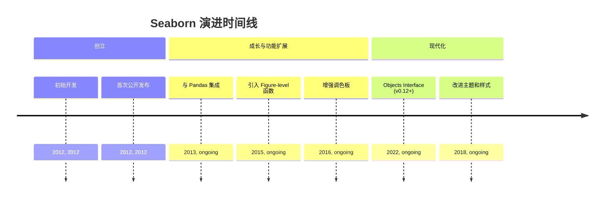
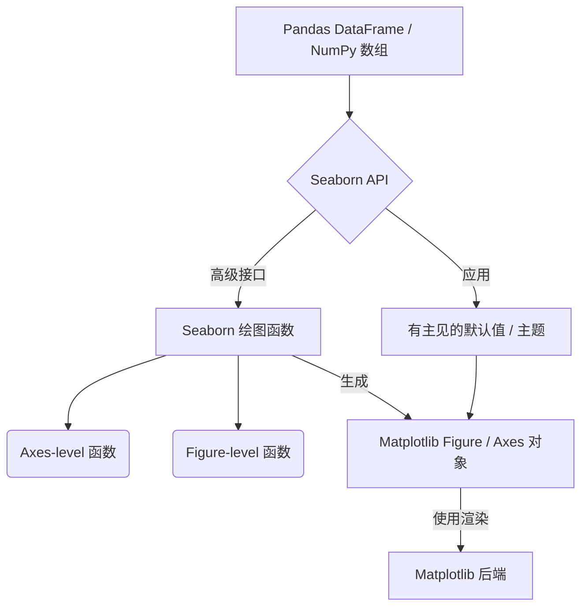
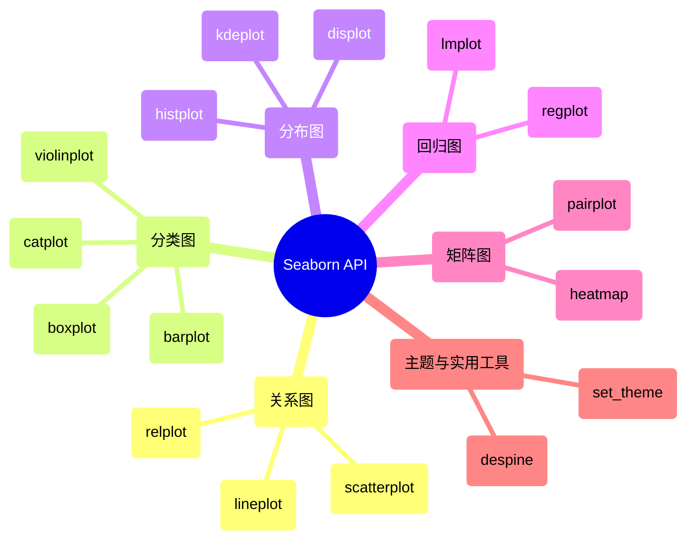

## Seaborn 演进文档

### 1. 引言与历史背景

Seaborn 是一个基于 Matplotlib 的 Python 数据可视化库。它提供了一个高级接口，用于绘制美观且信息丰富的统计图形。虽然 Matplotlib 在提供对绘图的精细控制方面表现出色，但 Seaborn 简化了创建复杂统计可视化的过程，使其更容易探索和理解数据，尤其是在使用 Pandas DataFrame 时。

Seaborn 由 Michael Waskom 创建。它的出现是为了满足一种更精简的方法来生成美观且具有统计意义的图表的需求，它建立在 Matplotlib 的基础功能之上。该库的开发重点是提供一个面向数据集的 API，该 API 自动处理 Matplotlib 的许多底层复杂性，允许用户专注于数据中的洞察力，而不是绘图的复杂性。

### 1.1. Seaborn 演进时间线



### 2. 核心架构

Seaborn 的核心架构是建立在 Matplotlib 之上的高级抽象层。它利用 Matplotlib 的绘图功能，同时为统计可视化提供更方便且有主见的接口。它还与 Pandas DataFrame 深度集成，使其在处理表格数据时非常有效。

#### 2.1. Matplotlib 后端

Seaborn 依赖 Matplotlib 作为其渲染后端。这意味着 Seaborn 生成的任何图表最终都是 Matplotlib 的 Figure 和 Axes 对象，允许用户使用 Matplotlib 的广泛 API 进一步自定义 Seaborn 图表。这种共生关系使 Seaborn 能够受益于 Matplotlib 的健壮性和灵活性，同时为统计绘图提供更简单的入口点。

#### 2.2. 面向数据集的 API

Seaborn 的一个关键架构原则是其**面向数据集的 API**。Seaborn 函数通常将整个 Pandas DataFrame 作为输入，而不是要求用户手动将数据列映射到视觉属性（如 x 轴、y 轴、颜色）。然后，它智能地将列映射到适当的视觉角色，执行必要的统计聚合，并处理底层的 Matplotlib 调用以生成信息丰富的图表。

#### 2.3. Figure-level 与 Axes-level 函数

Seaborn 将其绘图函数分为两种主要类型：

*   **Axes-level 函数**: 这些函数绘制到单个 Matplotlib `Axes` 对象上。示例包括 `sns.scatterplot()`、`sns.histplot()`、`sns.boxplot()`。它们适用于在更大的图中创建单个图表，或者当您需要精确控制子图位置时。
*   **Figure-level 函数**: 这些函数管理整个 Figure，并可以在单个 Figure 中创建多个图表（子图）。示例包括 `sns.relplot()`、`sns.catplot()`、`sns.displot()`、`sns.jointplot()`、`sns.pairplot()`。它们对于探索数据不同子集或变量之间的关系非常强大，因为它们会自动处理多个图表的布局。

#### 2.4. 有主见的默认值和主题

Seaborn 提供美观的默认样式和调色板。`sns.set_theme()` 等函数允许用户轻松应用这些主题，然后这些主题会影响所有后续的 Matplotlib 图表，确保可视化效果一致且专业。

**Mermaid 图：Seaborn 核心架构**



### 3. 详细 API 概述

Seaborn 的 API 围绕不同类型的统计关系和绘图类别进行组织。

#### 3.1. 关系图 (`sns.relplot`, `sns.scatterplot`, `sns.lineplot`)

用于可视化两个或多个变量之间的关系。

*   **`sns.relplot(data, x, y, kind='scatter', ...)`**: 用于在 FacetGrid 上绘制关系图的 Figure-level 函数。
*   **`sns.scatterplot(data, x, y, ...)`**: 绘制散点图，可以进行多个语义分组。
*   **`sns.lineplot(data, x, y, ...)`**: 绘制折线图，可以进行多个语义分组。

#### 3.2. 分类图 (`sns.catplot`, `sns.boxplot`, `sns.violinplot`, `sns.barplot`)

用于可视化数值变量与一个或多个分类变量之间的关系。

*   **`sns.catplot(data, x, y, kind='strip', ...)`**: 用于在 FacetGrid 上绘制分类图的 Figure-level 函数。
*   **`sns.boxplot(data, x, y, ...)`**: 绘制箱线图以显示相对于类别的分布。
*   **`sns.violinplot(data, x, y, ...)`**: 绘制小提琴图，它结合了箱线图和核密度估计。
*   **`sns.barplot(data, x, y, ...)`**: 将点估计和置信区间显示为矩形条。

#### 3.3. 分布图 (`sns.displot`, `sns.histplot`, `sns.kdeplot`)

用于可视化单个变量的分布或两个变量的联合分布。

*   **`sns.displot(data, x, kind='hist', ...)`**: 用于在 FacetGrid 上绘制分布图的 Figure-level 函数。
*   **`sns.histplot(data, x, ...)`**: 绘制数据的直方图。
*   **`sns.kdeplot(data, x, ...)`**: 绘制单变量或双变量核密度估计。

#### 3.4. 回归图 (`sns.lmplot`, `sns.regplot`)

用于可视化两个变量之间的线性关系。

*   **`sns.lmplot(data, x, y, ...)`**: 用于在 FacetGrid 上绘制线性模型图的 Figure-level 函数。
*   **`sns.regplot(data, x, y, ...)`**: 绘制数据和线性回归模型拟合。

#### 3.5. 矩阵图 (`sns.heatmap`, `sns.clustermap`, `sns.pairplot`)

用于以矩阵形式可视化关系。

*   **`sns.heatmap(data, ...)`**: 将矩形数据绘制为颜色编码的矩阵。
*   **`sns.pairplot(data, ...)`**: 绘制数据集中成对的关系。

#### 3.6. 主题和实用工具

*   **`sns.set_theme(style='darkgrid', palette='deep', ...)`**: 设置绘图的美学风格。
*   **`sns.despine()`**: 从绘图中移除顶部和右侧的边框。

### 3.7. API 思维导图



### 4. 演变与影响

*   **增强统计可视化:** Seaborn 显著提高了 Python 中创建统计可视化的质量和便捷性，使其成为探索性数据分析的首选库。
*   **连接 Matplotlib 和 Pandas:** 它有效地弥合了 Matplotlib 的低级控制和 Pandas 的高级数据结构之间的鸿沟，为数据科学家提供了强大而直观的工作流程。
*   **美学默认值:** Seaborn 对样式和调色板的有主见默认值提高了 Python 生态系统中绘图的美学质量标准，使用户更容易创建专业外观的可视化。
*   **面向数据集的方法:** 其面向数据集的 API 鼓励用户思考数据中的统计关系，而不仅仅是绘图的机制，从而产生更具洞察力的可视化。
*   **Objects Interface (v0.12+):** 最近版本中引入的 Objects Interface 标志着一个重要的演变，它提供了一种更具声明性和灵活性的方式来构建复杂图表，与现代图形语法原则保持一致。

### 5. 结论

Seaborn 已成为 Python 中统计数据可视化不可或缺的库。通过建立在 Matplotlib 之上并与 Pandas 无缝集成，它提供了一种强大、高级且美观的方法来探索和理解数据。其持续演进，包括最近的 Objects Interface，确保 Seaborn 始终处于数据可视化的前沿，赋能用户有效且高效地传达洞察力。

### 6. 典型用例

- 分布探索

```python
import seaborn as sns
import pandas as pd

df = pd.DataFrame({"x": sns.load_dataset("tips")["total_bill"]})
sns.histplot(df, x="x", kde=True)
```

- 带语义映射的关系图

```python
import seaborn as sns
import pandas as pd

df = sns.load_dataset("penguins").dropna()
sns.scatterplot(data=df, x="bill_length_mm", y="bill_depth_mm", hue="species", style="sex")
```

- Figure-level 的 FacetGrid

```python
import seaborn as sns

df = sns.load_dataset("tips")
sns.relplot(data=df, x="total_bill", y="tip", col="time", hue="sex", kind="scatter")
```

- 使用 set_theme 设置主题

```python
import seaborn as sns

sns.set_theme(style="whitegrid", palette="deep")
df = sns.load_dataset("flights")
sns.lineplot(data=df, x="year", y="passengers")
```